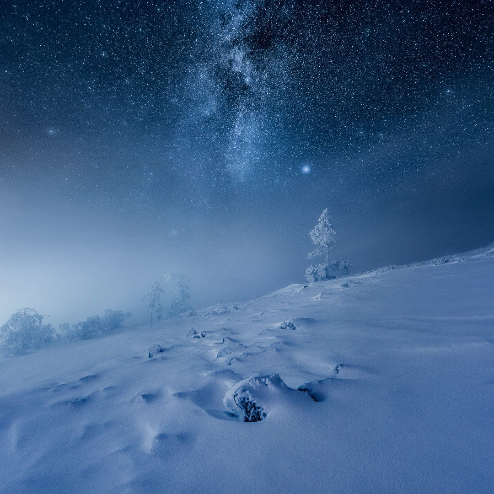

It's that time of year when the temperature drops and snow covers landscapes. Winter is my favorite time to shoot landscapes. You can almost hear the silence from snow covered landscape photographs. The light is low and beautiful almost the entire day but as you know me I enjoy to photograph at night. Here is my checklist when I'm heading out to photograph in below-freezing weather.

Frozen World - Ylläs, Finland 2015

### 1. Extra Batteries

When shooting in below-freezing temperatures, batteries discharge faster, so it's essential to have extra batteries. Remember to charge the batteries fully before heading out. I put my extra batteries to inside pockets in my jacket, this way they will stay warmer and kept fully charged when I need to change to a new one.

Night Tiles - Porvoo, Finland 2015

### 2. Camera Bag

Keeping your camera gear clean and easy to access is essential. I take my camera bag with me everywhere, so I take it with me when shooting in cold weather. I use Lowepro Protactic 400AW to carry my gear. Depending on what time I'm out, I might take only a couple of lenses and a Tripod.

I always carry a big plastic bag inside the camera bag. You don't have to keep your camera inside the plastic bag when you are out shooting, instead use it when you get back inside the house. Put your camera inside the plastic bag and leave the plastic bag with the camera inside your camera bag. The plastic bag will keep the moisture out of the camera. Keep the camera there for a couple hours before transferring the photographs to the computer. It's also important to warm up the gear gradually.

For those of you who are interested in what gear, I have with me most of the time: Camera bodies Nikon D810, D800 and lenses Nikon 14-24 mm f/2.8, Samyang 14 mm f/2.8, Sigma 35 mm f/1.4 ART and a telephoto lens and Sirui tripod.

Night Glow - Kerava, Finland 2012

### 3. Gloves, Clothes & Shoes

Keeping yourself warm in cold temperatures is important. I try to have spare gloves with me or top-up mittens such as hunting gloves since these work great when you need to adjust the camera settings. When you are out the whole day with the wrong kind of clothes, it affects the energy level you have so you won't be able to capture all the beauty you might have wanted to. There are a lot of different winter clothes you can choose. My go-to clothes are Goretex to keep me dry and warm. I suggest investing in decent winter clothes. I use [IceBug shoes](http://www.amazon.com/Icebug-Moss-Studded-Traction-All-Season/dp/B00J59OVMK/ref=sr_1_2?s=apparel&ie=UTF8&qid=1448354115&sr=1-2&nodeID=7141123011&keywords=icebug) when I'm on a frozen or otherwise slippery surface. When on a snowy terrain I recommend to get snowshoes if you need to travel by foot.

### 4. Accessories

My go-to filters include UV-filters and Polarization filter. Usually, I don't bring my long exposure kit (Lee filters) with me, but when there is open-water insight I might have them with me. A remote controller can keep your hands warm when you don't have to change the settings. I keep spare batteries for my remote-controllers if I'm shooting at night or in the evening light.

### Tips for taking the pictures

1. Don't over exposure the snow
2. Don't rush and take a moment to appreciate the surrounding scenery
3. Look for leading lines and interesting foreground elements
4. Light might change quickly so keep yourself ready to shoot at all times

Learn more my techniques from my [Star Photography Masterclass](http://www.mikkolagerstedt.com/star-photography-tutorial)!