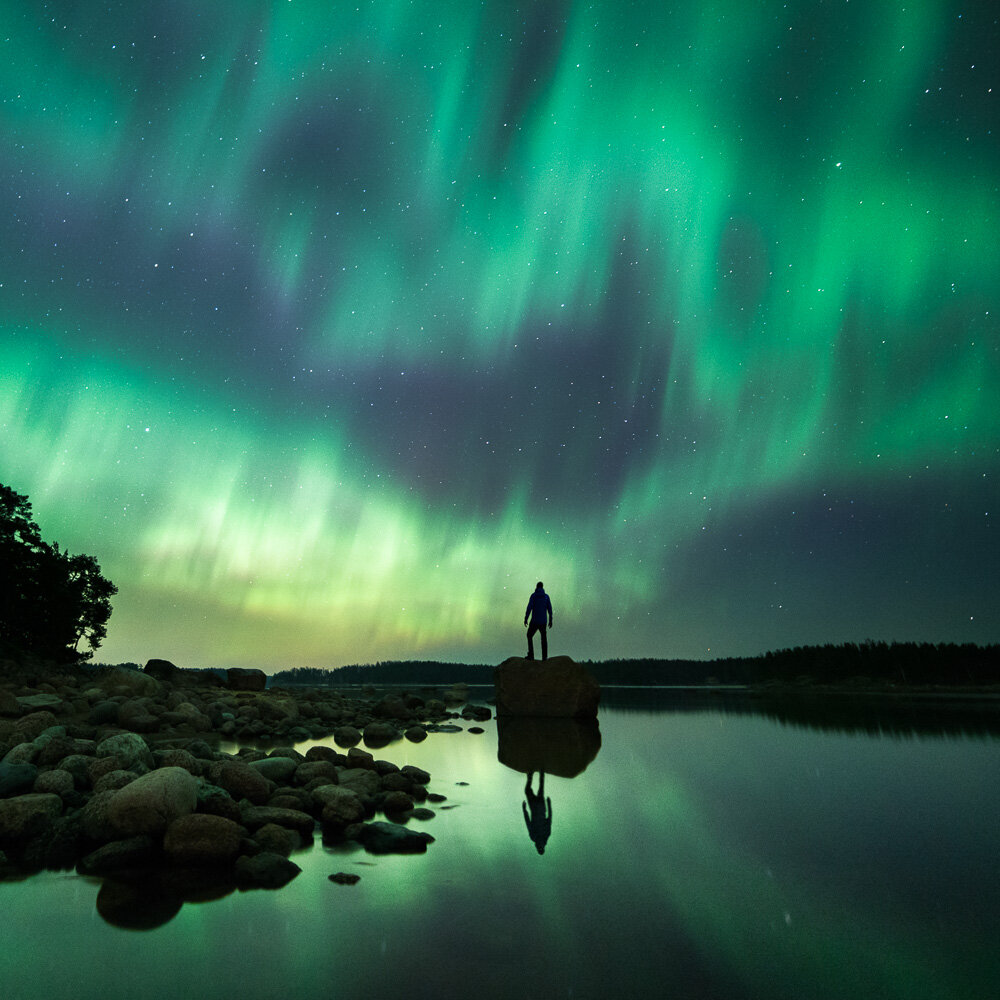

We were fortunate to capture the Northern Lights couple of weeks ago when they hit the South of Finland.  Here is another view of those beautiful lights dancing in the sky. For this photograph, I was there standing on a rock captured in Porvoo, Finland.

### Equipment and Exif

Nikon D800, Samyang 14 mm f/2.8 Sirui Tripod & Ball Head  
ISO 4000, 14 mm, f/2.8, 20 sec.  
Edited with [Phase Presets Collection](/phase-presets) Basic Adjustments

[PHASE PRESETS NOW ON SALE!](/phase-presets)

View fullsize

Mikko Lagerstedt - Illuminated Night - 2015 - Porvoo, Finland