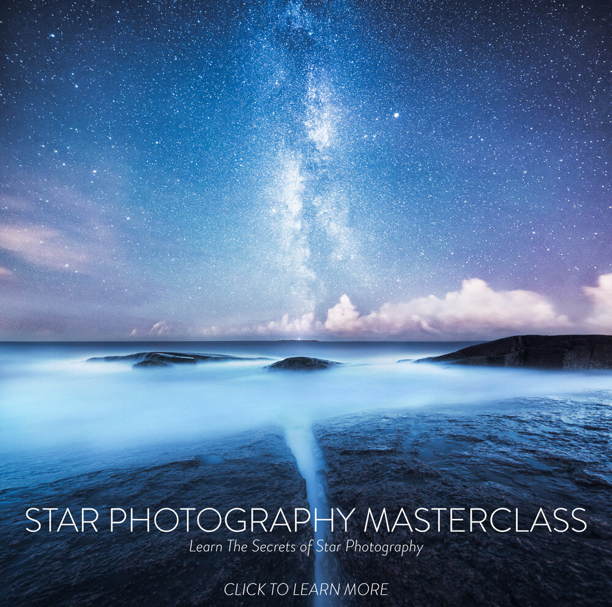

As you may have noticed, it has been quite some time from my last post. Finally, after countless hours of work, I present to you my new eBook, Star Photography Masterclass. Here is a quick intro about the Masterclass. [Learn more here.](/star-photography-tutorial)

* Essential Guide to Star and Milky Way Photography
  + How To Capture Stars and Milky Way
  + What Equipment You Need
  + *Planning:* Location Scouting & Timing
  + *Capture*: Focus, Read the Landscape, Composition and Camera Settings
* Quick Tips
* Three *In-Depth Tutorials* **Visions of Depth**, **Dreamy Night** and **Moonlit**.
  + How To Create Surreal Star Photography: Capture Technique & Post-Process
  + How To Use Light Pollution in Star Photography: Capture Technique & Post-Process
  + How To Use Moonlight in Star Photography: Capture Technique & Post-Process
* Photography Inspiration Exercises to Get Motivated

