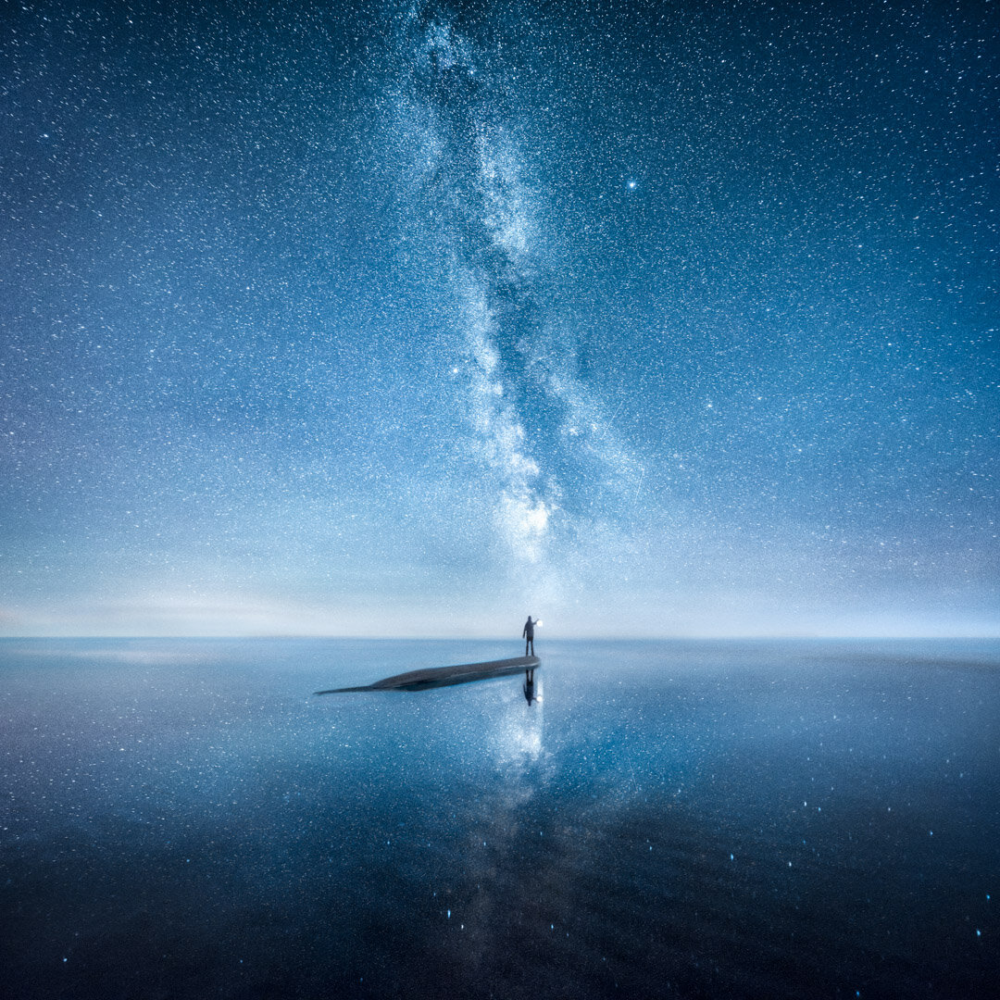

I had a great time last week in Yyteri, Finland. I walked down the beach and found a perfect spot to capture the Milky Way with reflections. This was one of the first photographs I took with the Nikon 14 - 24 mm f/2.8 lens. It's a fantastic piece of glass from the first impressions! I'll be writing an in-depth review in about a month.

I used one of my favorite techniques to capture this photograph Visions of Depth a combination of two photographs from the same spot. You can learn it on my [Star Photography Masterclass](/star-photography-tutorial).

### Exif & Equipment

Nikon D810, Nikon 14 - 24 mm f/2.8 and Sirui Tripod  
Two Horizontal Images: 14 mm, f/2.8, ISO 6400 & 30 seconds.

### Post-Processing

Color edit with the Phase Presets Collection: Hint of Blue (Color) & Balanced: Smooth II (Overall Settings).

Searching For The Horizon