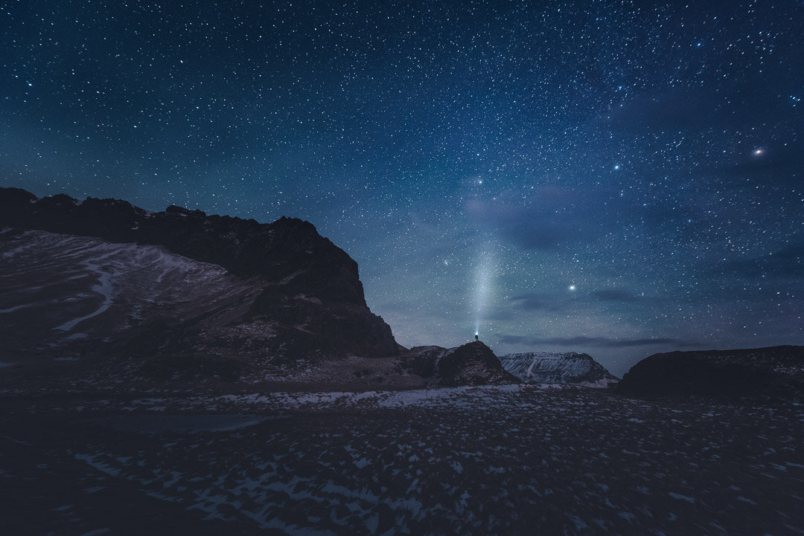

Hi, everyone. I hope your year has had a fantastic start! I had the pleasure to visit Iceland for the first time. It was an amazing place to travel. I will be creating a series of photographs from there, here is a teaser from my first night there. I'm currently working on a new set of Presets for star and landscape photography. The set will be released in the following two weeks.

### Exif & Equipment

Nikon D810, Nikkor 14 - 24 mm f/2.8 G ED  
14 mm, 30 sec. ISO 6400, f/2.8 with a timer

### Post-Processing

[Phase Preset Collection](/phase-preset) for Lightroom: Night - Blue and Smooth.

View fullsize

Mikko Lagerstedt - View from Iceland, 2016