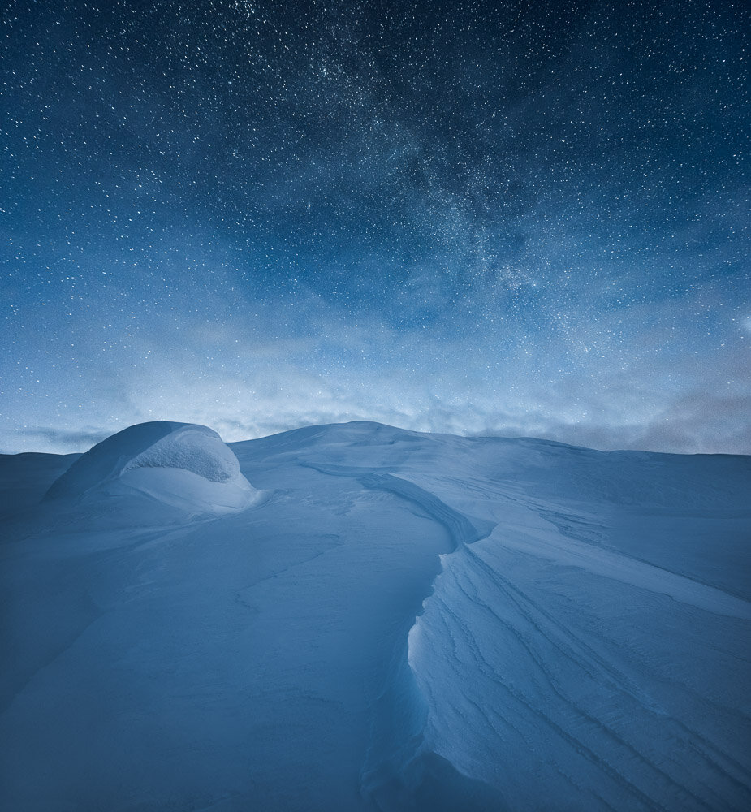

I visited Kilpisjärvi in February and while I was there I had the pleasure to go out and explore the landscapes. I had a vision how I wanted to show the landscape. I captured this photograph on my first evening there. It was a quite windy, cold yet quiet environment. Standing in this beautiful scenery alone in the dark was an amazing experience. I captured the scenery using my Vision of Depth technique. Which you can find in my [Star Photography Masterclass eBook](/star-photography-tutorial/).

### Equipment & Exif

Nikon D810, Nikkor 14-24 mm f/2.8 & Sirui Tripod & Ball head.   
Foreground: 4 min 32 sec, f/8 ISO 800, 14 mm  
Stars: 30 sec. f/2.8, ISO 1600, 14 mm

### Post-Processing

Edit in Lightroom using the Panorama function ([see my free tutorial](http://www.mikkolagerstedt.com/blog/2015/5/7/how-to-create-night-panorama-lightroom-cc)) capturing two horizontal exposures. Edited with [Saga Preset Collection](/saga-presets) (Cold Night).

View fullsize

