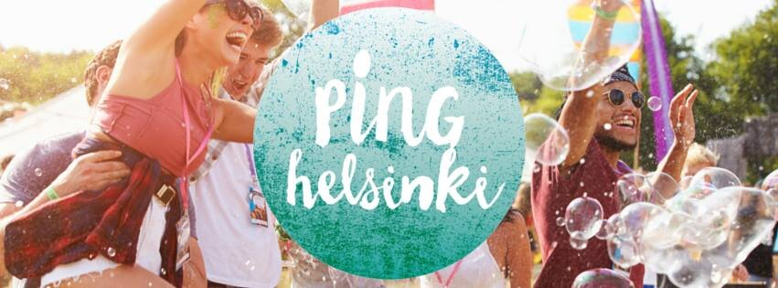

Here is something a bit different from my regular posts. However, I believe it's something you will enjoy and learn from, whether you are a photographer, business owner or a freelancer.

Last year I had the pleasure to teach a workshop in PING Helsinki (maybe you saw [this post](http://www.mikkolagerstedt.com/blog/2015/3/20/workshop-at-ping-helsinki) back then), which was a fantastic opportunity to share my knowledge about photography. This year I had the pleasure to get an invitation as a Content Guru.

So what is [PING Helsinki](http://www.pinghelsinki.fi)? It's THE place where businesses and content creators are gathered together to share their vision and knowledge but most of all it's about the community and fun! I enjoyed the inspiring keynote speakers and workshops; I learned a lot. The most important message from the festival for me was that it made me remember what is the most important part of my work. The community!

I have been a photographer for over seven years and through the time, I have been part of many communities. My first real online community was Flickr, which was the biggest photo sharing network at that point, and still people are using it. Getting feedback about my work was an essential part of my journey. I never would be here if I would not have been part of this community. See one of my first posts on [Flickr](https://www.flickr.com/photos/latyrx/3660734756/in/dateposted-public/). Getting comments from other photographers gave me the courage to continue with my work.

I have had my share of luck with social media, for instance, my [Facebook page](https://www.facebook.com/Photography-Mikko-Lagerstedt-137616549627247/) has now over 870 000 followers. I believe it's because I have always tried my best to keep up with the comments and share my knowledge as best as I can. Answering to messages and emails and by replying to comments can take up time. I still think it's essential. I have also been sharing my techniques and photography knowledge. It's about the community; it's not just about you or your work even though it all starts from there.

### Eight key things that make you stand out on Social Media

1. Create the kind of work YOU enjoy doing
2. Do it regularly
3. Share your work
4. Keep your work consistent
5. Fail
6. Learn from your mistakes
7. Engage with the audience
8. Repeat

And I believe this works for any work you put out and for different kind of platforms as well!

PING Helsinki 2016 – That's me second from the top left with a bunch of my fellow Instagrammers – see my huge ears and a black cap...

### Shoutout to my fellow Instagrammers from Ping Helsinki

If you didn't know this is my Instagram: [@mikkolagerstedt](https://www.instagram.com/mikkolagerstedt/)

Juuso Hämäläinen – [@juusohd](https://www.instagram.com/juusohd/)  
Jaakko Kahilaniemi – [@jkahilaniemi](https://www.instagram.com/jkahilaniemi/)  
Jaakko Kivelä – [@jaakkokivela](https://www.instagram.com/jaakkokivela/)  
Julia Kivelä – [@julia\_kivela](https://www.instagram.com/julia_kivela/)  
Anna-Elina Lahti – [@annisellis](https://www.instagram.com/annisellis/)  
Sofia Lavaste – [@slavaste](https://www.instagram.com/slavaste/)  
Joonas Linkola – [@joonaslinkola](https://www.instagram.com/joonaslinkola/)  
Konsta Linkola – [@konstalinkola](https://www.instagram.com/konstalinkola/)  
Pekka Pelkonen – [@pekkelsson](https://www.instagram.com/pekkelsson/)  
Konsta Punkka – [@kpunkka](https://www.instagram.com/kpunkka/)  
Teppo Tirkkonen – [@teppotirkkonen](https://www.instagram.com/teppotirkkonen/)

If you enjoyed this post, feel free to share it! If you have any suggestions for future tutorials, leave a comment. Finally, thank you [PING Helsinki](http://www.pinghelsinki.fi) for the hugely inspiring festival!

If you are on Snapchat, follow me there to see behind the scene footage! Click here [@mikkolagerstedt](https://www.snapchat.com/add/mikkolagerstedt) to add me on Snapchat. (You need a mobile phone with IOS or Android to use it)