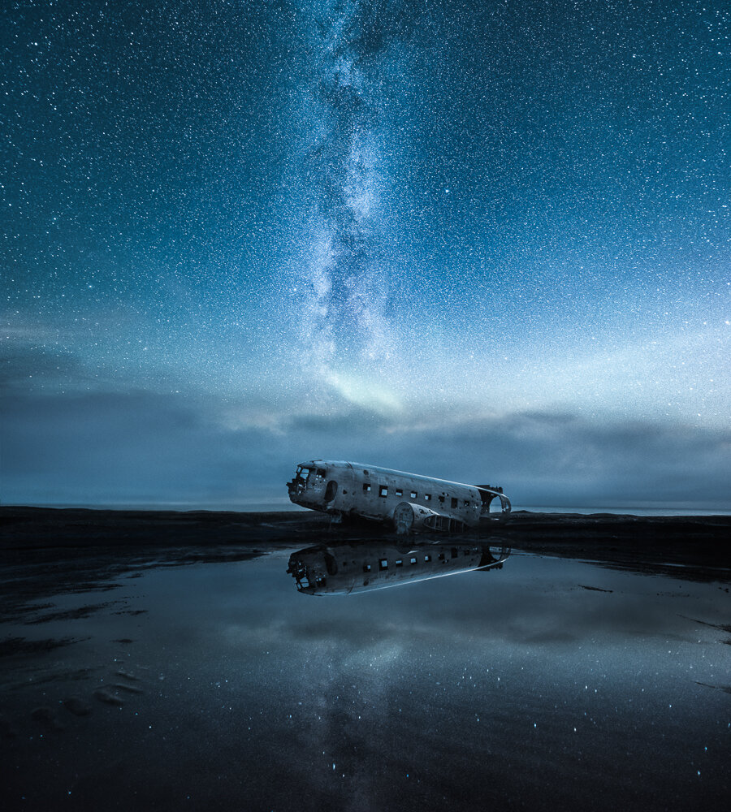

There are plenty of unique views in Iceland, and while I visited the country, I knew this plane wreck was one of those sights I wanted to visit. Walking around this iconic plane wreckage in the darkness of night was one of my favorite and most emotional experiences in Iceland. The wind made the wreck make ghostly sounds in the dark. I felt alone and inspired in this vast, surreal landscape. If you have visited the place you know, it's in the middle of nowhere (Sólheimasandur). I knew the [story](http://www.dailymail.co.uk/news/article-2643794/Left-rot-The-eerie-wreckage-crashed-U-S-Navy-aircraft-abandoned-Icelandic-beach-40-years-ago.html) behind the abandoned plane wreckage; I still wanted to vision a different storyline.

After a long rainy day, there was an opportunity to capture the plane wreck with an interesting and different vantage point. I carefully placed the camera on a tripod to the lowest possible height, close to the little puddle of water to create this perspective. I had to capture the scenery with multiple exposures to give it the final look because the wind kept blurring the water. I also wanted to get enough detail in the dark parts of the wreck.

If you want to learn my star photography techniques, you can view my eBook [Star Photography Masterclass](/star-photography-tutorial) where I go through my star photography vision.

### Exif & Equipment

Nikon D810, Nikkor 14–24 mm f/2.8 G, Sirui R4203 L Tripod & Manfrotto 3WAY-Head  
Sky: ISO 6400, 14 mm, f/2.8, 30 sec.  
Plane wreck & black sand: ISO 500, 14 mm, f/2.8, 14 min  
Reflection: ISO 8000, 14 mm, f/2.8, 30 sec.

### Post-Processing

I selected the photographs I wanted to stitch together in Lightroom and applied Saga Preset (Ice) to each of them. For combining the three horizontal images, I used my Vision Of Depth technique in Photoshop. The hardest part was masking different parts of the pictures together to create the unique depth of the final artwork. After I had stitched the image together, I applied another of my favorite presets: Hint of Blue ([Saga](/saga-presets)).

If you want to learn all of my techniques view [The Complete Photography Bundle](/complete-collection).

[Buy a print of this photograph](https://www.mikkolagerstedt.com/edge-prints/the-abandoned-world)

View fullsize

The Abandoned World – Sólheimasandur, Iceland – 2016