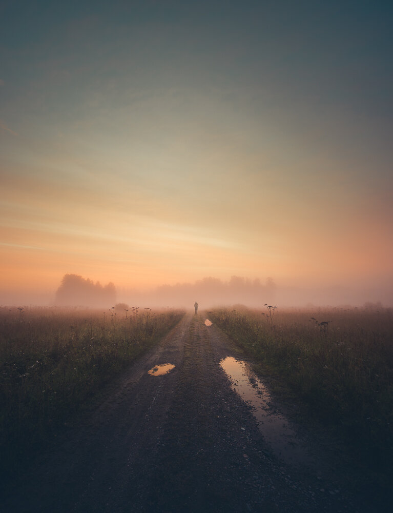

Even though I love to capture the stars and the Milky Way, I love summer mornings. In Finland, summer is so bright that you can't see the Milky Way. I have been photographing mostly on summer mornings and nights recently, and I found that they are full of mystery and beauty. Mist crawling to a field to create a beautiful isolated feeling. I captured this picture a few days ago after photographing the whole night. After a couple of rainy days, the sun made an appearance on this beautiful sunrise. This image was captured in Kerava, Finland. I placed my camera on the tripod and used the camera's self-timer and ran to the scenery.

### Equipment & Exif

[Nikon D810](https://www.amazon.com/Nikon-D810-FX-format-Digital-Camera/dp/B00LAJQVR6?ie=UTF8&camp=1789&creative=9325&creativeASIN=B00LAJQVR6&linkCode=as2&linkId=VV2WUOFGH2GDLTU7&redirect=true&ref_=as_li_qf_sp_asin_il_tl&tag=photomikkolag-20), [Nikkor 14-24 mm f/2.8 G ED](https://www.amazon.com/Nikon-NIKKOR-14-24mm-Focus-Cameras/dp/B000VDCTCI?ie=UTF8&camp=1789&creative=9325&creativeASIN=B000VDCTCI&linkCode=as2&linkId=S4OV3WH75BNGJ6T7&redirect=true&ref_=as_li_qf_sp_asin_il_tl&tag=photomikkolag-20)  
ISO 100, 1/100, 14 mm @ f/2.8

Color edited with my Lightroom [Phase Preset Collection](/presets): Hazy - Surreal

View fullsize

Mikko Lagerstedt – Summer Morning Dream – Kerava, Finland 2016