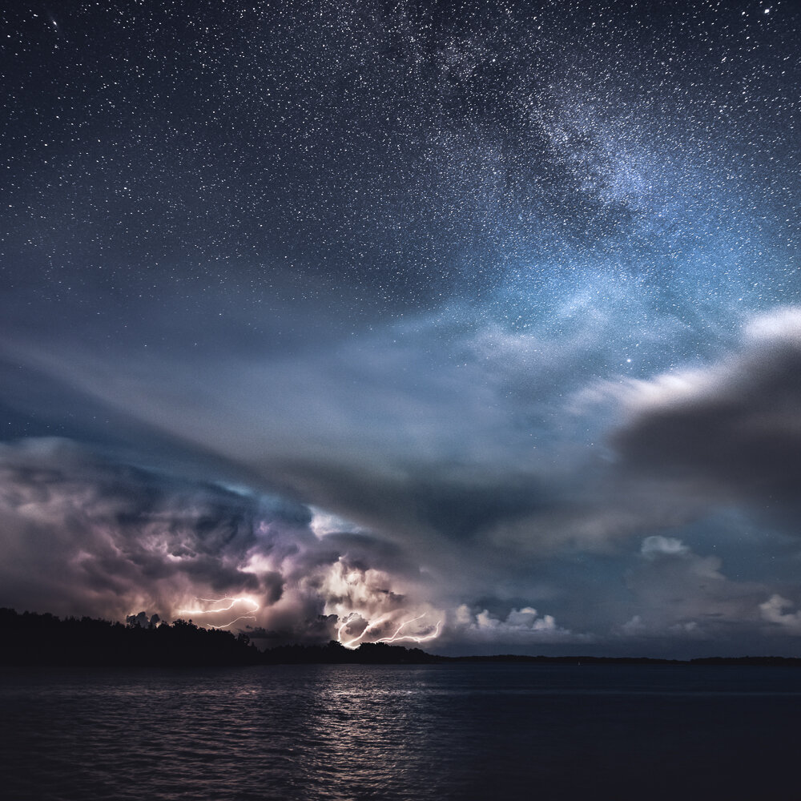

Last week I was photographing with Konsta Punkka ([@kpunkka](http://www.instagram.com/kpunkka)) and Juuso Hämäläinen ([@juusohd](http://www.instagram.com/juusohd)). We had an amazing experience after a long beautiful summer day in Kasnäs, Finland. The clouds drifted away from the mainland and were greeted with a grandiose display of stars and storm clouds. I used two vertical exposures to capture the field of view. I, of course, took several photographs of the scenery, but these two were the ones I used to create the final image. The lightning was so intense that it made the foreground look like it would have been shorter exposure.

### Equipment & Exif

Nikon D810, Nikkor 14-24 mm f/2.8, Manfrotto Tripod  
Two vertical shots: f/2.8, ISO 1250, 22 mm & 20 sec

### Post-processing

Photoshop CC for stitching the images together, Lightroom CC for color editing [Phase Preset](/phase-presets): Vintage Early Morning and details with [Saga Preset](/saga-presets): Enhance Stars.

View fullsize

The Show - A Lightning Storm in Kasnäs, Finland 2016