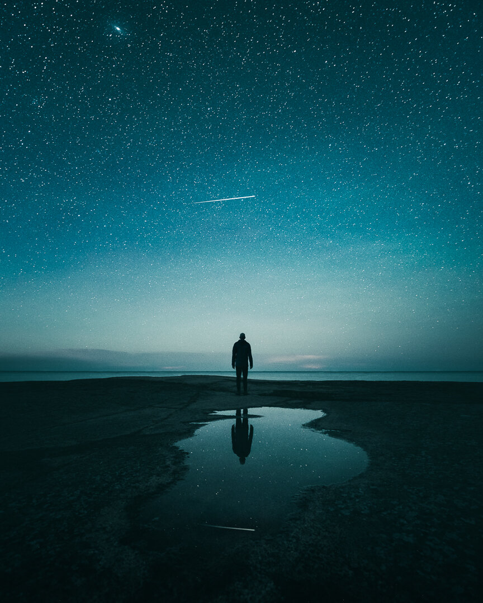

After the bright summer nights, I'm excited that the astrophotography season has started in Finland. A couple of weeks ago I made a trip to Emäsalo, Finland. It's one of my favorite seascape places in Finland. I ended up going there four nights in a row to capture some time-lapse footage and still images.

There are not many places in Finland where you can view to the sea without being on someone's private property. Which is a shame. So this place is rather unique. Standing there is a calming experience when the only noises you could hear are the subtle wind and crashing waves. I placed my camera low and set the self-timer to 20 seconds so I had time to walk to the frame and stand there for 30 seconds. Luckily I also captured a satellite in the frame which gave the image nice balanced look.

### Equipment & Exif

Nikon D810, Nikkor 14-24 mm f/2.8 & Manfrotto Tripod  
ISO 3200, 14 mm, f/2.8, 30 sec.

### Post-production

Color edit with Lightroom CC basic settings with my [Phase Presets](/presets): Hazy - Movie Look & Contrast - Night. I also added a [Saga Preset](/saga-presets): Enhance Stars - Med 2/3 to add detail to the stars.

[Buy a print of this photograph](https://www.mikkolagerstedt.com/edge-prints/descent)

View fullsize

Descent - Emäsalo, Finland - 2016