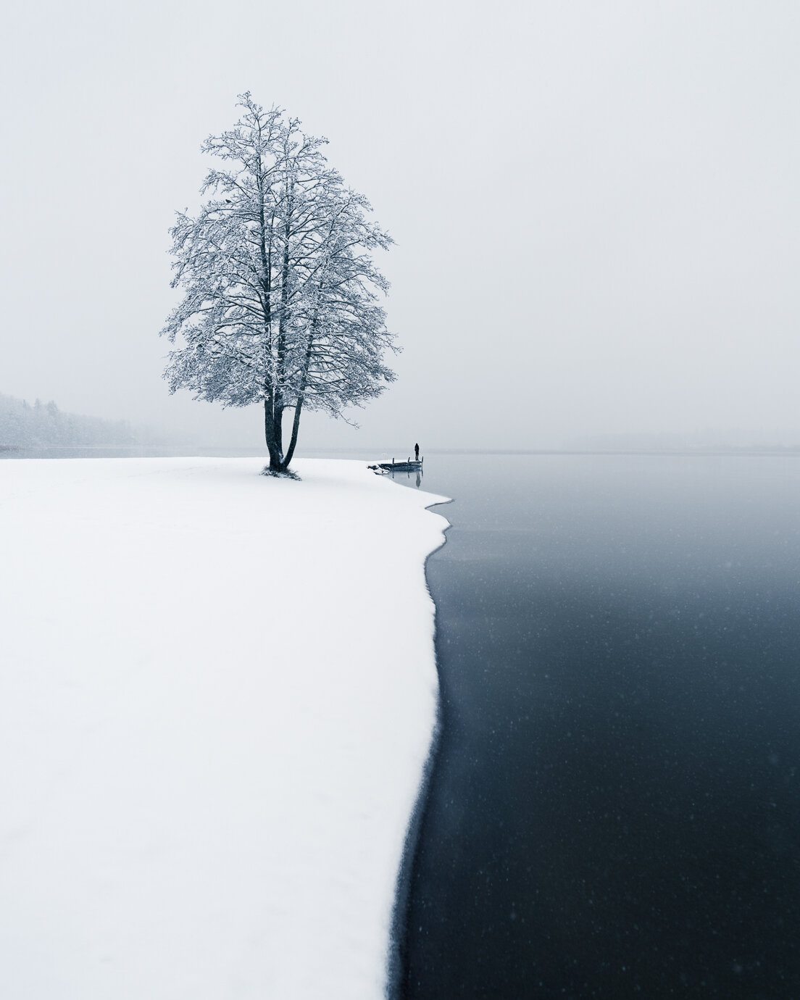

Feeling inspired by the first snowfall of the season, I headed to one of my favorite spots near our home. There is always something magical about the first snow and how it lights up the landscape.The heavy snowfall and the beauty of the landscapes with calm water made me appreciate the moment. In the blizzard, I saw a fisherman going for his fish traps and rowing in the middle of the lake. The scenery sure looked like a still from a movie. I captured many photographs here and might publish some later.

After spending time at the first location, I decided to head to Järvenpää and photograph a spot I have been to many times and this time I had luck with the conditions. Not a single person in sight and no tracks in the snow I carefully made my way to the beach. Capturing the beach and lake and balancing the elements I saw a man approaching the scenery. I waited for some minutes before he was in the perfect spot.

### Exif & Equipment

Nikon D810, Sigma 20 mm f/1.4 ART  
ISO 100, 1/160 exposure, f/4.0

### Post-Processing

I used Lightroom basic settings to edit the photograph. The colors I edited by using my [Phase Preset Collection](/presets) - Blue & Yellow.

First Snow - Mikko Lagerstedt 2017 - Järvenpää, Finland