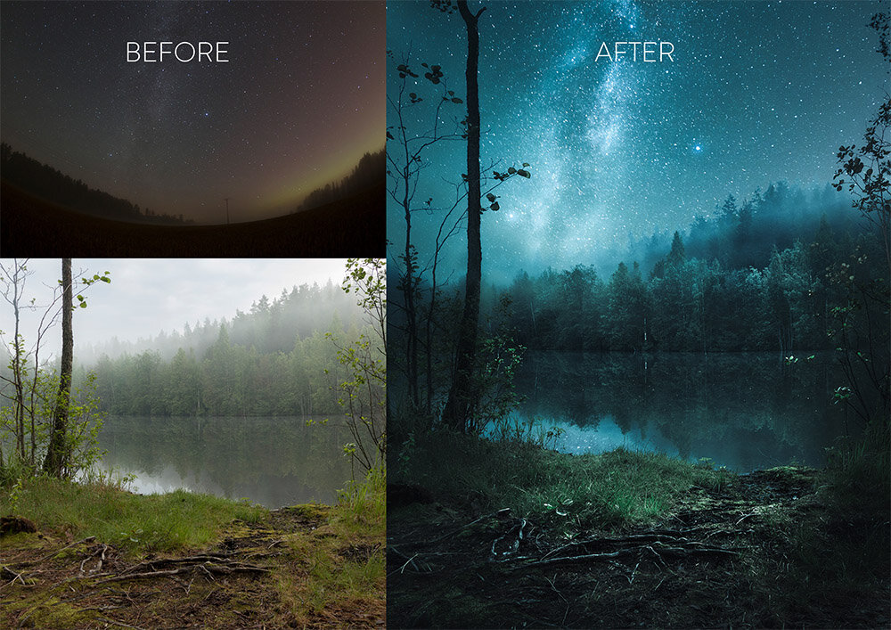

We released a new tutorial in collaborating with [JuusoHD](http://www.instagram.com/juusohd). The tutorial contains information and step-by-step process how to blend night and day images together using Lightroom and Photoshop. You can view the tutorial [here](/star-photography-composite).

## YOU WILL LEARN

* How to Create Composite Milky Way and Night Sky Photograph
* How to Edit Star & Foggy Landscape Photograph in Lightroom
* Learn How [JuusoHD](http://www.instagram.com/juusohd) Creates His Unique Dreamy Look
* How to Follow The Steps with Juuso's Source Photographs
* How to Easily Blend Photographs in Photoshop
* Why Use These Tricks and Tools
* Includes Final Image PSD with Layers

[New Star Photography Composite Tutorial](/star-photography-composite)