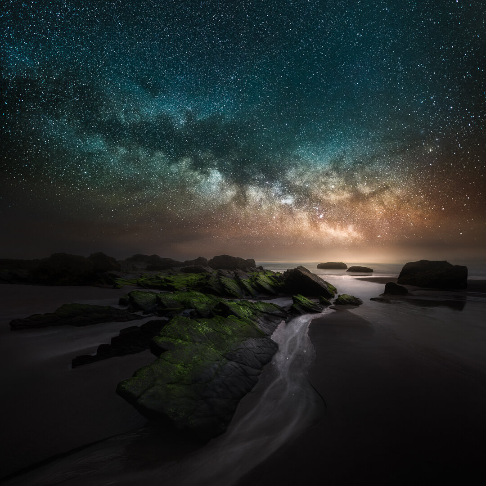

You might know that I love to capture night sky near a coastline. I traveled to Portugal to capture the beauty of night sky and the Atlantic Ocean. I was blown away by all of the little gems and beautiful seascape views in Portugal. This picture was captured near Telheiro a small beach. I spent my days searching for possible locations to capture and I found a location with the foreground rocks. I went back to this location when it was dark. I knew that the tide might affect the landscape and it certainly did. The view was different, but luckily I found a spot to capture.

I used my [Vision of Depth](/star-photography-tutorial) technique, to capture the scenery. Longer exposure for the foreground and 25 second's for the Milky Way. I also brought my new lens [Sigma 20 mm f/1.4 ART](http://amzn.to/2sl9kEP) with me to capture the sky. This lens is a beast!

### Exif & Equipment

[Nikon D810](http://amzn.to/2pWQ7Ir), [Sigma 20 mm f/1.4 ART](http://amzn.to/2sl9kEP), RRS Tripod and Hähnel Gigapro II remote controller.   
Sky: ISO 6400, f/1.8, 25 sec. tilting the camera upwards.   
Foreground: ISO 2000, f/4.0, 7-minute exposure tilting the camera downwards.

### Post-processing

Color and contrast edit in Lightroom and opened the images in Photoshop as Smart Objects and copied the landscape to the same file as the sky. Once both images are in the same file, expanded the canvas with the crop tool. Masked the meeting point of the views. Saved file and went back to Lightroom, and used a [Phase Preset](/phase-presets) (Contrast - Light) to give it an overall look.

View fullsize

Mikko Lagerstedt - Flow - Portugal, 2017