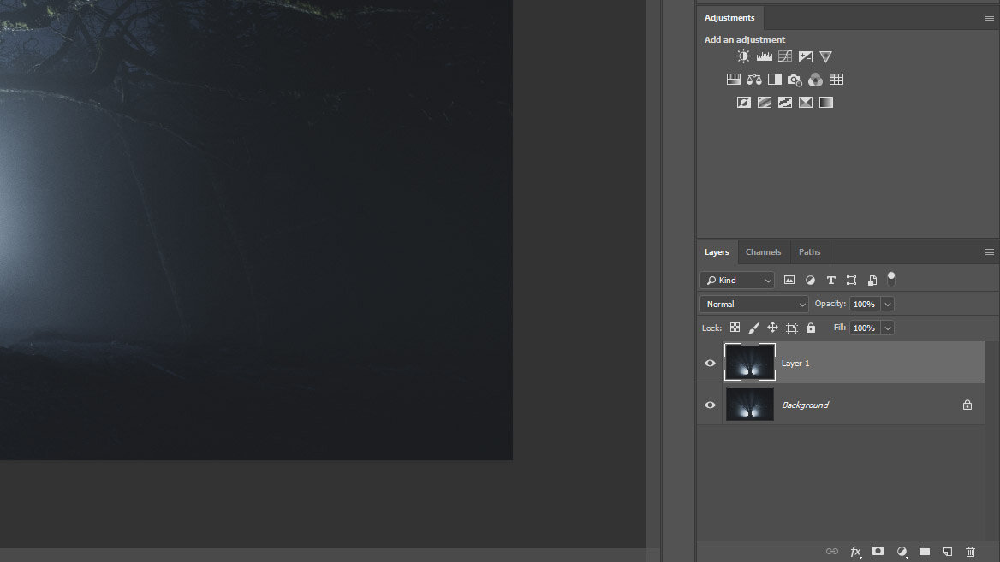
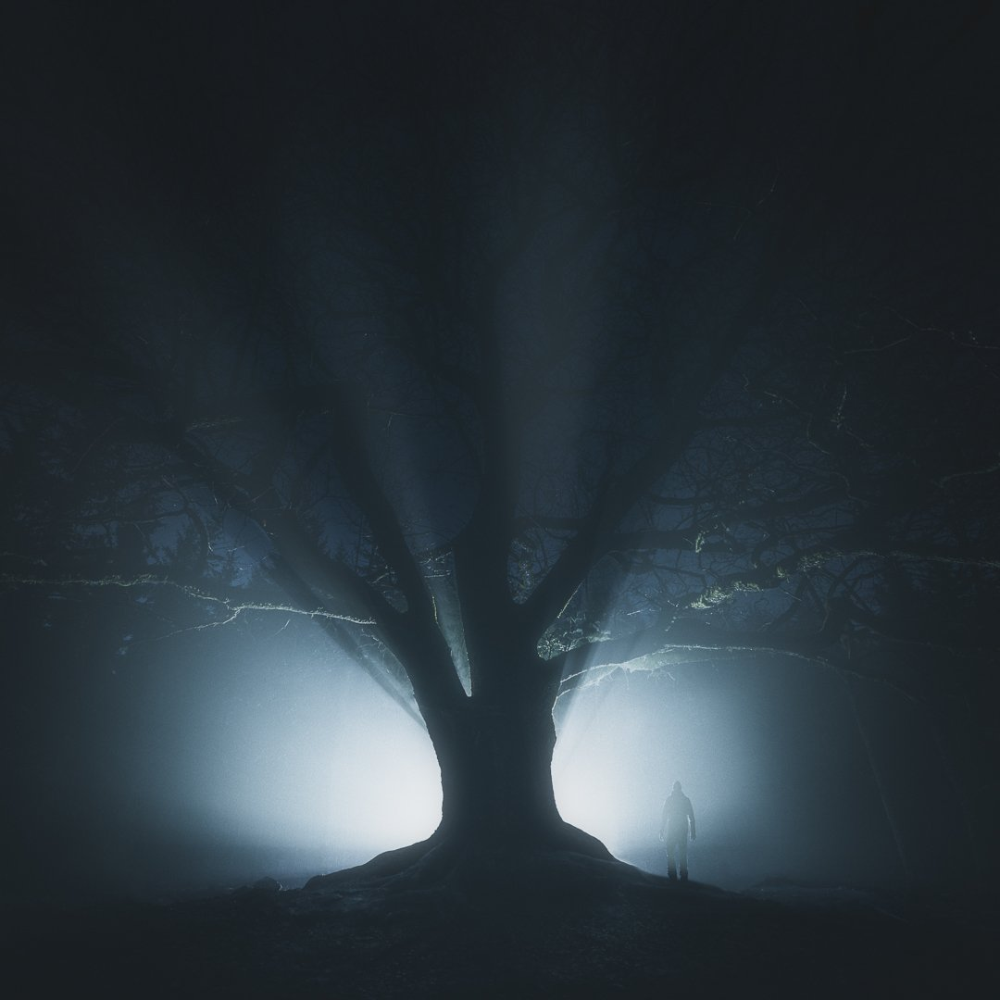
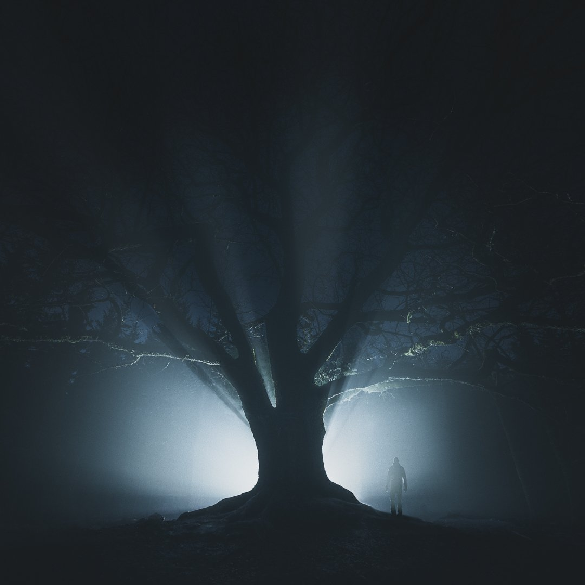

In this weeks tutorial, we are adding a glowing effect to photographs in Photoshop. I received a wonderful comment from Melissa, one of my readers regarding that it would be interesting to see a tutorial for Photoshop. So I thought why not share one of my favorite tricks on how to create glow in Photoshop.

This Photoshop trick works perfectly when you have a bright light source or sources in the photograph. Without further ado let's go ahead and open the image in Photoshop and start the process.

### Duplicate Layer

Use shortcut *CTRL/CMD + J* to duplicate the background layer.

View fullsize

### 

### Convert to Smart Object

When we are working with this type of effect, it's useful to convert the layer to Smart Objects since we can edit the effects after we have made them.

Convert the duplicated layer into Smart Object by right-clicking on top of the layer and select Convert to Smart Object.

View fullsize

### 

### Blur

Now give the layer a blur. Go to *Filter > Blur > Gaussian Blur*

View fullsize

Add blur to the image. Around 40–100 pixels seems to work most of the time. Don't worry about the amount at this moment since you can edit it later.

View fullsize

### 

### Highlights and Contrast

Add Curves adjustment layer above the blurred layer.

View fullsize

Create a Clipping Mask by right clicking on top of the curves layer and select Create Clipping Mask. This will now make sure that the Curves adjustments only affect the layer below.

View fullsize

Pull up the highlights and pull down the shadows slightly to create S-curve with curves.

View fullsize

### Opacity

Go back to the blurred layer and pull down the opacity to around 15-30% depending on your image. I recommend to go with a low opacity and don't overdo the effect.

EDIT: If you don't want to affect the shadow and sharpness of the image use blending modes: Soft Light or Hard Light on the blurred layer.  
(Thanks for the tip Roland!)

View fullsize

### Before and After

And that's it! Just a few steps can add impact to your photos. Thanks to Melissa for suggesting a Photoshop tutorial. I hope you enjoy it!

## GET THE LATEST CONTENT FIRST

If you like this post. Subscribe to be the first to receive fresh new tutorials straight to your inbox!

First Name

Last Name

Email Address

Subscribe

We respect your privacy.

Thank you!