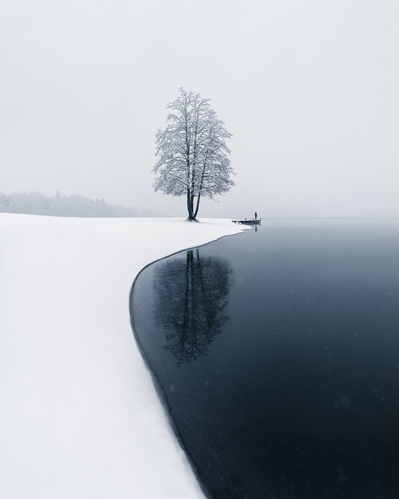

I just released a new photography series The Shapes of Nature from the past six months. You can view the whole project on my Behance page. You can also find prints of these photographs [here](/shapes-of-nature). I hope you enjoy the series.

[View the full collection](https://www.behance.net/gallery/65702301/The-Shapes-of-Nature)

[Limited Edition Prints](/shapes-of-nature)

Mikko Lagerstedt - Reflect

Mikko Lagerstedt - Solitude

Mikko Lagerstedt - Long Shadows