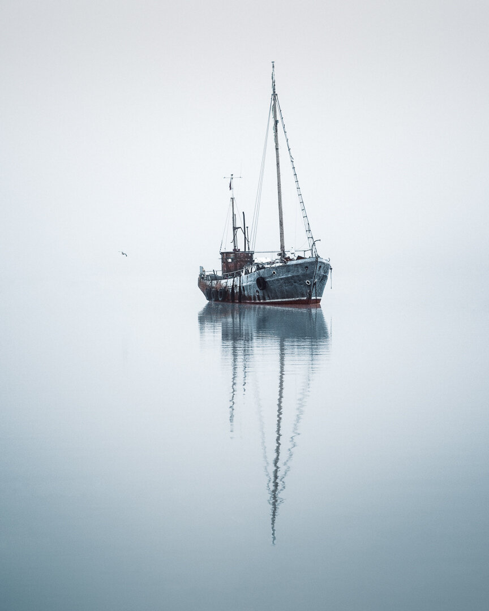

It doesn't matter if you go out to photograph landscapes or portraits there is always a story to be told. Here is a short story about the "Old Ghost" photograph. Woke up at 2 am feeling tired yet excited. Got my gear and drove to the coast. I didn't have a plan for what to photograph in this particular morning; I just knew that there was a possibility of mist. So, I decided to visit a couple of different places. I got out of my car in Emäsalo. The fog was thick, the air smelled like rust. It was a cold yet beautiful morning.

The shipwreck in the picture was once tilted and almost entirely submerged in water. The wreck was fixed a few years ago, and now you can find it sitting in the middle of a seashore. I walked around the area and saw the wreck from a different perspective than I have used to seeing. One seagull kept circling the shipwreck. I shot a couple of photographs, and once the seagull was in the perfect spot, I took this one.

### Exif & Equipment

Nikon D810, Nikkor 24-120 f/4.0 VR  
95 mm, ISO 200, 1/125, f/8.0

### Post-Processing

I used Lightroom basic settings to edit the photograph. The colors I modified by using my [Phase Preset Collection](/phase-presets) – Blue Preset.

[Buy a Print of This Photograph](/alone-prints/old-ghost)

Mikko Lagerstedt – Old Ghost – Emäsalo, Finland – 2018