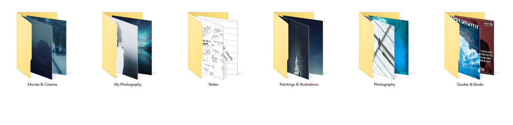

How to feel more inspired? What inspires me? It's good to ask yourself these questions. For me, it's a collection of things. I have always loved to view paintings, drawings, watch movies and listen to music to feel inspired. Of course, there are plenty of ways to stay inspired. Some work for others and some don't.

In this weeks tutorial, we are building a catalog of inspiration which is one of my favorite ways to stay inspired. Even if you are not a photographer, I recommend that you have one of these lists. It is one of the best ways to get fired up.

Surround yourself with inspiring works of art. Even though you might be the same as me and your go-to source of inspiration is nature, I believe it’s essential to have an archive of inspiring works of art in your home, on your computer or online.

Whenever you lack inspiration, or can’t quite figure out what it is you want to create, I recommend that you flip through your catalog of inspiration and get excited about photography or whatever it is you enjoy making.

## Online or Offline?

You can create these types of catalogs in many ways. My recommendation is to have an Inspiration -folder divided into subfolders on your computer.

If you wish to build an online list, I highly recommend [Pinterest](https://www.pinterest.com/mikkolagerstedt/). It doesn’t work great with notes, but other than that it’s a great way to search for inspiration and put anything you like on different boards.

Pinterest Overview

Divide your catalog into categories or folders. Be intentional when you are creating your lists. Stay off from the place of "this get's more likes than this". It's the wrong way to start producing anything.

## 1. Notes

The first folder includes your notes from the different photo shoots you have had. Notes come handy when your memory starts to fade, and it has been a long time since you captured the photographs. With notes, you can keep the focus on your inner inspiration, feelings, and vision. I highly recommend you take a few minutes after each photo shoot to put down few words about the work you just captured. There are many ways you can archive your photo notes.

To keep my notes in one place, I take a photograph of my moleskin page and send it to my Evernote with a tag: notes. As I'm sitting on my computer editing the photos, I can search and flip through my notes quickly.

## 2. Your best photos

Select photographs YOU are most proud of and put it into a folder. Better yet print them, hang them and be continuously inspired. Be sure that you enjoy the work. Why do you like this and why does it inspire you? Don't be fooled by how other people saw the creation, or how many likes the photographs got in social media be true to yourself. Stop chasing those likes.

## 3. Movies & Cinema Stills

Create a list of movies that you love and visually stunning movies that you like to watch. Do not care if other people find those movies garbage, stay true to yourself. Include stills from those movies in the folder. This way you can easily see some of the moving scenes without going through the whole film. (Hint Tumblr and Pinterest have a lot of beautiful cinematography you can go through.)

## 4. Quotes & Books & Poems

Create a folder with your favorite books, quotes, and poems. The fantastic aspect about amazon kindle is that you can share your citations and send them to your email straight from your device. Some people frame their favorite quotes so that they can see them daily. By all means, do it if you find it inspiring.

## 5. Paintings, Illustrations & Graphic Designs

This part can be a great addition to your inspiration catalog. I love to have a folder including paintings, illustrations, drawings and graphic designs. If this is something you find inspiring as well, do it! Again ask yourself why do you like this and why does it inspire you? What is it in this work of art that you enjoy?

## 6. Music

Make a list of music that inspires you. Do at least a couple of different playlists that you can switch between depending on your mood. I recommend using Spotify because of the massive amount of different kinds of music you can find. You might want to listen to the music while you are driving to a photo shoot or when you are editing the photographs.

## 7. Photography

Whenever you see something unique in the photography world, take a screen capture or download the picture and put it into the photography folder. I rarely go through the photographs, because I tend to favor the other mediums for inspiration. Again ask yourself why do you like this and why does it inspire you? What is it in this work of art that you enjoy?

Pinterest Boards Example

I hope you enjoyed this article! Have you ever had anything like the inspiration catalog? Has it helped you to feel inspired?

Would you be interested in a guide to find your unique style in photography? I'm considering to create a free guide for you. Let me know!

If you enjoy my free tutorials and want to support them, or you want to learn how to create unique ideas for your photography and create work you that inspires you? You can learn it all from my video course [Day & Night](/day-night). We are running a **Summer sale** on it now. [**Check it out here.**](/day-night)

Have a wonderful new week and keep on creating work that excites you.

## GET THE LATEST CONTENT FIRST

If you like this post. Subscribe to be the first to receive fresh new tutorials straight to your inbox!

First Name

Last Name

Email Address

Subscribe

We respect your privacy.

Thank you!