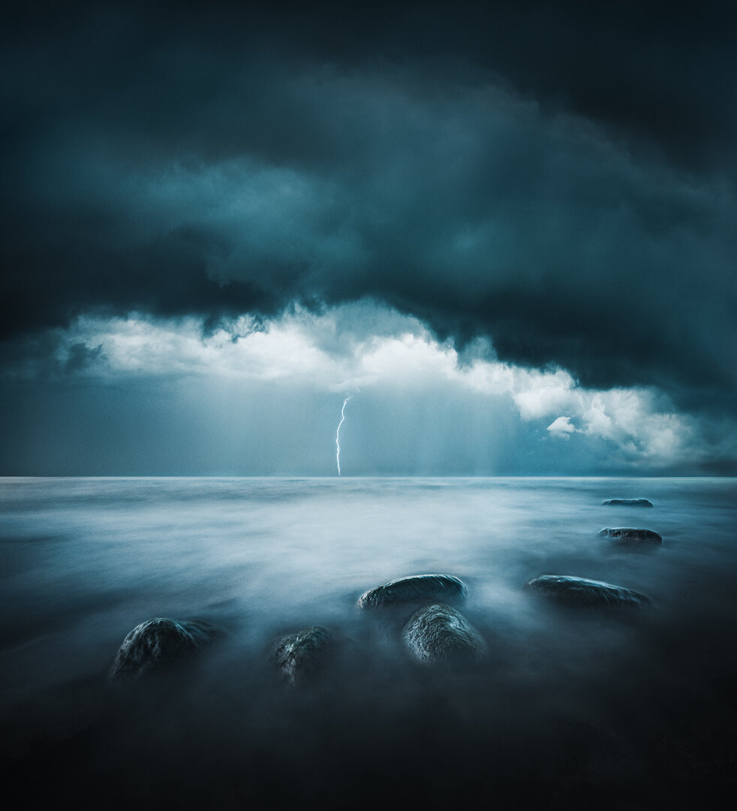

In Finland and northern Europe, the summer weather has been hot, and it has lasted far longer than the typical summers. I fell in love with the warm mornings. Waking up early in the morning has its advantages, and in Summer when the sun rises around, 4 am you need to be early to catch it. For the past three weeks, I have woken up around 3 am to head out before the first rays hit the landscapes. The rains have been scarce, but recently after long hot days, the storms have arrived.

The storm gives a fresh feel to nature. Humidity and wind make you feel alive. Heart of the Storm is a vision I created by combining three of my images to create this surreal looking seascape view.

### Exif & Equipment

Nikon D810, Nikkor 14-24 mm f/2.8, RRS Tripod  
Sky: ISO 100, 14 mm, f/7.1, 1/100   
Seascape: ISO 100, 15 mm, f/11, 109 sec.  
Lightning: ISO 64, 24 mm, f/9, 3.0 sec.

### Post-processing

The photographs were first edited in Lightroom to match the light and color using the reference view. After this, the set was opened as smart objects inside Photoshop and drafted together using the techniques in my [Day & Night](/day-night) -course. Finally, opened in Lightroom to make the final color adjustments using [Phase Collection](/presets) - Discreet - Blues preset.

View fullsize

Mikko Lagerstedt – Heart of the Storm, 2018 – Emäsalo, Finland