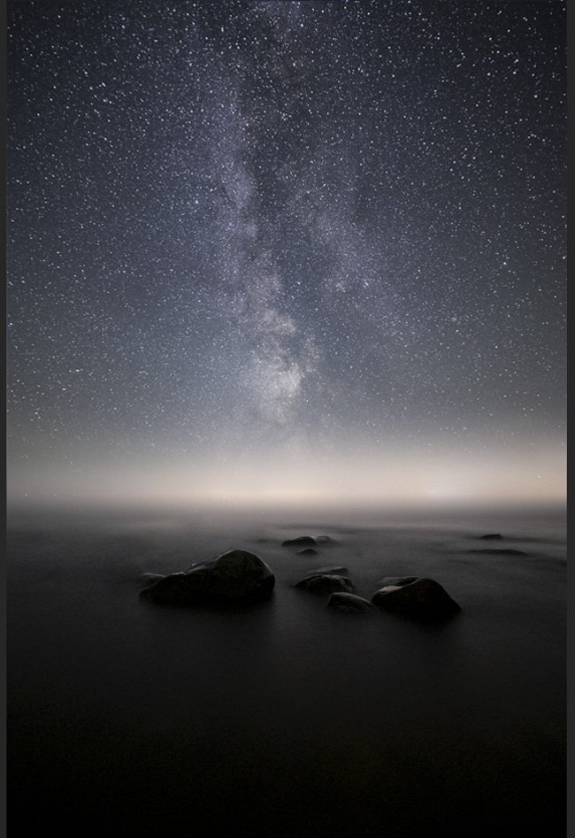

Last week I wrote about [**How to Edit Astrophotography in Lightroom**](http://www.mikkolagerstedt.com/blog/how-to-edit-astrophotography-in-lightroom). And as I promised, this week, we go through how to create dreamy astrophotography using dual exposure techniques in Lightroom and Photoshop CC.

I talk about the dual exposure technique in the [**capture part**](https://www.mikkolagerstedt.com/blog/4-steps-to-capture-beautiful-astrophotography-landscapes) of this series, so make sure to check it out!

For this example, I shot two different exposures from the same view without moving my camera. I recommend that you take the first shot always to capture the stars sharp. After that, you can lower the ISO and increase the f-stop and exposure.

### **Settings for the photographs**

Star exposure: ISO 8000, f/1.6, 20 mm, and 25 seconds.

Foreground exposure: ISO 4000, f/1.6, 20 mm, 134 seconds.

As you can see in the star image, the foreground was too dark, and it was necessary to capture a longer exposure to get more detail in the foreground. I had luck with the mist this evening, which makes it slightly easier to combine the photographs. But if you don’t move your tripod the blending process is quick and easy most of the time.

Shorter exposure on the left with more detail in the sky, and on the right, you can see more detail in the foreground.

Use the same settings in Lightroom for the photographs as in my last week’s tutorial: [How to edit astrophotography in Lightroom](http://www.mikkolagerstedt.com/blog/how-to-edit-astrophotography-in-lightroom).

## 1. Open as Smart Objects

After applying the settings, open both photographs as smart objects in Photoshop. It’s helpful to have the option to edit the RAW files inside Photoshop, so I recommend using Smart Objects.

## 2. Duplicate Layers

Go to the foreground exposure image in Photoshop and use shortcut CTRL+M, and right-click on the image. Select Duplicate Layer… and choose the sky image as the destination.

## 3. Creating Mask

Now you have both files in the same Photoshop document, save the file and continue creating a layer mask for the foreground layer.

Use the gradient tool. Shortcut G and default colors create a soft transition between the sky and the foreground.

## 4. Removing Distracting Elements

I like to go through the image and see if there are unnecessary spots, and in this case, I removed one rock and some long exposure noise dots. Use the clone stamp tool on a new layer and remove noise dots and elements you don’t want in the final image.

## 5. Final Adjustments In Lightroom

As the image is starting to come together, let’s save the file, and jump back to Lightroom to make the final adjustments.

**Basic Settings**

I want more contrast and slightly bluer colors for the image, so let’s make the changes in color temperature and use the contrast slider.

Temp – 4  
Tint – 4

Exposure – 0,10  
Contrast + 32

Highlights – 9  
Whites + 18

Dehaze + 9

Add slight Post-Crop Vignetting from the Effects panel. I used – 6 and feather 100.

Let’s use the detail panel to remove noise from the long exposure.

Luminance 15  
Detail 45  
Contrast 15

Crop by using the crop tool, shortcut R.

As I made the final crop I noticed that the horizon was unbalanced so I added a Radial filter (shortcut SHIFT+M) to the left side of the horizon with settings: Exposure + 0,80 and Dehaze – 20.

And here is the final dreamy double exposure astrophotography landscape.

View fullsize

Dreaming – Mikko Lagerstedt – 2021

Below are two different color versions done with the [**EPIC Preset Collection**](https://mikkolagerstedt.squarespace.com/epic-presets).

View fullsize

[**EPIC**](/epic-presets) – Overall Colors: Boost

View fullsize

[**EPIC**](/epic-presets) – Color Grading: Tears

### Tools & tutorials used in this tutorial

Lightroom CC Classic  
Photoshop CC  
[EPIC Preset Collection](/epic-presets)  
[Star Photography Masterclass](/star-photography-tutorial)

**I hope you enjoy the tutorial and learn something new. Let me know what would you like to learn next! Leave a comment down below.**

Until next time my fellow photographers, take care and keep on creating!

Ps. My video tutorial [Day to Night](/day-night) goes deep into capturing and creating this type of work.

## Subscribe

If you enjoy this post. **Subscribe** to be the first to receive   
**fresh new tutorials** straight to your inbox!

First Name

Last Name

Email Address

Subscribe

We respect your privacy.

Thank you!