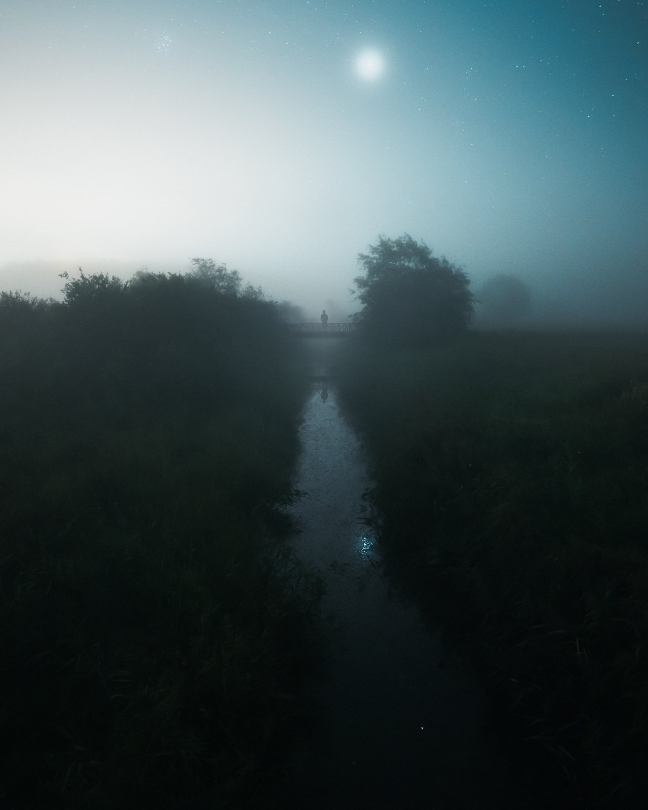
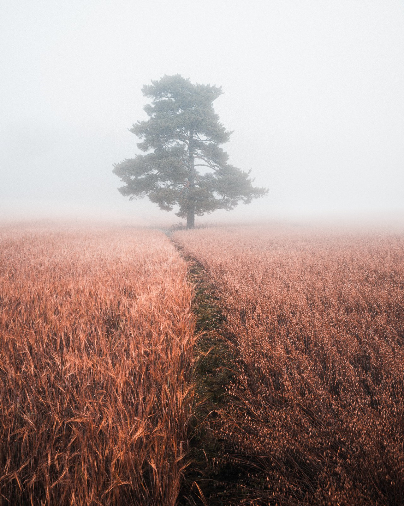
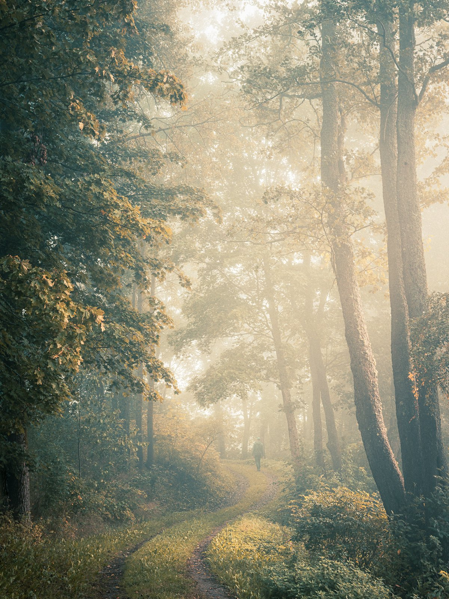
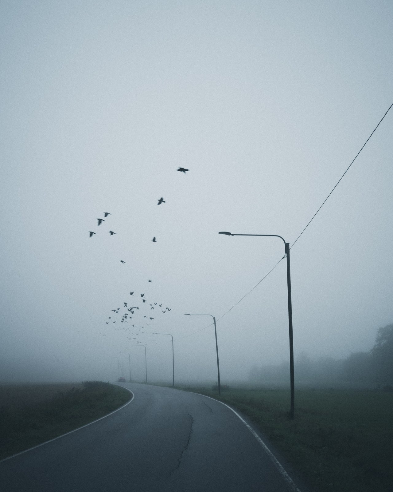
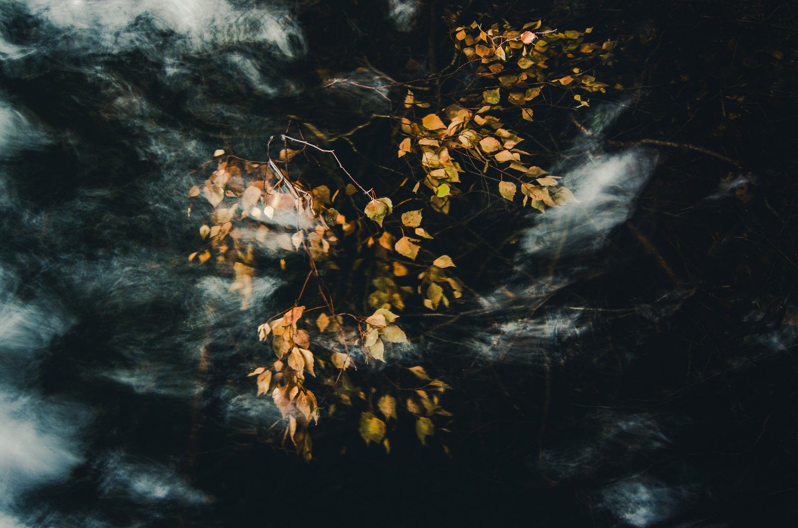
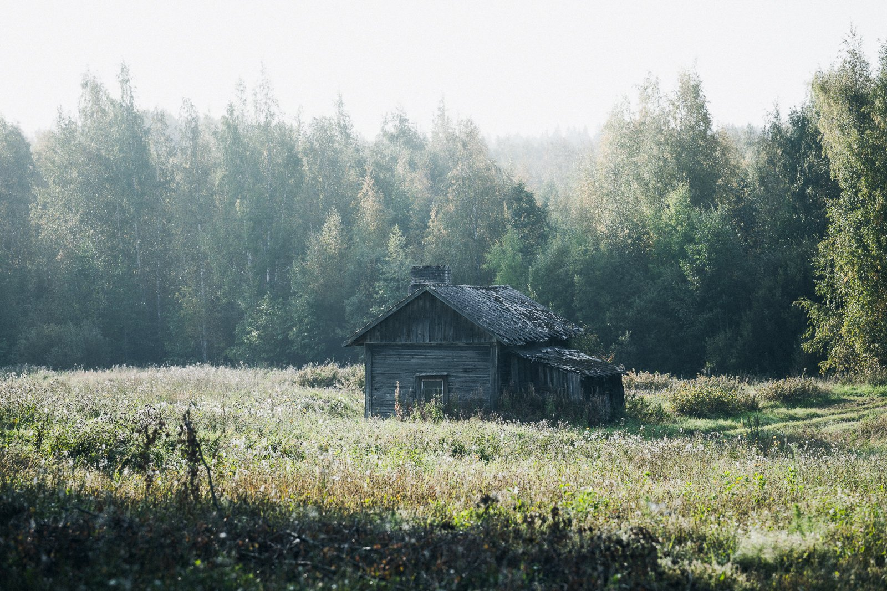
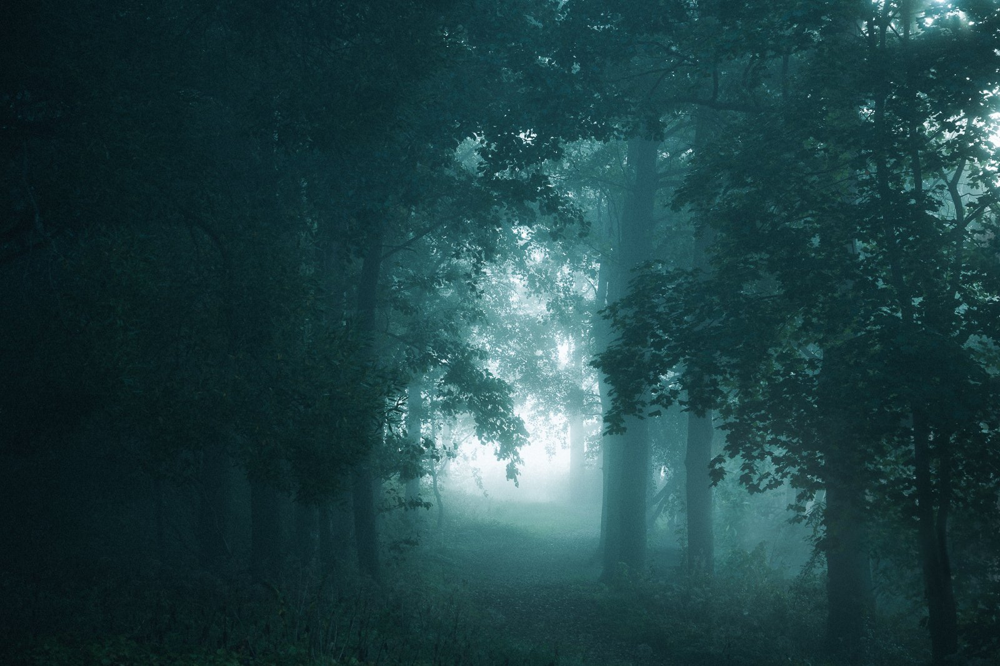
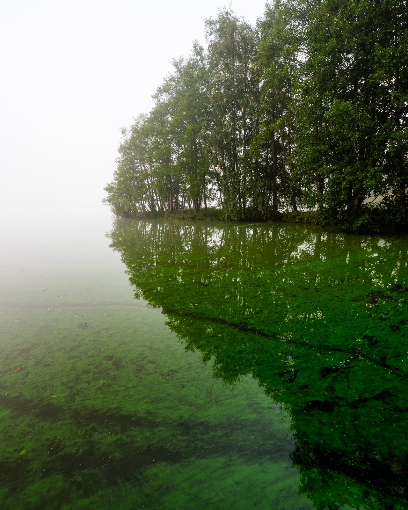
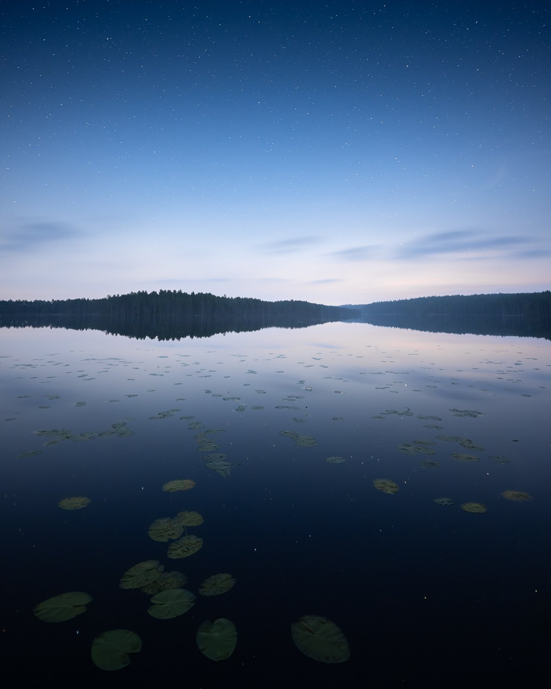

It’s been one month since I introduced a challenge to all of you who follow me on my blog. The #DiscoverWithMikko challenge was to capture something nearby (no more than 20 km’s away) where you live. It was also to encourage you to try to capture something unique. The month flew by, and I can say that it was a tough challenge for me as well. Not many participated in this challenge, but I saw some beautiful entries on Instagram, which I’ll share in my stories [@mikkolagerstedt](https://www.instagram.com/mikkolagerstedt/).

I went out to photograph 15 times in the past month, whether to a nearby field or around the nearby lake. I didn’t take photographs each time because I couldn’t find anything to capture, but that’s how it goes at times. What this challenge reminded me of is that I really enjoy having options. In the future, I want to get a macro lens to capture those details and different perspectives.

There weren’t many great opportunities with the weather, but I eventually captured something I enjoyed. It wouldn’t be a challenge if it weren’t challenging, right?

Each of the challenge photographs I captured was edited with my [**EPIC Preset Collection**](/epic-presets). See the descriptions for more information of each edit and camera settings.

## 1. Keep an open mind and Find new places nearby

Finding something new from nearby places can sometimes be challenging. However, it was easier than I thought. I have driven, biked, and walked around a lot of the area where I live. But I still found a few spots I had never seen before. Keeping an open mind while searching for something to capture is essential. If you want to improve your craft, this approach will move you forward more than anything else.

The first capture was on a beautiful night about 11 kilometers from where I live. The night was amazing and misty. The light pollution wasn’t so evident because of the fog. I ventured to this field and saw this beautiful small bridge. I ran to the bridge while my camera was taking long exposure photographs. I stood there for a few minutes to ensure one of the 20-second exposures was sharp.

Mikko Lagerstedt – Lost Night, 2023  
[Nikon Z8](https://amzn.to/3PTgIS5), [Nikkor Z 14-24 mm f/2.8 S](https://amzn.to/3LoUXGL) & RRS Tripod  
ISO 6400, 24 mm, f/2.8, 20 sec. – [EPIC Preset Cinematic: Spectrum + Color Grading: Ride](/epic-presets)

## 2. Beautiful weather can make anything look beautiful

Never give up on a place you know has the potential with the right conditions. Weather is such an essential part of landscape photography that it’s important to be ready to visit a place you might have already spent many times in.

Another of my favorites from the past month was this place I’ve visited many times but never had the right conditions. This place is about 13 km’s away from where I live. This morning, the thick fog made this beautiful pine tree stand out of the background. The two different grain fields also lead nicely to this majestic tree.

Mikko Lagerstedt – Somewhere, 2023  
[Nikon Z8](https://amzn.to/3PTgIS5), [Nikkor 24-70 mm f/2.8](https://amzn.to/44YEBvu) & RRS Tripod  
ISO 64, 35 mm, f/9.0, 0.6 sec. – [EPIC Preset Cinematic: Big](/epic-presets)

## 3. Keep a list of Inspiring & potential places

Having a list of places you can visit when the weather is inspiring is crucial. Or, when you are unsure where to go and take photographs, this list will give you options. I encountered this place a few months ago, yet I knew it needed something more to make it beautiful. As the mist and light cast onto this road, I knew it was going to be beautiful. I set my camera on a tripod and started walking to the road to have a person in the frame to give it a subject and a focal point.

Mikko Lagerstedt – Embracing Light, 2023  
[Nikon Z8](https://amzn.to/3PTgIS5), [Nikkor 24-70 mm f/2.8](https://amzn.to/44YEBvu) & RRS Tripod  
ISO 64, 46 mm, f/8.0, 1/13 sec. – [EPIC Preset Forest: At the Crossroads + Color Grading: Beef](/epic-presets)

## 4. Embrace the unexpected

Sometimes, the most beautiful photographs come from unplanned moments. Be ready to embrace the unexpected — a sudden change in weather, a fleeting moment of light, or a spontaneous event that unfolds before your eyes. On this beautiful morning, I noticed these birds sitting on the power lines, and as I stopped to take a photograph, they decided to fly. Captured 7 km’s from home.

Mikko Lagerstedt – Early Morning Atmosphere, 2023  
[Nikon Z8](https://amzn.to/3PTgIS5), [Nikkor 24-70 mm f/2.8](https://amzn.to/44YEBvu)  
ISO 64, 24 mm, f/2.8, 1/100 sec. – [EPIC Preset Cinematic: Mood](/epic-presets)

## 5. Play with Different Angles and Perspectives

A change in perspective can breathe new life into a familiar scene. Don't hesitate to get down low to the ground, climb a little higher, or find a vantage point that offers a fresh angle. During the challenge, I found myself focusing on details and unique views more often than not. Here is a take of longer exposure with a submerged tree branch that still has leaves on—just a few kilometers from where I live.

Mikko Lagerstedt – Beneath The Surface, 2023  
[Nikon Z8](https://amzn.to/3PTgIS5), [Nikkor Z 14-24 mm f/2.8 S](https://amzn.to/3LoUXGL) & RRS Tripod  
ISO 100, 24 mm, f/8.0, 1 sec. – [EPIC Preset Forest: More Light + Color Grading: Somebody](/epic-presets)

## Final thoughts

What did I learn from this challenge? I think the key takeaway for me is that it doesn’t matter how long you’ve been doing photography. Every new challenge is a fantastic way to learn and develop yourself. It’s a great way to break those old patterns and embark on capturing something unique and inspiring. It sure was difficult to constantly remind myself that there might be something more to capture than the basics. The challenge made me go out and seek more photo opportunities, so it was a great practice.

I encourage you to remember these tips during your photographic adventures. Remember, the world is full of beauty, waiting to be discovered, often just a stone's throw away.

Below are a couple of more photographs I captured through this monthly challenge.

View fullsize

Old Barn

View fullsize

Glowing Light

View fullsize

Algae

View fullsize

Night at the Lake

I hope you found these tips helpful. Feel free to share your thoughts in the comments below, and stay tuned for more challenges and adventures in photography. Until next time, my fellow photographers, keep on creating!

*The links to the products are Amazon affiliate links, if you wish to support my blog.*

## Subscribe

Sign up with your email address to receive new tutorials and updates!

First Name

Last Name

Email Address

Sign Up

Thank you!