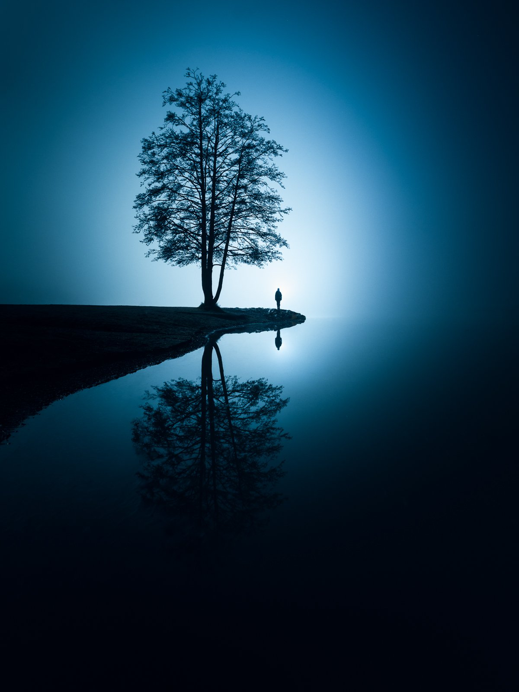
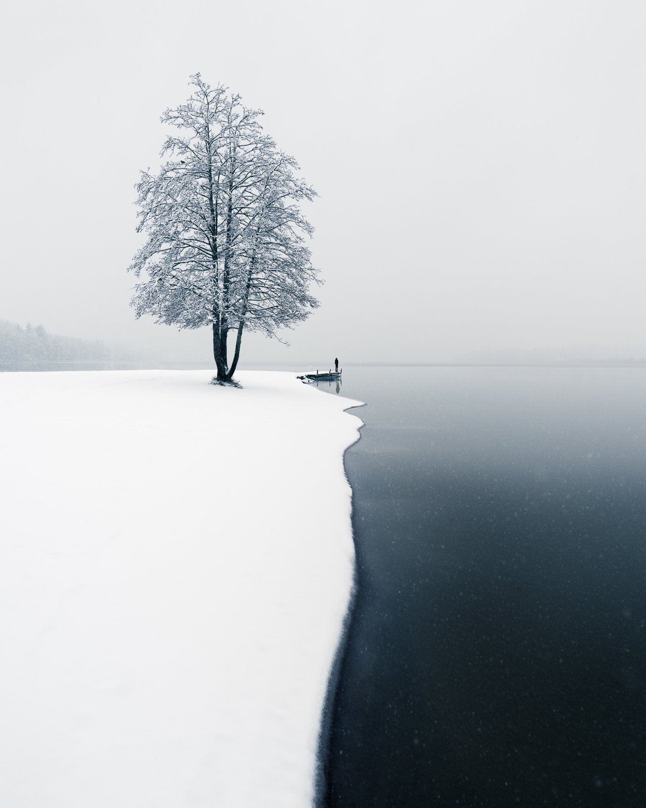
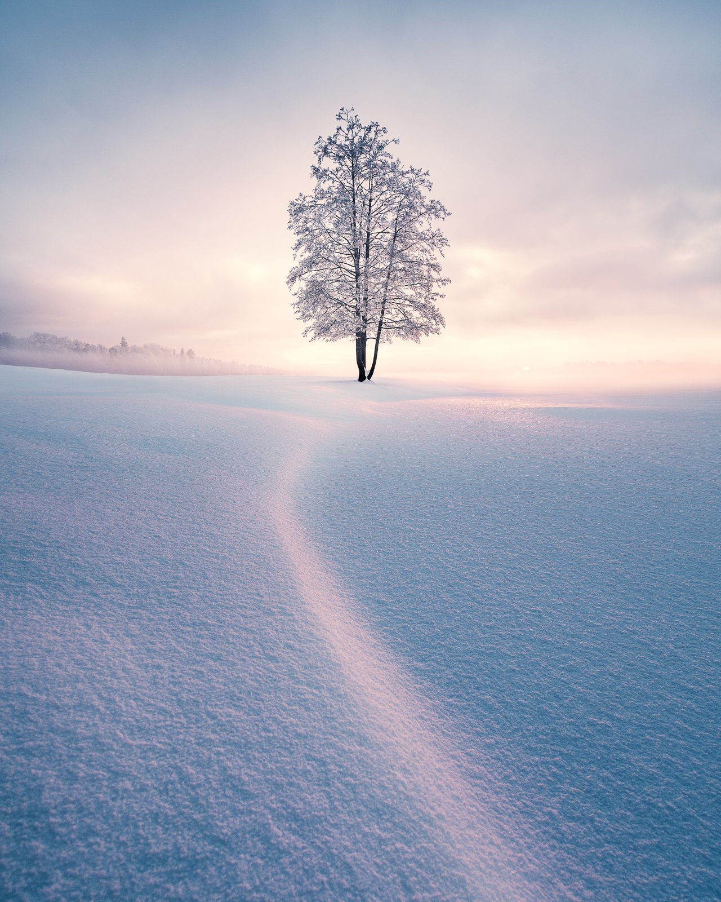
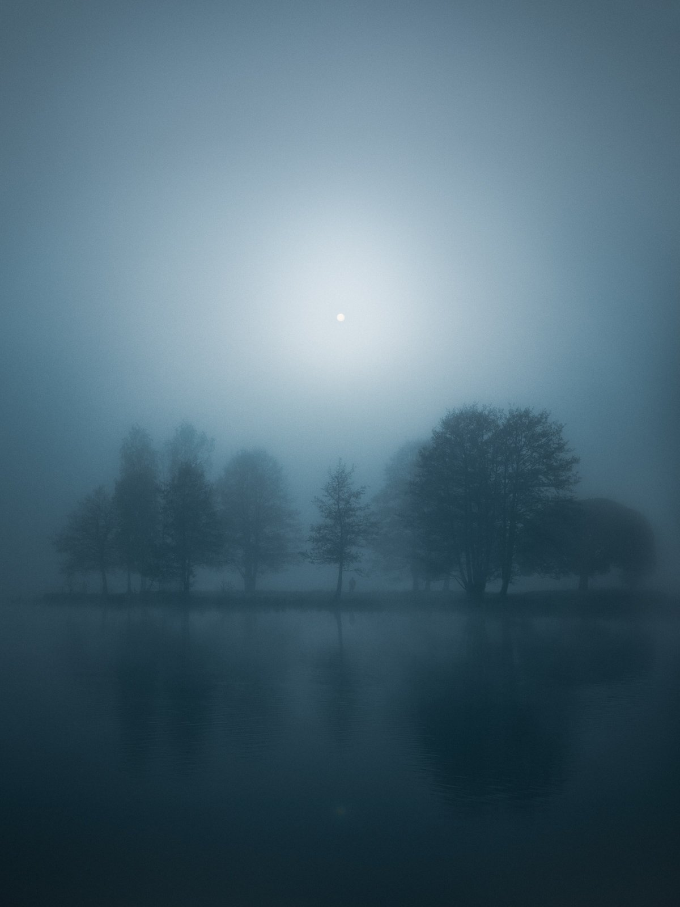
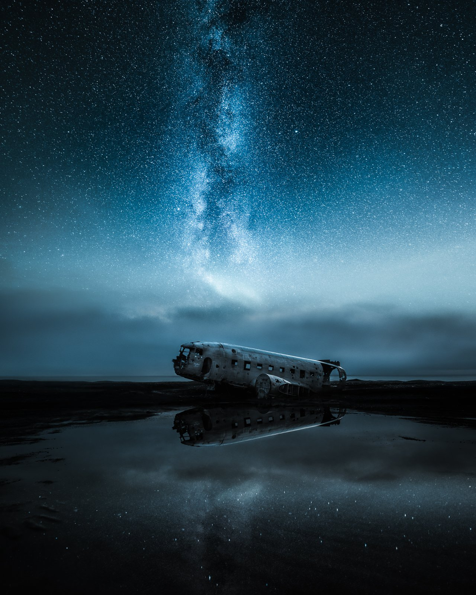
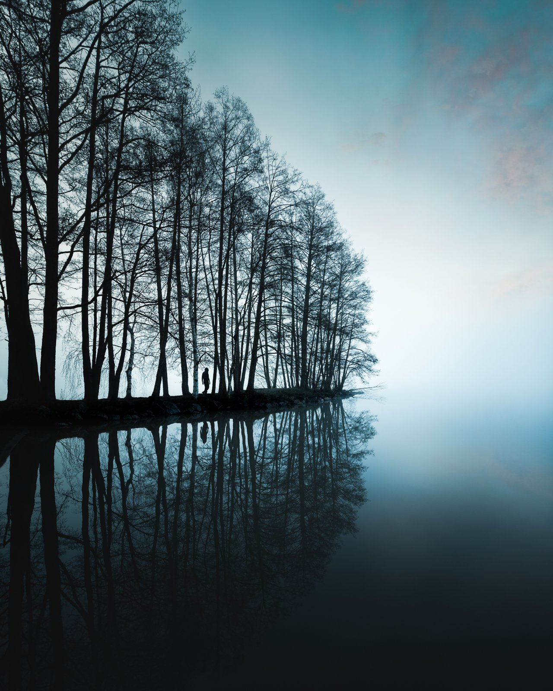
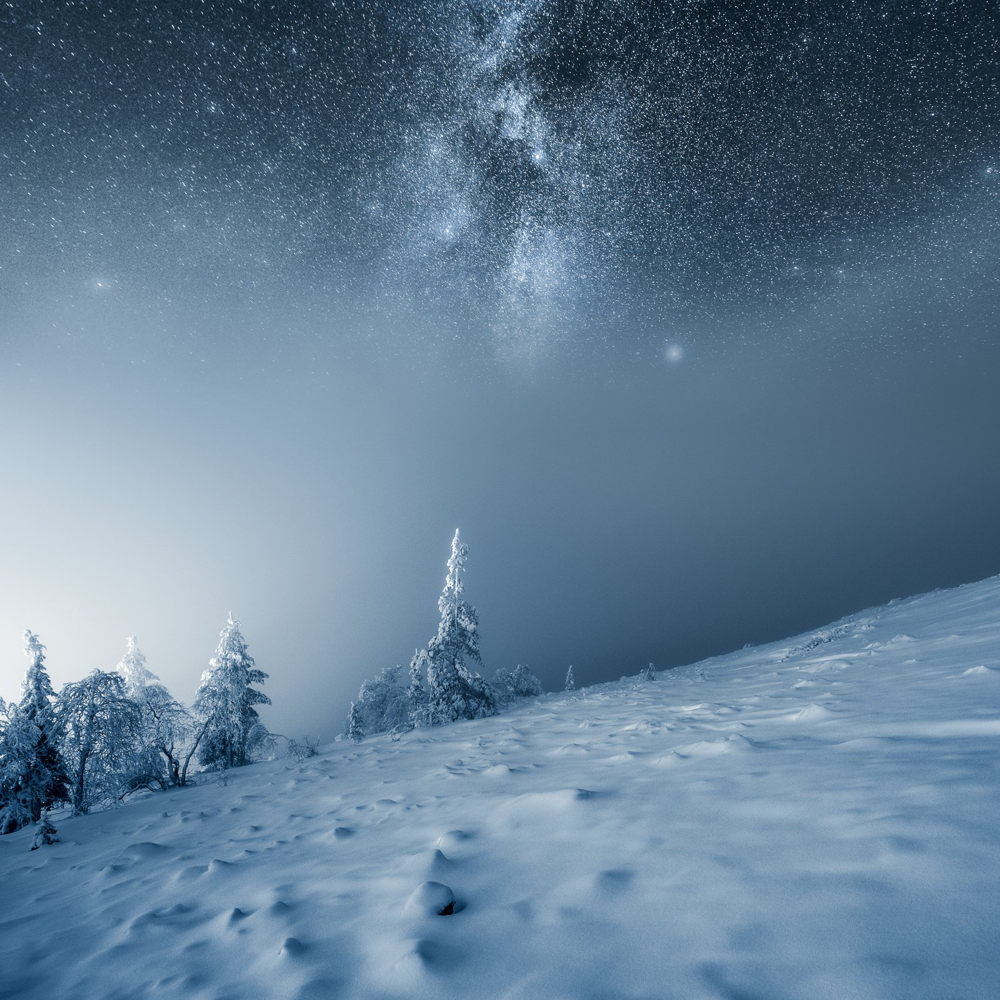

As a photographer, I have discovered that starting a project can help me channel my creativity and bring new dimensions to my work. A project can be a way to explore new techniques, themes, and perspectives, leading to personal and artistic growth. Currently, I am working on a new photography series that will challenge me to think more deeply about my craft and explore new horizons. While I cannot reveal my project, I encourage you to consider the benefits of taking on your own photography project.

A project can provide purpose and direction to your photography work. It can help you explore a specific subject or theme, experiment with different techniques, and improve your photography skills.

To inspire you, I have compiled a list of project ideas that can help you enhance your photography skills in various ways. These ideas cover different aspects of photography, such as exploring different genres and experimenting with lighting, composition, and post-processing techniques.

Selecting the right photography project can give new life and meaning to your work. It can allow you to explore new themes, experiment with new techniques, and help you take your photography to new heights. To help you get started, I have curated eight project ideas that can benefit photographers, whether you're a seasoned professional or just starting.

## **Project Ideas**

### 1. One Landscape, One Day

Capture a single landscape over 24 hours. This exercise in patience and timing, observing how light transforms the scene, is fundamental for mastering exposure and understanding the nuances of natural light.

### 2. Seasonal Series

Document the same location across different seasons. This long-term project highlights nature's transformative power and tests your commitment. It's perfect for studying changes in color, light, and weather. Below is my try at capturing this location in different seasons.

Here is an ongoing series of this beautiful tree I’ve captured with different seasons, from Autumn to the start of Winter to Mid-Winter. The only season missing is Summer. However, I’ve shot it multiple times and never really gotten anything special in summer.

[View fullsize
](https://images.squarespace-cdn.com/content/v1/63ceaffd33529a45e572bf90/1702892856712-HMYCDWNRI858X82805AN/Mikko-Lagerstedt-Balance.jpg)

Balance

[View fullsize
](https://images.squarespace-cdn.com/content/v1/63ceaffd33529a45e572bf90/1702892856402-XQ6T97Y17F4LCNUDHO8M/Mikko-Lagerstedt-First-Snow.jpg)

First Snow

[View fullsize
](https://images.squarespace-cdn.com/content/v1/63ceaffd33529a45e572bf90/1702892859648-5KO7VXF0EKFN2LQXG9K6/Mikko-Lagerstedt-Winter-Solitude.jpg)

Winter Solitude

### 3. Water in Motion

Play with shutter speeds to creatively capture water in its many forms - rivers, oceans, waterfalls, or rain. Experiment with silky smooth flows and dramatic frozen splashes, starting at shutter speeds like multiple seconds for a smooth flow to 1/500th for sharper captures.

### 4. Monochrome Landscape

Challenge yourself to see the world in black and white. This is an excellent exercise in focusing on contrast, texture, and composition and will deepen your understanding of tonal values.

*Shipwreck – Emäsalo, Finland 2013 – ISO 100, 35 mm, f/10, 689 sec. exposure. Captured with 15 stop ND-filter.*

### 5. Urban Landscapes

Explore the intersection of nature and the urban environment. This project can reveal cityscapes' often-overlooked beauty and complexity, enhancing your ability to capture natural elements in man-made settings.

### 6. Stories

Create a series with a narrative focus, like a collection of images where each tree tells a unique story through angles, lighting, and composition. This is an exercise in conveying emotion and story through your lens.

### 7. Cloudscapes

Dedicate your lens to the sky. Capturing the ever-changing patterns and forms of clouds is a dynamic way to practice exposure control and understand the interplay of light and atmosphere.

### 8. Reflections and Symmetry

Find and capture reflections in natural and artificial settings. This project is about finding balance and harmony, using water bodies, glass buildings, or other reflective surfaces to create symmetrical compositions.

[View fullsize
](https://images.squarespace-cdn.com/content/v1/63ceaffd33529a45e572bf90/1702909034057-I939B20NKXUUO5PEC78R/Mikko-Lagerstedt-In-Silence.jpg)

In Silence

[View fullsize
](https://images.squarespace-cdn.com/content/v1/63ceaffd33529a45e572bf90/1702909746408-NSV1WMYU4V2MMUUO2PBM/Mikko-Lagerstedt-Abandoned.jpg)

Abandoned

[View fullsize
](https://images.squarespace-cdn.com/content/v1/63ceaffd33529a45e572bf90/1702909032638-N46H6FZCV6P9JUBFIFXL/Mikko-Lagerstedt-Fav-12.jpg)

In The Early Morning Mist

These photography projects are designed to push boundaries and stimulate creativity. Whether you choose one or several, the key is to stay committed, observe, and enjoy the process of discovery and learning. Each project is a journey into seeing the world differently through your lens.

**I hope you enjoyed this tutorial, and if you did, feel free to leave a comment or share this with your fellow photographers or artists!**

## Subscribe

Sign up with your email address to receive new tutorials by Mikko.

First Name

Last Name

Email Address

Sign Up

We respect your privacy.

Thank you!

