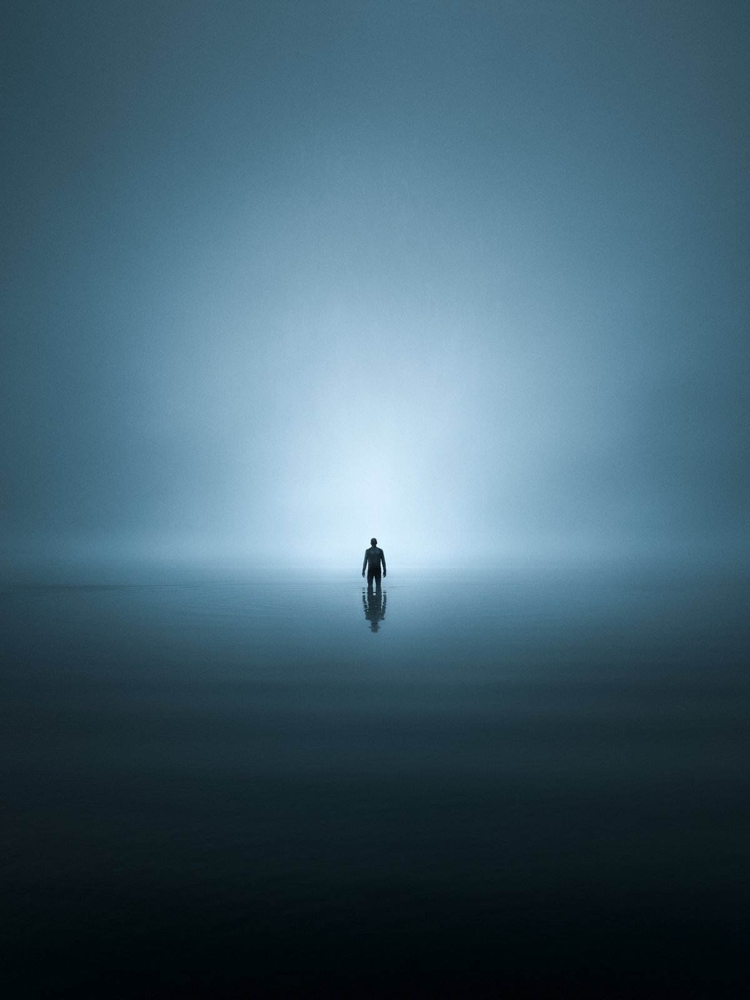

I wanted to write something different this week. Since it’s been very much a lot of misses on the photography part lately. Even though I have been photographing quite a lot recently, there are times when it just doesn’t happen, and you end up empty-handed.

Sometimes, I find it inspiring to reminisce about certain moments while out photographing. The morning I captured the “Morning Echo” photograph was one of those special moments. I left to photograph at this beautiful secluded beach at Päijänne Lake in Finland. My idea was to capture the night sky from this place, spend the night under the stars, and see what the morning would look like.

As I drove to the location, it was already getting dark. Going through the forest and finally arriving at the beach, the moonlight started to illuminate the horizon. It was a beautiful autumn night. I set my camera to take a time-lapse of the beach with the moonlight and stars. The time-lapse came out ok, but nothing special. But as the temperature dropped, the humidity rose from the warmer lake.

In the morning, I woke up before sunrise and explored different views from the location. The mist was already thick, so I was excited to capture different views. Finally, as the light was getting stronger, I went out to the water and tried to see if I could go into the frame and capture myself.

As I walked back and forth from the camera, I set a self-timer that would take nine images after 20 seconds, and I moved and stood in the clear and shallow water. Finally, I captured something I enjoyed.

Inspired by the feeling of solitude, I edited the image to look a bit darker than it was. Those little ripples in the foreground were perfect to give the view more atmosphere.

### Equipment, Camera Settings & Post-Processing

Nikon D810, Nikon 14-24 mm f/2.8 AF-S, and RRS Tripod.

ISO 100, 24 mm, f/8.0 @ 1/160 sec.

I edited the photograph in Lightroom. I made changes, such as adjusting white balance, exposure, and contrast, to make the image look how I saw the scenery. The colors were edited with the help of my [Preset Collections](/epic-presets).

I hope you find this bts post inspiring! Remember that the early morning is one of the most beautiful times of the day.

Mikko Lagerstedt - Morning Echo

How does it make you feel when you see the photograph? What type of emotions does it provoke in you?