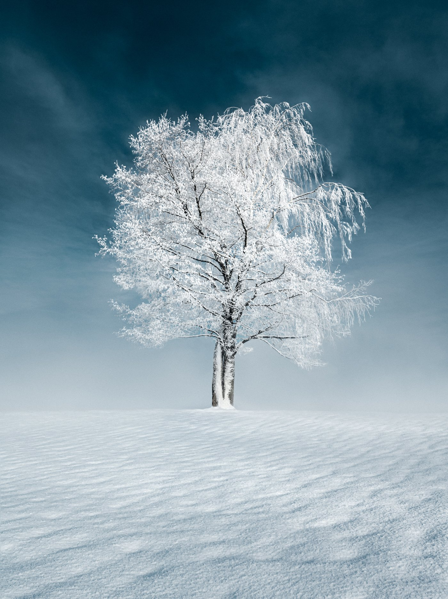
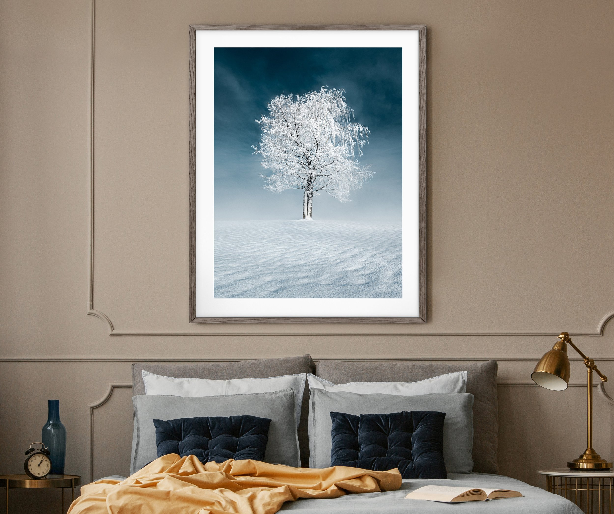

This week I wanted to share the story behind one of my favorite recent landscape photographs, Wonder. It was quite a cold morning. When I woke up, I saw the mist rise, so I headed out. I went around the nearby places and saw the mist rising on the lake. I had been waiting for the perfect shot of this majestic tree I had been photographing for years. I never was able to capture its full glory until that day.

As the sun began to rise, the frost-covered branches were illuminated by the cold morning light, creating an eerie and magical effect with a wonderful blue sky. One of those moments which reminds me why I do what I do. The feeling of being out in the cold, surrounded by the beauty of nature, is when I feel most alive.

If you look closely at the photo, you'll notice that it's not just one tree but two tangled together. This adds another layer of wonder and magic to the scene, making it even more special. It's like something out of a movie, and moments like these make me grateful to be a photographer.

I used a low angle to go near the smooth snow and get the perspective without distracting background elements. I love the frost on the tree and how the snow looks crisp yet smooth simultaneously.

[View the Print of this Photograph](https://mikkolagerstedt.com/print-collection/p/wonder)

Mikko Lagerstedt - Wonder, 2022 Finland

### Equipment, Camera Settings & Post-Processing

Nikon Z7 II & Nikon Z 24-70 f/2.8 S.   
1/160 sec. f/9.0, ISO 64 @ 24 mm

I edited the photograph in Lightroom. While there was not much distracting the view, I decided to remove one background branch from another tree, to make the tree stand out even better. I made minor changes, such as adjusting white balance, exposure, and contrast to make the image look how I saw the scenery. The colors were edited with the help of my [EPIC Preset Collection](/epic-presets).

This photograph is part of my new [2023 print collection](/print-collection), In The Solitude.

I hope this behind-the-scenes story helps you appreciate the beauty of this photograph even more. Thank you for taking the time to read it.

Until next time my friends, keep on creating!