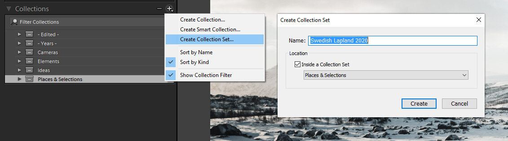

Organizing and going through your photographs after each shoot is one of those less focused aspects of photography, but I believe it is wildly overlooked. It’s an important part of the entire editing process. You must have an excellent system to approach editing intuitively, and that's why I wrote this tutorial.

I have worked with this approach for some time now and feel that it has helped me to organize my photographs and, in the end, create unique work. Even if you have a solid system in place, you might find some parts of this tutorial helpful. For a lot of photographers, the hardest part of photography is editing. A lot of questions raise about the editing process. Such as, how to know which photographs to edit? Where to start an edit? How to create unique looking images? I made this post as simple as possible with clear steps you can follow to create unique work. This tutorial is for those who use Lightroom CC Classic.

## 1. Organize

There are plenty of ways to organize your pictures. I use Lightroom Classic with various methods to organize my photographs, and here is how you can do it as well. Use Collection Sets to have neat organizing of each photoshoot. I recommend organizing your photographs straight after a shoot.

Rating images is a common way to organize photographs, but I find it hard with too many options. I mean how do you define a 2, 3 or 4-star photo? It is much easier to determine what photographs to delete, keep, and edit with a simple: reject, unflag, and flag system.

After importing new photographs to your Lightroom catalog. Create a new Collection Set with a name where the photographs were shot. Inside the set, create one collection with all the photographs from that shoot. Inside the Collection Set, make a new Smart Collection show the picked images after you have gone through all the images.

*Note from a reader:* When you have Caps Lock on, you don’t have to use the arrow keys to move between the images.

View fullsize

View fullsize

*Adding Collections & Collection Sets in Lightroom CC Classic*

Use the following smart settings: Match all

* Capture Date - is in the range – "select the starting date and end date when you shot the photographs."
* Pick Flag – is – flagged

View fullsize

*Adding Smart Collections in Lightroom CC Classic*

*Note: If you had multiple photoshoots on the same day in different locations with different types of images. Use colors to define what you want to put in each Collection Set and add a rule to the Smart Collection: Label Color – is – "and choose a color for each shoot." Then you must add colors to the shots from the photo shoot.*

## 2. Choosing photographs to edit

When taking photographs doesn't cost much, you shoot dozens of images from the same location and end up with hundreds if not thousands of images to go through. I often have a problem like this. Either I have too many photographs to go through, or I have too many similar-looking photos, but still, there are minor differences in them, so I don't want to get rid of any of them. What you can try to do in this situation is to go through all-new photographs and intuitively pick the images that are interesting to you. Don't spend a lot of time in the first pick. Go through the photos swiftly. Once you have set up the system in the first section of this tutorial, you can start going through the photographs.

Go to the Grid Mode with shortcut G and double click on the first image of the set. Use shortcut L twice to go to light out mode. Now you only see the current image with no distractions. Go through the photos with arrow keys, press either P, X, or nothing. Press X on the pictures that you want to reject and delete, rest of the shots that are ok, but not really anything worth of working on straight away leave unpicked. Use P to flag all the images that you find interesting and want to start editing. If you made a mistake, go back to the image and use shortcut U to make it unflagged.

Now that you have selected multiple photographs that you find interesting. Don't waste too much time figuring out what to work with instead choose one that pulls your interest the most based on your gut feeling. Remember, we are working with our intuition. If you find it hard to focus on an image, hide the filmstrip in Lightroom.

*Lights Out Mode in Lightroom CC Classic (Shortcut L)*

*Note: You can change the colors of the background of the Light Mode from   
Edit > Preferences > Lights Out > Screen Color > Black.*

## 3. Start the editing process

How to know where to start the editing process? I bet you have been in a situation where you have no idea what the first step in the editing process is. I have been uncertain about my edits many times. That's why Lightroom presets are so popular; they can give you a base to work. I guess we are used to doing things the easy way. Instead of using presets straight away, try to focus on the feeling you had at the moment you took a photograph. In this way, you have a solid base on where you can go with the edit. Having a clear goal of how you want an image to look is a great way to start the edit. No, I don't always have a clear picture in mind when I start an edit. And many times, the whole image might change in the process.

**Here are questions you can ask yourself to guide the edit:**  
How did it feel when you took the photograph? Was it cold or perhaps hot? What colors did you experience? What emotion did you experience? Was it dark or bright? What did you think when you captured the image? What do you see in the picture right now? What type of feeling do you want to provoke with the photograph?

Start by going through the settings from the basic settings always to color settings. Go with the gut feeling, and don't focus on rules, settings, or anything that might put you into a more analytical mind. Sort of feel the image and how it felt when you took it. Most of the unique edits come from a state of discovery and creativity. Not by editing to match the colors correctly using the histogram or by having the perfect exposure with no clipping and so on.

Once you have done an edit and you are not quite sure if you like it. Why not try it again and this time again feel if the image provokes emotion, or could you make an opposite edit? You can create a Virtual Copy and reset it and try again. You can make duplicates by right-clicking on the image and clicking "Create Virtual Copy."

*Right Click to Create a Virtual Copy in Lightroom CC Classic.*

## 4. Experiment with Lightroom presets

If you are stagnant and don't have a clue what to do with your photograph, start experimenting with Lightroom presets. Using presets is a great way to figure out what works for your photograph. For example, when I experiment with edits, I scroll through my [Atmosphere](/phase-presets) presets and figure out if any of them suit the image. If I find one that looks good, I might tweak it and make a duplicate of the image with the Virtual Copy function and see if any other preset works for it as well. Usually, if the image is good, there might be plenty of presets that work with it. It's sometimes hard to decide which one to choose. In this process, I feel them out and then go with what feels best for the photograph.

## 5. How to know when the edit is ready?

I sometimes lose myself in the process of trying to perfect everything, and that will make me feel overwhelmed and lose interest in the picture I'm editing. I guess there are no rules that you can make to know when the image is ready. What I have found to work is to take breaks on the editing and then go back to the image and look at it with fresh eyes. You might catch something you never saw before the break. If you have done duplicate edits of the image, go through them with new eyes as well. I recommend looking at the individual edits once at a time and again use gut feeling to decide which one you prefer and want to share. Don't try to overthink the edits; instead, do the selecting part quickly.

View fullsize

Desolation, Mikko Lagerstedt – Swedish Lapland – 2020

Alright, that's it. I think we covered a lot of things to consider when editing images. I hope you find the tutorial helpful! Let me know what type of process you have for your photographs.

## GET THE LATEST CONTENT FIRST

If you like this post. Subscribe to be the first to receive fresh new tutorials straight to your inbox!

First Name

Last Name

Email Address

Subscribe

We respect your privacy.

Thank you!