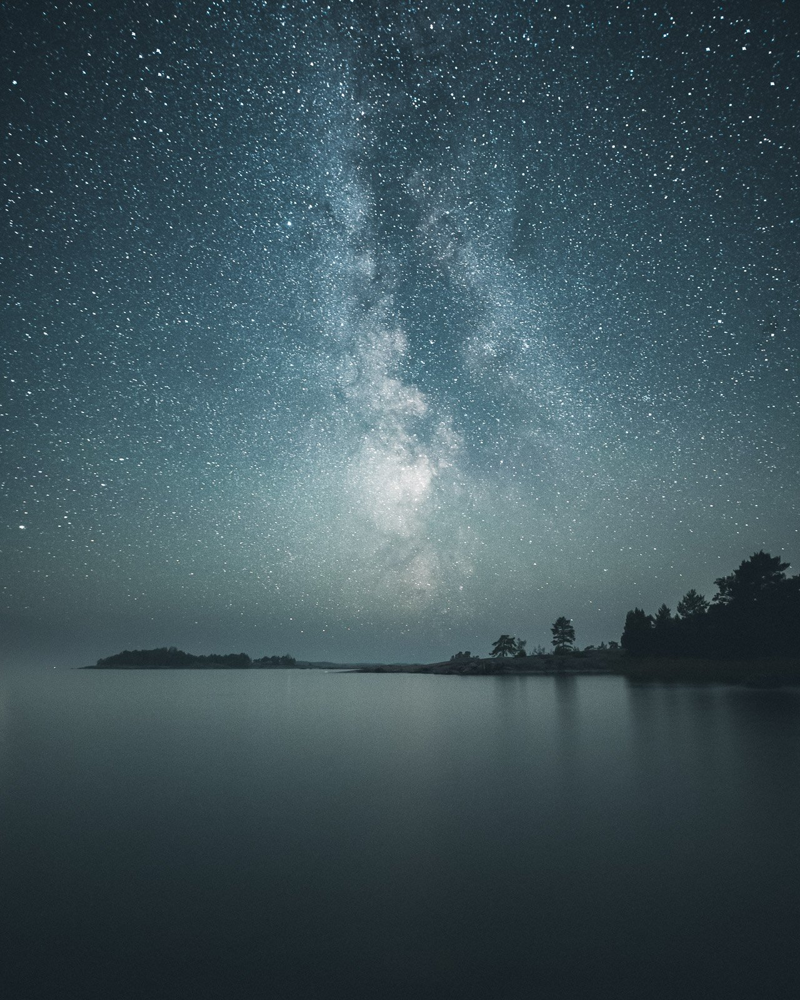
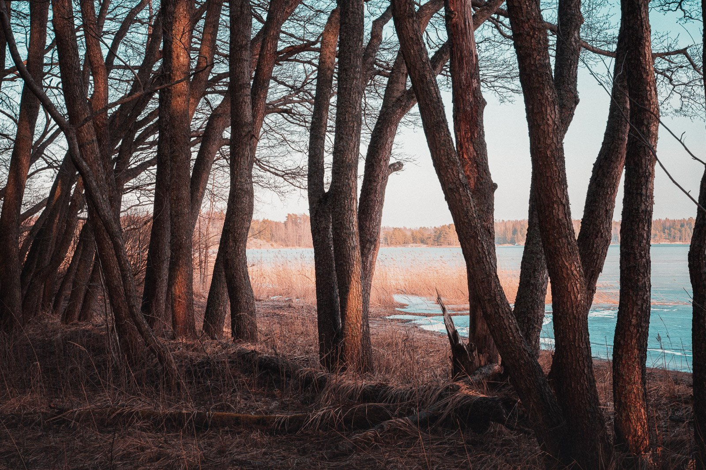
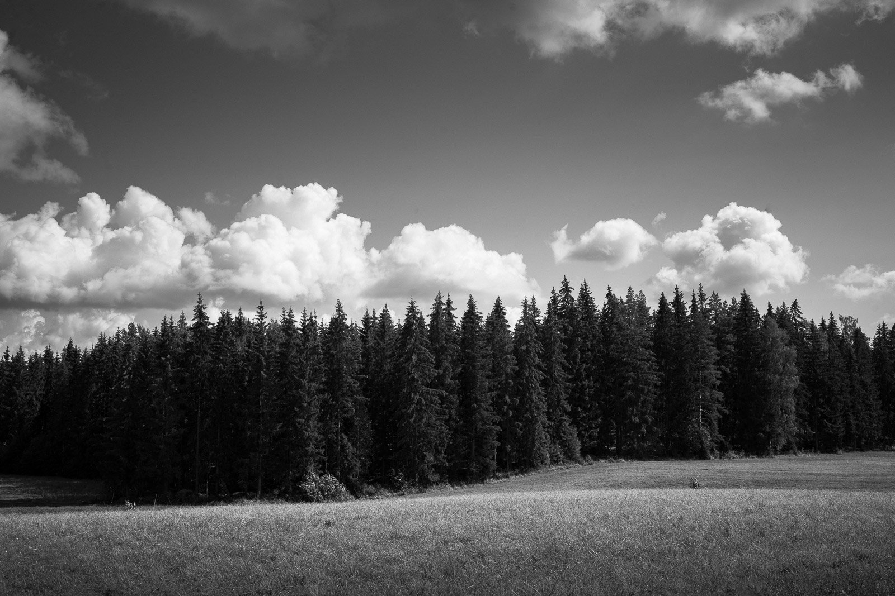
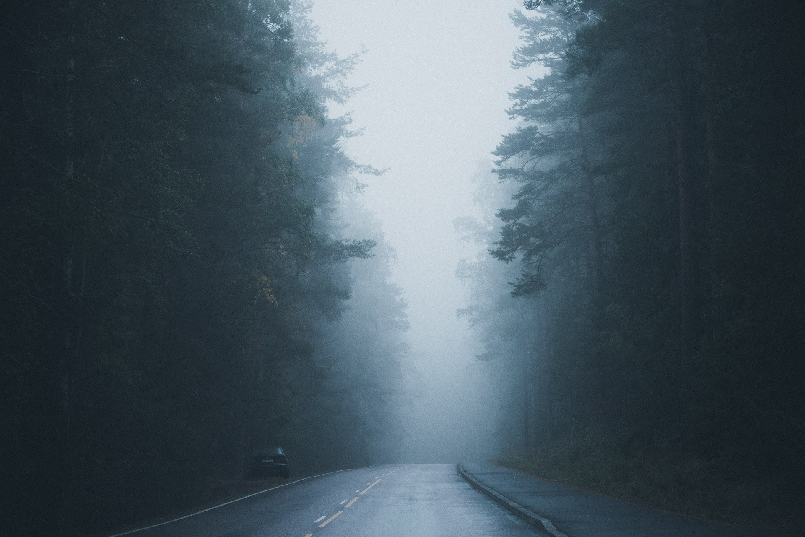
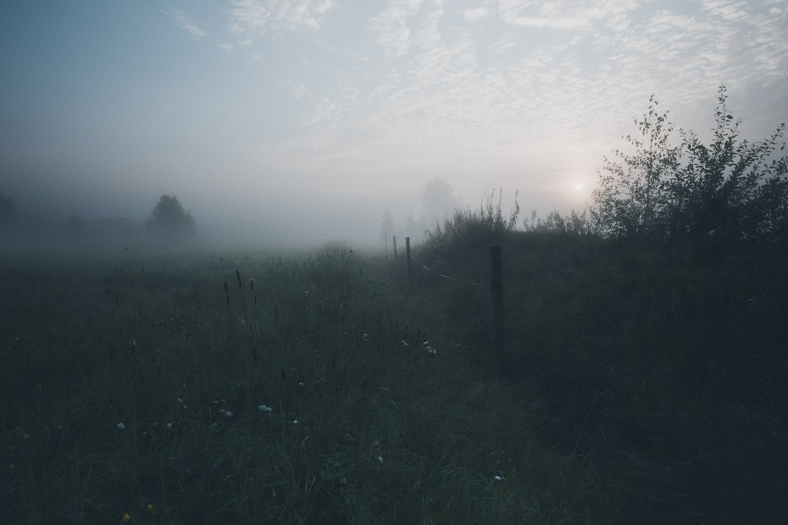
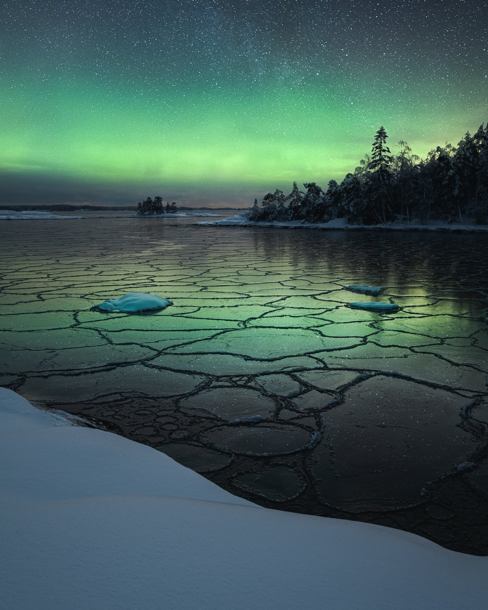
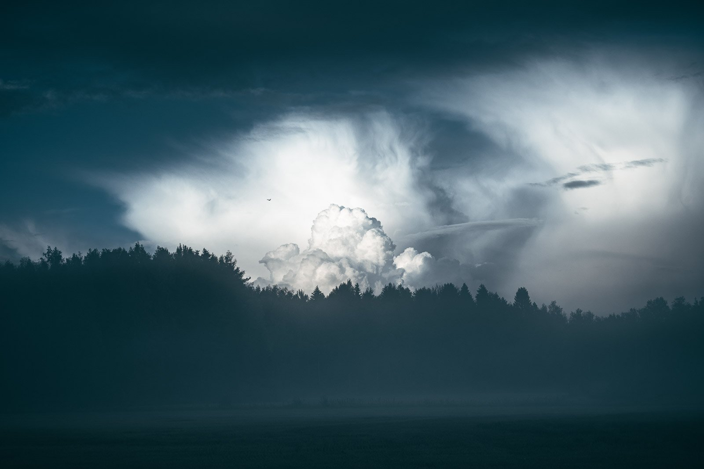
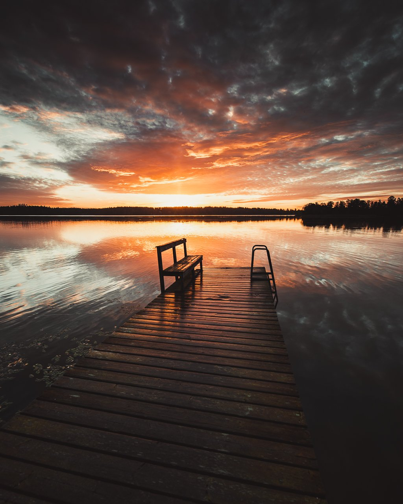
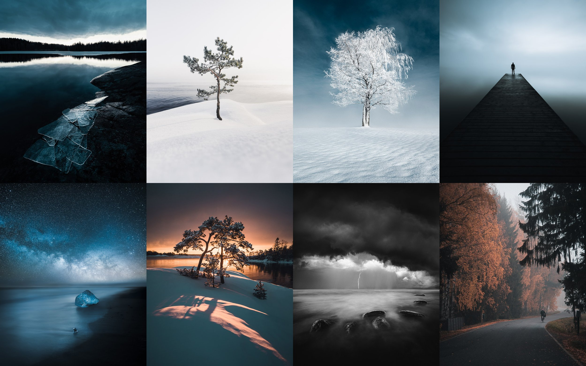

Today, I'm thrilled to share the new 2023 update to The EPIC Preset Collection. So, in this article, I'll be going through The EPIC Preset Collection. With the help of these updated tools, I can make easier selections and enhance my photography adjustments and editing to bring my vision to life easier than before.

If you already have [EPIC Presets](/epic-presets), you should have received an update in your email.

## What is new in the 2023 EPIC Preset Collection?

How can you make the most comprehensive collection even better? By experimentation and with a passion for creating unique tools to help others. I believe the new updates suit perfectly for different styles and give you the tools to turn your images EPIC! Implementing the AI Masks to a collection this complete is the perfect way to make it even better.

* **Two New Preset Collections**: Cinematic and Black & White.

  + The Cinematic Preset Collection includes 17 unique, highly stylized colors and looks to give your photography a cinematic feel.
  + The Black & White Preset Collection includes 15 unique B&W EPIC presets to use in different styles of photography.
  + All of the EPIC presets are fine-tuned to suit different types of landscape photography.
  + Create dreamy looks with single presets, or make them your starting point.
* **AI-Powered Selections**

  + This collection of presets uses AI to make intricate editing easier.
  + Use the sky AI masks to make your landscape more balanced and add depth.
  + Make your night sky photography epic.

If you want to see how it works in real life, check out the video below. Note that these are just quick edits and if you would like to see more edits with The EPIC Preset Collection, let me know!

[View fullsize
](https://images.squarespace-cdn.com/content/v1/63ceaffd33529a45e572bf90/1682352586203-7DCHCPVUMQ6KRV2O44RW/Mikko-Lagerstedt-Night-Epic.jpg)

[View fullsize
](https://images.squarespace-cdn.com/content/v1/63ceaffd33529a45e572bf90/1682352590419-R2U1SAZHRE13KAHKSUZJ/Mikko-Lagerstedt-Trees-After.jpg)

[View fullsize
](https://images.squarespace-cdn.com/content/v1/63ceaffd33529a45e572bf90/1682352588191-C11HHSP990WWJ678JOGW/Mikko-Lagerstedt-Field-After.jpg)

[View fullsize
](https://images.squarespace-cdn.com/content/v1/63ceaffd33529a45e572bf90/1682352585804-ENTB9TM1EEMOMH6DA4J1/Mikko-Lagerstedt-Mood-2.jpg)

[View fullsize
](https://images.squarespace-cdn.com/content/v1/63ceaffd33529a45e572bf90/1682352587432-4C5AGGYYS8ONBOUTBPD7/Mikko-Lagerstedt-Dream-After.jpg)

[View fullsize
](https://images.squarespace-cdn.com/content/v1/63ceaffd33529a45e572bf90/1682352592794-KLLANSYGDCNQRK59TFOE/Mikko-Lagerstedt-Au.jpg)

[View fullsize
](https://images.squarespace-cdn.com/content/v1/63ceaffd33529a45e572bf90/1682352586804-K2LXT7X9CMQ94PGF3BBJ/Mikko-Lagerstedt-Clouds-After.jpg)

[View fullsize
](https://images.squarespace-cdn.com/content/v1/63ceaffd33529a45e572bf90/1682352614986-BHJ961DMAK2Y4M3X2D0O/Mikko-Lagerstedt-Sunset.jpg)

## **What is the EPIC Preset Collection?**

It is by far the most comprehensive collection of presets for landscape photography. Since day one of my photography journey, I have been intrigued to find different solutions to use in my own photography. To make the editing process intuitive, I created the EPIC Preset Collection. It’s more than just a preset collection. It’s a complete system to edit your landscape photographs. The presets work in Adobe Lightroom CC, Classic, and Camera RAW.

* **Over 500 Presets**

  + Neatly organized to make your editing intuitive and EPIC.
  + From subtle to intense effects.
  + Easy apply filter presets.
* **8 Different Starting Preset Categories**

  + Blue Hour, Fog, Forest, Night, Overcast, Sunrise & Sunset, Black & White, and Cinematic.
* **Easy 10-Step System** to get the best out of your landscape photography.

  + Each step is easy to follow, along with the video guide provided with the presets.
* **Save time** and ensure **EPIC results**.
* Enhance the aesthetic of your landscape photography with different colors, tones, and overall adjustments!
* Quickly achieve professional-looking results and be more creative with your photography and editing.

For more information about the EPIC Preset Collection, visit [here](/epic-presets).

So what are you waiting for? Unlock your editing today and get the EPIC Preset Collection!

# [The EPIC Preset Collection](/epic-presets)

*All of the above images were stylized and edited with the EPIC Preset Collection.*

## Subscribe

If you enjoy this post, SUBSCRIBE to be the first to receive **fresh new tutorials** straight to your inbox!

First Name

Last Name

Email Address

Subscribe

Thank you!