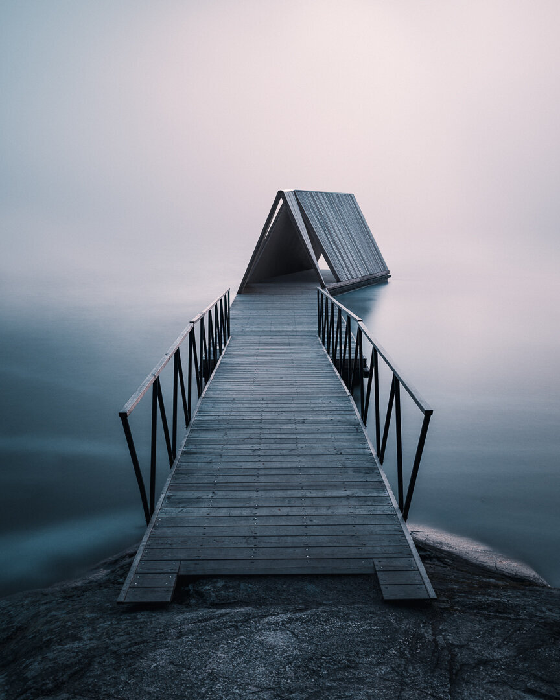

There are excellent guides where you can learn techniques and compositional rules in photography; however, there are not many guides that give you advice on how to create a unique style. That's why I decided to write this tutorial from the experience I have had in photography. I believe that anyone can create a unique vision and style, but it takes time and self-awareness.

If you don't know much about the gear you are using, I recommend you get familiar first with the tools you want to use in photography. Learning your equipment throughout and developing style are not necessarily things that go hand in hand, but I find it essential first to know how to use the equipment you have and then figure out a style as you progress.

## 1. Experiment

When you start to get familiar with photography, try to photograph anything and everything. Experiment with different subjects and styles. As you are experimenting, try to capture the subject in the most beautiful way you can. If it doesn't work out as you planned, then you find ways to improve. Maybe you want to capture a beautiful landscape with great depth, and you end up with a flat image. Analyze the photograph and see what might be the reason it looks flat and make notes. It's essential to be aware of how you would like your pictures to look, and with analyzing, it's easier to get better quicker and find your style in the process.

As you progress and have experimented with every photography subject, you start to gravitate to a way you want your photographs to look like and therefore create a unique style.

## 2. Find Real Inspiration

Don't follow anyone because of how many likes or followers they have. Gravitate towards real inspiration—photographers or artists whose work makes you feel something. When you look at their work and wish you had captured the shot, that's when you have found real inspiration. Focus on photography, not on the photographer. Back in the day, when I started photography, there were not many places that you could find inspiring artists. Therefore I never looked at someone's photographs and thought, "wow so many likes." I just focused on photography, nothing more. Detach yourself from the likes and comments, simply look at the work. The likes will come if you first follow your inspiration.

If you are reading this, maybe you enjoy the way my work looks, and you are already getting inspired by other photographers. However, it's essential to know what makes you enjoy a photographer's work. You can try and take something out of each photographer's work who inspire you and mix things and create a unique style. Don't copy anyone's work; instead, get inspiration and merge the things you find inspiring into your style. Remember that your style is always evolving, and you must grow and find new ways to motivate yourself, to keep on learning. Don't hesitate to go and find inspiration from painters, designers, or other artists as well.

Once you find inspiring photographers, find out if they provide tutorials and tips on how they took some of their work, and immerse yourself with that style for a while and you can see how it start’s to affect the way your photography looks.

**Analyzing photography tips:**

Ask yourself the following questions when you find an inspiring photograph.

* What time was the photograph taken?
* Where was it shot? Do you like the location, and why?
* What type of technique was used?
* What is the main subject?
* What do you like about the colors?
* What can you say about the post-processing?
* How could you achieve a similar photograph?

If you want to create a list of inspiring photography/art/music, check out my earlier tutorial: [*Stay Inspired*](https://www.mikkolagerstedt.com/blog/2018/6/9/stay-inspired-create-a-catalog-of-inspiration)

## 3. Practice with intention

As you have learned something out of someone who creates inspiring work, it's time to put it in practice. You can read books, watch tutorial videos all the time, but if you don't put it in action, it doesn't work. You have to put in the hours. Pick a subject and focus on it with intention. If you are internally motivated to photograph, you can easily spend days photographing before getting bored.

Try out different equipment, focal lengths, and settings. If you have a limited budget as most of us do when we start the art of photography, lend a new lens or camera and try it out. If a particular look inspires you, maybe it's shallow depth of field. Go and find a lens to get that look and try it out and see if you can create those types of shots.

## 4. Challenge yourself

As you get better and better, try and challenge yourself, and create daily challenges that inspire you to try out new ways to photograph. Here is a list that helped me to create unique work.

* Photograph a day with only one lens
* Create one exciting photograph today for yourself
* Learn a new style of photography each week
* Take pictures in bad weather
* Take photos in the middle of the day
* Use a long exposure to create a different look
* Use the rule of thirds to capture a landscape
* Capture low light photographs

Capture images with the following subjects

* Reflections
* Landscape
* Waterscape
* Motion
* Lines
* Stars
* Color: blue, red, orange
* Mood: dark, bright

You can create as many as you want and check them off and move to the next one.

Spring in Finland I, 2020 – Tuusula, Finland – Mikko Lagerstedt

Spring in Finland II, 2020 – Tuusula, Finland – Mikko Lagerstedt

Isn’t it funny how a view can change in a matter of hours? Both of the photographs above were taken a few days ago. Talk about Spring in Southern Finland. The first one taken earlier when it was rather warm and the second the day after when it had snowed a lot. Snow has since melted and it’s starting to look like a real spring again. Both were captured with the Nikon Z7 and Nikkor 14-24 mm f/2.8 with a 10-stop filter. Edited with the [Atmosphere](/atmosphere-presets) preset collection.

On a side note: about a year ago, I found myself uninspired to create photographs. I'm writing about my experience and how I finally learned to overcome my creative rut—a guide on how to reignite your love for photography. If you are interested in this guide, let me know in the comments down below, so I'll then know if I should keep writing and share my knowledge with you.

I hope you enjoyed the tutorial. Stay safe, and take care of one another!

## GET THE LATEST CONTENT FIRST

If you like this post. Subscribe to be the first to receive fresh new tutorials straight to your inbox!

First Name

Last Name

Email Address

Subscribe

We respect your privacy.

Thank you!