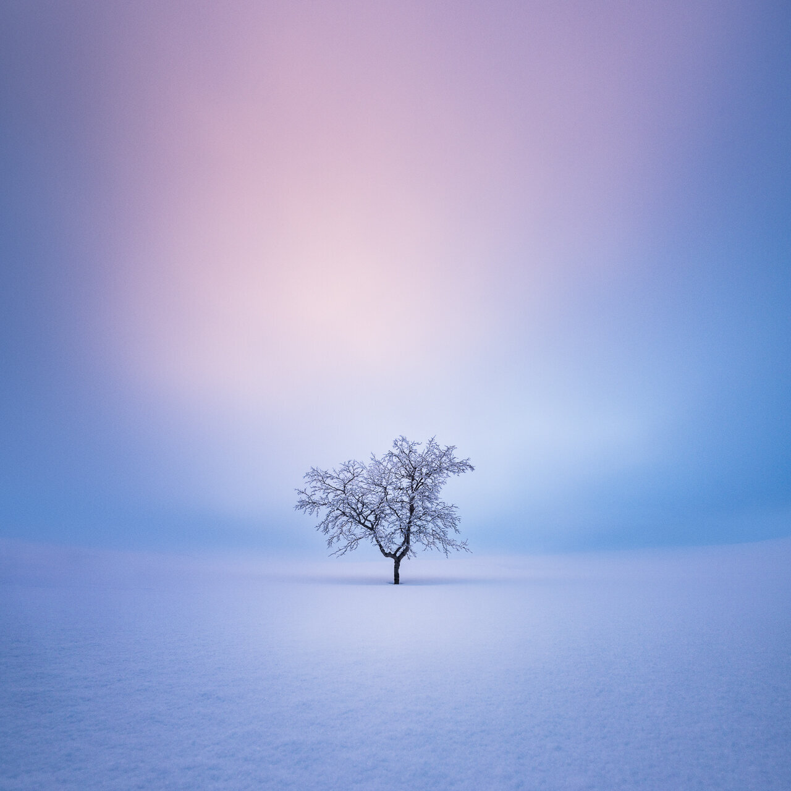

I originally wrote this guide before my back surgery last autumn. It’s a self-development guide for creatives who want to create more and inspire others. How to get out of a creative rut and reignite your love for arts. First, I thought I would make an eBook out of it, but as I don’t want to spend hours editing a book, I’ll share it here on my blog. Enjoy, and as always, you can share and comment on it if you find it useful. It means the world to me!

In this guide, I will go through the things that have helped me overcome a lack of motivation and reignite my love for photography. I have been severely affected by a lack of inspiration and motivation towards photography in the past. It hit me sometimes hard, and other times it just lingered in the background. Finally, I have learned the steps that have helped me to overcome creative rut and get back my internal motivation. In this guide, I walk you through each step of the way to find motivation, creativity, and enjoyment in photography.

I have been a self-development enthusiast for the past seven years, and it has been hugely beneficial for me in search of my inner motivation in photography. I have tried many different things, and in this guide are the ones that work for me and for photographers I have interviewed who have gone similar paths.

In this guide, I don't just brush through motivation as something that is outside of you. Instead, we go deep in self-development and how to find your way through the other end—hopefully more inspired and motivated than you have been in a long time.

I wrote the guide to share my experiences and teach you the solutions I found working for me, so you don't have to make the same mistakes. I wouldn't say I liked the feeling of losing my motivation towards photography, so if you are in that place, I want to help you overcome it. If you are in a creative rut, you can use these tools to reignite your creativity. I know some of the things I'm sharing might feel over the top, but these things have worked for me, and you should be open to trying different things if you have lost your way. I'll also share my favorite books in the last part of this guide, where you can research and learn more about these topics.

*Solitude – Mikko Lagerstedt*

# **1. Break old patterns**

If you want to change the situation you are in right now. It would be best if you started within yourself. It would help if you had a new perspective, and self-awareness is the starting point. If you don't know where you are at this moment, how can you improve your situation? When you are aware and accept that you have lost your inner motivation, it's much easier to start figuring out what you can do differently. You don't need to dwell on where you are now. Acknowledge that this is your situation and focus on what you can do to improve it. If you don't do anything about the lack of motivation, you will start to procrastinate and question your love for photography, and if it has been a big part of your life, you start to question your passion for life in general. Try to get yourself out of the loop of self-doubt.

I lost myself in the loop of self-doubt a few years ago, and it has taken me a long time to get where I am right now. I don't feel that I have mastered self-awareness, but my perspective has changed, and my internal motivation is back. I was searching for it for a long time. It wasn't completely gone; instead, it was buried in the old patterns and beliefs I had created for myself. The first step was to be aware of my feelings and thoughts. Every time I took photos or edited my photographs, I tried to be more aware of my emotions or thoughts and observed them negatively or positively. My self-talk was often very poisonous. No wonder I felt terrible about photography and lost my motivation.

*Try to feel if your thoughts surrounding your creative art have been negative or positive. Do you feel that there is pressure to create from outside of you?*

I think my negative self-talk started some time ago. It may have started from the work I was creating. If you are a perfectionist like me, it's hard to be positive about your work if you make mistakes or if people don't enjoy it as much as you thought they would. It's like a negative spiral: you start to feel awful about your work, lose momentum, and so the negative self-talk begins. If you have low self-esteem, social media can be a difficult place to be. Don't let anyone or anything prevent yourself from creating the things you enjoy the most.

At first, I tried multiple different ways to solve the feeling of inadequacy. I forced myself to photograph every day. I forced myself to wake up at 3.30 am every day for three months. I forced myself to be brutally strict to achieve my goals and plans for the day. If I didn't do or achieve the things I had planned, I despised myself. I forced myself to do many things that didn't help my confidence or creativity at all. It just made me feel bad, sad, tired, and on edge. I was not happy at all. Forcing myself to do things did not work for me. And it probably won't work for you either.

In my journey to reignite my love for photography, I had to break my old habits on how I looked at photography. When I first started photography, I wanted to create the most beautiful photographs there are. Not that I have any shape or form accomplished that, but it was my inner dialogue for a long time. Somewhere in my journey, I lost the plot. I wanted to reignite that feeling of creating something beautiful and inspiring.

*Do you remember why you started photography? Have you lost your way? Can you reignite that spark of inspiration? We will talk more about goals and intentions in the next chapter.*

A practice you can start doing straight away, which is an excellent way to be more aware of your thoughts and feelings, is journaling. It's simple and highly effective. I recommend you do it every day, at least six days a week. Write one page every morning to your journal, and let yourself write anything on your mind. Leave the internal filters off and write. The reason you do it is not the writing per see. Instead, it's the part where you realize that you are not your thoughts, and eventually, you become more aware of your self-talk, thoughts, and feelings. It is the first step in breaking old thought patterns. Think of the journal as a safe place for your positive and negative thoughts; you can write whatever you want. As you do it daily, you start to see how it can relieve you from those looping thoughts in your head. When you get that junk out of your head, you have more space for creativity and pleasing thoughts.

*It would help if you didn't read your journal; it's not why you write it, and going back to your old thoughts and feelings can set you back in your process.*

> “Productivity is never an accident. It is always the result of a commitment to excellence, intelligent planning, and focused effort.”

— Paul J. Meyer

If you want to take journaling to the next level, have it with you all day and write down whenever you feel overwhelmed, sad, or angry. Leave your anger to the pages and move on with your day.

Another practice to be more aware of your thoughts and feelings is meditation, which is highly regarded in the self-help community. The benefits of meditation cannot be overlooked. Studies have shown that it can help you boost creativity and make you healthier and overall happier. Meditation has been part of my life for about seven years, and I switch different meditation practices from time to time. Meditation is a powerful practice, but in my opinion, it is not a solution to every problem you have. It can be a catalyst for change and increase creativity, but it can start to feel like a chore you have to do each day if you don't fix your act altogether.

Every morning I start my day with a 10-25 minute meditation. My current meditation practice is simple, focusing on the breath and releasing my thoughts.

Instead of doing more than one extended meditation every day, you can start with mini-meditation breaks throughout the day. A simple one to two-minute reflection in between your daily tasks is a great way to check in with your feelings and thoughts and remind yourself to be more aware of the moment.

*Mini-meditation practice: close your eyes, take a couple of deep breaths and release your emotions, and move your awareness to the next task and set an intention on how you want to show up in the next segment of your day.*

### Breaking negative thought patterns

* Use meditation, journaling, and mindfulness practices to be more aware of your thoughts.
* Set an intention to break those thought patterns every time you feel bad.
* Observe your self-talk: If it's negative while photographing, try to play through the negative thought. And when you have played it through, find a perspective where you create a different and more inspiring outcome to your view and situation.
* Repeat the process as many times as whenever you feel bad. Eventually, you will be releasing the old behavior and are a step closer to reignite your motivation for photography.

*Late Night Meditation – Mikko Lagerstedt*

# **2. Set goals that inspire**

The limitations you have set for yourself are not the truth, and those self-damaging thoughts can be broken when you don't follow old behavior patterns. You can break through those patterns with self-awareness as we went through in the last chapter, and the next step is setting inspiring goals.

When you first start photography, it's easy to learn new things and ways to be a better photographer, but as you learn more, it gets harder and harder to find ways to improve. You might think to yourself that *"I already know so much; how could I possibly learn more?"* It's is, of course, not true; you just have lost the way to grow and develop new skills. If you lose the aspect of growing as an artist, things will become dull and unenjoyable. Growing is what we do best. If you can't grow, you feel uninspired to do anything. There are always ways to improve. You must be more conscious of the opportunities for growth to happen.

My overall goal is to have an impact on people. It's the thing that inspires me in this quest we call life. For a long time, I believed that having goals was something self-centered. I needed to break that belief because goals can give you inspiration, motivation, and joy. You can feel much happier if you feel a sense of purpose towards whatever you are doing.

If you ask the authors that have written about happiness, having a purpose or mission in life is one of the most important things you can have to be happy and fulfilled. It's common to feel that you have no purpose, and when you are in this state, everything seems pointless. In my opinion, you need to develop a passion. It's not something you are born with necessarily. I don't believe your mission has to be such a grandiose thing that you have to matter or that you must be the one who inspires others or whatever it is. Your first job is to find what makes you do things that inspire you at this moment. It starts with clarity and knowledge of where you want to be in the future.

> If you lose the aspect of growing as an artist, things will become dull and unenjoyable.

How can you find meaning in life? As Emily Esfahani Smith talks in a TED talk called: There’s More to Life Than Being Happy. Studies have shown that there are four different aspects of meaningful living. The first one is belonging. Belonging comes from relationships with friends and family who respect you as who you are intrinsically and where you respect others as they are. True belonging comes from love, and it’s a decision. The second is purpose. Finding a purpose is not the same thing; it’s less about what you want but what you give. The key to purpose is to use your skills to serve others. The third is transcendence. Those are the moments where you lose a sense of yourself and feel connected to a higher reality. It can come from different ways; some achieve it by looking at art, some might feel it when they create something like photography. Some find it by writing. The fourth aspect is storytelling. The story you tell yourself about yourself. Creating a narrative of your life creates clarity, and it helps you understand how you became you. Most people don’t realize that you can edit, reinterpret, and retell your story. It’s about perspective.

Having inspiring goals that root yourself in the present moment is the key to happiness and success. There is no point in living in the future or past. Choose to focus on your future by living in the moment. Remind yourself daily why you do the things you do, and it will inspire you to focus on positive things. There will be setbacks and hurdles, but you will be at peace no matter what happens when you feel encouraged to conquer those challenges.

I have had a lot of self-criticizing thoughts about what I should be doing and what inspires me. Because of my learned way of thinking as a perfectionist, it has been hard for me to accept where I'm at moments. Even when I'm writing this, I feel an inner pull not to share this stuff because some part of me tries to keep this information for myself and wants me to be safe and not feel vulnerable. But screw it, I don't want to live by "my" limitations. I want to share my knowledge, even if it is slightly unconventional or if I feel it makes me vulnerable.

About a year ago, I almost convinced myself that I don't want to photograph anymore. But in me, there was this underlying feeling that it was not the truth. I was lying to myself. It all was due to a lack of goals and aspirations. I had many conflicting thoughts about traveling and photography in general. As I don't want to harm our beautiful planet, I convinced myself that I don't want to travel at all anymore. But it is not the truth. Instead, I can make a more conscious decision towards traveling and what's right for the planet. Because I enjoy traveling, and I enjoy the feeling of seeing something new and different, I must continue to bring more experiences like that into my life. I prefer to choose other ways to travel than flying. If I fly, I try to select the best possible way to do so and compensate for it.

Instead of being overly critical of what you can or can't do, create goals that are inspiring. Give you the spark you have lost on your way. You can dream a little. How do you want to feel? Make that your desired goal. It's essential to be open to new sources of inspiration. Ask yourself the tricky questions. What is the desire you want to achieve in photography? If you had all the money, you needed what places you would travel and capture? If you had all the time, you needed what skill you would learn? If you had all the connections and work required, where would you want your photography to be exhibited? The questions you ask will determine your goals and desires. After you have at least five things you want to achieve in the next year to ten years, think of ways to reach those by being true to yourself. Being true to yourself is crucial. What does it mean? Well, if you don't want to harm the planet, for example, be creative and find ways to travel without flying. You don't want to have conflicting goals. It's not about the goal; it’s about how you want to feel when you get there.

Your process is not linear, and the path you have chosen as an artist is not the only way. How can we get better and set inspiring goals? Challenge yourself to do things outside of your comfort zone, skills that you never knew you could master. Set a goal to learn a skill that you have wanted to try out. Why wait? Just start! You won't be good straight away; you must put in the work to be great at it. If you don't start to harness new skills, you won't grow. In the end, what you want to create in your life comes down to the goals you have set for yourself. Let yourself dream and set goals that are inspiring and true to yourself.

Remember that if you don’t believe that you can achieve a goal you want. It’s not going to happen. So, how can we make ourselves believe we can achieve something? It’s not easy, and that’s why it’s much easier to create goals that feel achievable. You can have huge life goals, but if you don’t experience something that makes you feel that you can achieve those, you start to feel pessimistic and depressed.

The way you have lived until this day has shaped how you think about certain things. If success or confidence are things you think you are born with, you have a fixed mindset. You have to have a growth mindset to reach those goals that you thought were not possible. The goals you set have to spark inspiration and desire. Otherwise, you won’t pursue them.

### Setting inspiring goals

* Imagine yourself in 12 months.

  + What goals and accomplishments you want to achieve?
  + How do you want to feel when you achieve those goals?

* Imagine yourself in 5 years.

  + What goals and accomplishments you want to achieve?
  + How do you want to feel when you achieve those goals?

* Imagine yourself in 10 years.

  + What goals and accomplishments you want to achieve?
  + How do you want to feel when you achieve those goals?

* Find three skills you want to master in the next 12 months.

  + Read and research each skill.
  + Find a mentor that masters the skill and study them

* Set one self-development goal for each month

  + What do you want to be better in your personal life?
  + Use affirmations and remind yourself to study them every day or at least every week.
* Read or listen to one book each week.

*The Lost World – Mikko Lagerstedt*

# **3. Achieve your goals**

Now that you have inspiring goals, you have to beak those goals into tasks. With clarity on your next manageable task, you are more likely to complete it and be closer to reaching your goals. If you feel overwhelmed, see if you can create clarity by writing down your goal and then dividing it into five steps. With each step looking like a possibility, the overall goal doesn't look so intimidating. Schedule the tasks into your daily or weekly calendar. Now you start to see the whole picture, not just the overwhelming amount of things you have to figure out. Clarity is key.

Even when you have divided your tasks, it's not always easy to focus on achieving your goals. Whenever you feel like you don't have the self-discipline or focus on going through a more difficult step in reaching your target, try to use a technique I have learned to get most of my days and do most of the things I set out to do. I use a method I discovered with self-awareness; I call it "new identity." For example, when I'm working on something meaningful yet challenging, and If I feel that my work is not good enough, I play through the negative thought and then visualize: how I can make the outcome better? And ask: what does excellent work look like? It's like using an alternate perspective in different situations. It works sometimes, but it's not a bulletproof method.

Luckily, I recently stumbled across *“Alter Ego”* book by Todd Herman, which was insightful and added more power to what I was already trying to do. The concept is that you have created these beliefs and stories that do not help you achieve your dreams. The idea of the book is that you jump into a different personality or identity. An alter ego.

How it works needs practice, but it becomes more natural and potent when you get things going. Every time you feel tired or not happy with what you are doing. Use another perspective: what would your alter ego or highest self do in this situation? Would he feel tired? Would he get annoyed by little things? No, he would focus and enjoy the task at hand. He would destroy excuses and be sure to enjoy every moment. He wouldn't start checking email or social media to distract himself. He would take a deep breath and focus on the task. Now you take a deep breath and visualize the outcome you want to achieve, and keep on creating. Remember that you don't want to rush; focus on whatever you are doing with enthusiasm and intention. If you rush through your day, what was the point? You need to be present to experience life.

> “Concentrate all your thoughts upon the work in hand.   
> The Sun’s rays do not burn until brought to a focus.”

— Alexander Graham Bell

Using an alter ego is a powerful way to get out of those old thought patterns you have created in your life. By this simple perspective shift, I have been able to create more work that inspires me. I have learned more and focused on the things I enjoy creating. If you lack focus and discipline in tasks that are meaningful for you, use a perspective shift and play as a character in a different realm, as Todd Herman says, a *"Heroic Self"* in an *"Extraordinary World."*

Another more conventional but empowering practice you can do is each evening, ask yourself questions such as *"How do I rate my day? Did I accomplish the things I set out to do today? What could I have done better? What steps will I need to take tomorrow that will make me feel better? How can I change my situation tomorrow?*" Write down your answers and schedule the things you want to accomplish tomorrow on your calendar. With this simple practice, you can feel a difference in your life and build momentum.

> You don't want to rush; focus on whatever you are doing with enthusiasm and intention.

When you become clear about the intention and benefits you will receive when you accomplish something you want, you will do the hard things more often than not. Use visualization when you are unsure how to accomplish something; it's a powerful way to create urgency. Close your eyes and visualize yourself at the end of achieving what you want. Focus on the feeling you have when you have reached your goal. See all the people enjoying and getting inspired by your work. Feel it. By creating this new perspective, you will be joyful now instead of waiting to be happy in the future.

Rewarding yourself is extremely important. Having only external rewards is a sure way to lose the joy of creating. Don’t let money, social media likes, follows, and attention be the only reward you get from what you do. It’s so much more important to have intrinsic rewards for your hard work. Make a system where you reward yourself mentally when you do what you set out to do. Say to yourself that you are doing well, and you are on the right path.

> “Never give up on a dream just because of the time it will take to accomplish it. The time will pass anyway.”

— Earl Nightingale

*Searching for the light – Mikko Lagerstedt*

# **4. Taking action**

As I'm looking back to my twelve-year journey in photography, I realize that I have had my ups and downs. I have found out to be one of the keys to my success, and for the other photographers I spend time with is perseverance. It's not a surprising thing, but many of us overlook it.

It's much easier to focus on things that don't matter and where you get that dopamine rush. Because someone else is developing stunning work, they must have it in their genes. Please don't believe it at all; it's paralyzing! We all can get better and create unique work.

I'm sure all of us sometimes lack the motivation to take photos, but I think it all depends on how fast you can bounce out of it. For me, it's sometimes hard to find balance. I love to share my knowledge with people, but I feel uninspired if I "can't" go out to photograph. I think we all have these assumptions of how we are and cannot do anything about it. Like I talked about in the second chapter, I believe that those are just scripts that run in the back of our minds to keep us taking action needed to break out from the jam we are in.

So what are the steps we can take to break out of these excuses and keep us motivated to create beautiful photographs?

> “Procrastination is the art of keeping up with yesterday and avoiding today.”

— Wayne Dyer

### **4.1 Plan**

Make a plan that is easy to follow through. I use a planner I have created when I'm planning my week. I don't plan all of my weeks. Instead, I use planning if I haven't been photographing lately or find it hard to go out and take photographs.

### **4.2 Make it Impossible to fail**

I bet there have been times when you have woken up but felt that you need to keep sleeping instead of heading out to photograph. I know I have. Or you have been busy doing something else and forgot to go out and capture the sunset. We all have many excuses not to go out and photograph.

One of the best things you can do is prepare for it. Take the excuses away! Use the alter ego method I talked about in chapter three and make it impossible to fail. When you wake up and feel the need to sleep, imagine your highest self in the scenery you want to capture and see all the people admiring the photograph and inspiring them to go out into nature.

**Do these the day before if you have a shoot planned:**

* Charge your camera & gear
* Pack your gear into your backpack and keep it ready
* Make sure you have gas, diesel, or your car charged if you wish to travel with it.

**When you want to capture the sunrise:**

* Keep your clothes prepared near your bed
* Make it easy to take a coffee or tea with you or grab one on the go
* Cook your breakfast the day before

You can add any steps you think makes it easier to go out. If you have gone through all of these, I bet you would feel stupid not to go!

### **4.3 Take action no matter what**

It sounds counter-intuitive, but if you doubt yourself, the only way to break out of that doubt is to take action. Go out and take photographs, no matter what. When you make a plan, you can always say to yourself that this is what you promised yourself, and if you wish to inspire others, you will do as your highest self would do. So listen to your past self and take action. Action-cycle is where you want to end up!

### **4.4 Stop spending time on social media**

Scrolling the internet or using the smartphone instead of going out is a way to kill your productivity. I'm not saying that you should entirely stop using social media or any platforms that connect you with other creators and followers. I'm saying that you should have more time for creation than to watch what other people have done. Create work that inspires you! Get out of that dopamine loop.

Take a day off when you don't use social media, the internet, phone, computer, or eat junk food, listen to music, or anything that will give you a high hit of dopamine. Instead, you will take walks in nature, reflect on your goals, write your journal, and meditate. You will get bored, but that's the point. It's essential to balance your dopamine receptors once a week to get dopamine from more fulfilling tasks, such as creating something meaningful.

*Fragile – Mikko Lagerstedt*

# **5. Gratitude, happiness, and being truthful for yourself**

Gratitude is a thing everyone has been talking about for years now. If you don't have some gratitude practice, I highly recommend you try one. The critical part of doing your gratitude practice is writing down things you are grateful for or meditating; you must feel good about the things you write down or think. It can be hard sometimes to feel gratitude, but it makes you more grateful and joyous of life if you practice the feeling part.

If you focus on the things you are thankful for, you will find more things to be grateful for in your life. It's a good reminder that not everything is about getting something out of your life. It's about the things you already have and enjoying life as it unveils. Everything you have done up to this point has all been for happiness, but things became complicated at some point in time. If you want to be happy, you must realize that happiness comes from within, not out. It's essential to desire in life, but it should be a desire that makes you happy from within, not external.

A gratitude journal is a great way to feel more thankful for what you have. If you follow my advice from the first chapter and write every morning a page to your journal, you can easily add a gratitude practice after that and write five things you are grateful for today. They don't have to be grandiose. Instead, they can be small things that make you feel happy for today.

### Easy gratitude practice

* Each morning or evening, write three to five things you are grateful for today.
* Read what you wrote and try to feel the gratitude.

*The Whole Universe Surrenders – Mikko Lagerstedt*

# **6. Socialize or spend time alone**

In the first chapter, I talked about how you need to change something about your situation when you want to feel different and in a creative rut. If you are the type of person alone most of the time alone, you need to socialize with inspiring photographers. Use social media as a tool to reach out to photographers that inspire you and who do the things you want to be able to do. Ask them if you could join them someday to photograph. Please don't be shy; it's relatively easy to socialize with other photographers.

On the other hand, if you find that other people influence you all the time, it's good to have time for yourself in solitude. Spend time alone to get insight into your goals, dreams, and ideas. What works for me in photography is to arrange a trip as often as I can by myself and one with other photographers. For example, I might have one longer trip each other month with photographers and one by myself. It all depends on how you feel at the moment. Scheduling time for yourself is crucial if you don't usually have any time by yourself.

Figure out where you are at the moment and take steps to change the situation. You can find the inspiration grow in you when you challenge yourself to do something different.

> “Absorb what is useful, reject what is useless, add what is specifically your own.”

— Bruce Lee

# **7. Tools to get you going**

When you have done all of the steps in this guide, I guarantee that you are on your way to being motivated to create work that inspires you.

*Here are also some other ways you can raise your creativity that we often overlook.*

* Spend time in nature (without a camera)
* Move your body
* Stay hydrated
* Be present

### **My book recommendations for your summer readings**

[*The Artist Way*](https://amzn.to/3uYMbEz) *– Julia Cameron*A classic about creativity and habits.

[*High-Performance Habits*](https://amzn.to/3pAqtWj) *– Brandon Burchard*Not your typical creative guide, but a working practice of going for good habits.

[*The Alter Ego Effect*](https://amzn.to/3cn0Frt) *– Todd Herman*  
A different vision to your daily life.

[*The Happiness Advantage*](https://amzn.to/3fWCO3S) *– Shawn Achor*  
Studies about happiness and how it improves results.

[*Inner Engineering*](https://amzn.to/2Se1ewE) *– Sadhguru*A time-tested path to achieving absolute well-being: the classical science of yoga.

*I listed these links as an Amazon affiliate. If you use them, I will get a small fee.*

## SUBSCRIBE

If you enjoy this post. **Subscribe** to be the first to receive   
**fresh new tutorials** straight to your inbox!

First Name

Last Name

Email Address

Subscribe

We respect your privacy.

Thank you!