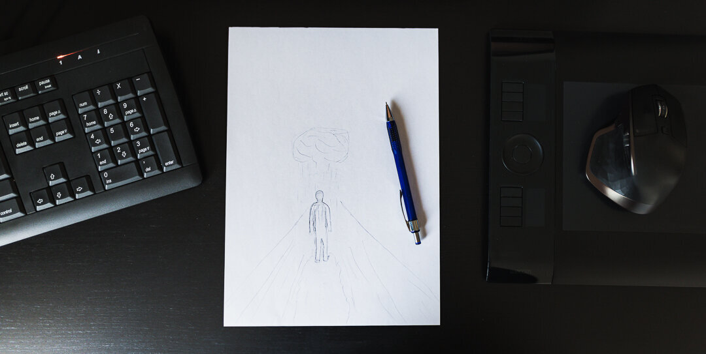

For my photographs, I use Lightroom 90 percent of the time so, it's not often I create photo manipulations, but recently I created a one because I felt inspired to do so. I guess it is a representation of hard times. Since the whole creating process is fresh in my mind, I want to share what goes into creating something like the final work from multiple images in Lightroom and Photoshop from sketch to the final work. As we all have more time in front of the computer, why not try to do and learn something new to stretch our abilities. I won’t go into every little detail of specific techniques; this is an overall look at how I create photo manipulations.

If you want to learn more about my techniques, check out my video tutorial [Day to Night](/day-night).

## 1. Creating a sketch

When I'm creating a photo manipulation, I usually start it with a blank paper in front of me and draw something that comes to my mind. I don't have any filters on what I should be creating; I start drawing from a vision I have. I sketch a rough idea and decide if it is something that I could be creating. I believe that when you have created the sketch, it's essential that you also take the next few steps on creating the work because otherwise, you might end up losing that momentum and vision you had in the first place.

**Sketching tips**

* Start with a blank paper
* Visualize how the final image would look like and start sketching
* It doesn't matter if you can draw or not, as long as you know what you are creating
* Don't be afraid to create multiple sketches
* Make notes on the paper if you can't start building the image straight away

## 2. Selecting the images

I always start by creating a collection in Lightroom, so I have all the chosen images in one place. In this way, I don't lose my concentration whenever I go through the photos. If in the making process, I want to add another image, I can easily add it to the collection.

When I go through my photographs, I pick any picture that is anything as I had roughly sketched and visualized. Instead of going through all my images, I usually have a vision in which images could work together, so in this case, it was quite a quick process to find the pictures for the final piece. The only one that I had trouble choosing was the person in the frame. In the end, I chose one that was close to what I wanted to use and edited it later in Photoshop.

The images don't need to be perfect straight away. However, using similar photographs with horizons approximately in the same place and similar lens used to take the picture is a great way to minimize any problems later on when creating a photo manipulation.

**Selecting tips**

* Select images with similar focal lenght
* Use parts of the images to create the overall look
* Visualize what type of images would work together
* Select more photographs than you think you need to use in the final work

*Using collections in Lightroom CC is a great way to have the selected images in one place.*

## 3. Creating the base

Once I have all the images I want to use in the collection, I open them as separate smart objects in Photoshop. I tend to use smart objects if I'm not sure what I want to do with the images in the first place. Or if I don't know whether the photos blend nicely. Smart objects are great when you don't want to sacrifice the editing abilities of the RAW files inside Photoshop. It makes your Photoshop files a lot bigger, but I still recommend using smart objects.

I then select each of the photographs and move them into one Photoshop file. As I have a rough idea of how I want the images to be placed inside the frame, I figure out if I need to make changes to the RAW files or if some of the photos won't blend well, and in that case, I need to select another one.

Once I have the images in the right places, I go back and forth between the pictures and change the settings to match them together by double-clicking on each image and editing the Camera Raw settings. It's a tedious job, but a crucial one to make your manipulations look more realistic. I use the road photograph as a base layer and as a starting point and try to match the other images with it. As I want the image to be quite dark, removing the colorful parts of the base layer is crucial.

Once I have all the images in place, I save the picture, and because the file size was going to be huge (11 GB), I used the PSB file format instead of TIF. The Lightroom CC Classic now supports PSB-files, which makes it easy to edit the file after you are done in Photoshop.

**Why use Smart objects?**

* You can edit them inside Photoshop as RAW images
* More flexibility to the edit
* You can add filters to them without losing the ability to edit them

*Smart object layers can be opened in Camera Raw by double clicking on the layer image.*

## 4. Masking

As the images start to look like they could fit together, I start the masking process. In the picture, I use multiple different ways to mask the layers. Most of the masking was done with brushes. First, I add a layer of fog, a shot I took at the lake to hide some of the branches on the side of the road. When I want to use only a small part of an image, I invert the mask with shortcut CTRL/CMD+I and start brushing with a soft brush with a low flow. When it looks decent, I hide and reveal the layer so I can see what it was before and after adding the fog layer.

*Smoothening the background with another layer of fog by using soft brush and inverted mask.*

For the cloud layer, I used multiple images to create depth and fluffy look. The cloud image was just a cloud in a blue sky, so it was easy to remove from the background. I used a cloud brush to create a mask with some soft yet detailed edges. I made duplicate of the cloud and rotated it so it would make it look much bigger and fluffier.

*The look of the first cloud mask.*

*Making duplicates of the cloud layer and rotating them to make the cloud look more realistic.*

*After making duplicates of the cloud.*

**Masking tips**

* Use soft brushes to create smoother transitions
* Invert the mask if you only want a small part of the image to be used
* ALT-click on the layer mask to see how the mask looks like
* If you have many layers as one object, add them to a group and mask the whole group to make final adjustments to the object

## 5. Creating elements

In these types of edits where, for example, I don't know how to do something, I google the effect I want to develop and try to learn new things. With the rain, I tried a couple of different tutorials. However, the rain effect was not as good as I wanted, so I created a set of brushes which I used to create the rain. I also added a rain cloud, which helped to create a more realistic look to the point where the rain starts from the cloud.

*After adding the rain layers.*

There were a few things I wanted to create, and one was the rain on the road. I wanted to create this feeling that the person and the raincloud had been moving together towards the horizon. So, it would look like the low part of the road was wet from the rain. First, I made a new layer and painted black with custom brushes to add some dark areas where I wanted and then added a layer mask as I wanted to have this rougher edge to the wet ground. As it started to look good, I set the blending mode of the layer to Soft Light to have this darker effect without being too overwhelming.

*Using Soft Light blending mode to make the wet asphalt realistic.*

*After the added wet asphalt.*

## 6. Adding details

When the road and the rain looked good, I added the figure. I wanted it to look like the person was walking in the middle of the rain, so I had to place it under the rain layer. When I want to create a detailed mask, I use the pen tool and take my time to go around the subject. As I had made the selection, I created a duplicate of the layer and flipped it vertically to create a reflection on the "puddle" on the road.

*Final piece to the manipulation was to add the person.*

As there were a lot of different things I wanted to create, I made a bunch of new brushes to create raindrops hitting the asphalt and the figure.

*Using custom brushes to make the raindrops.*

## 7. Final adjustments in Lightroom

When creating a photo manipulation, I usually end the edit in Lightroom. This time I spent little time going through different presets and used a one from my [Atmosphere](/atmosphere-presets) preset collection (Atmosphere – Down I). And after making a few changes in the preset, I added another preset (Atmosphere – Moon I).

View fullsize

Mikko Lagerstedt – Dark Thougths, 2020

And that's it — a dive into what goes into creating a photo manipulation from sketch to final piece. I hope you enjoyed the tutorial and if you want to see more of these leave a comment below, I would love to hear your thoughts. If you don't want to comment on the image, I would be interested in reading how you are coping with the situation we live in right now?

Stay safe, everyone!

## GET THE LATEST CONTENT FIRST

If you like this post. Subscribe to be the first to receive fresh new tutorials straight to your inbox!

First Name

Last Name

Email Address

Subscribe

We respect your privacy.

Thank you!