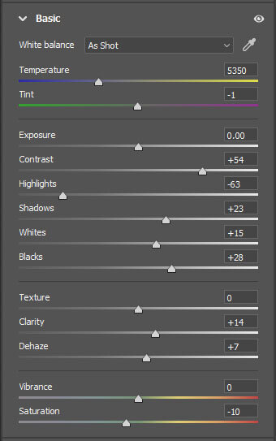

Hey everyone, I hope you are doing great! This time, we are talking about color profiles and how they can immediately change the way you edit your photographs in Lightroom and Camera Raw. If you don’t know how to use or create one or, better yet, don’t know what a color profile is, keep reading.

It's been about three years since Adobe released the color profiles for Lightroom and Camera Raw. I think they are one of the most overlooked parts of Lightroom editing, but they definitely shouldn't be. I use them daily because of the versatility they provide.

**What is the difference between presets and color profiles?**

Color profiles and presets are pretty similar, and you can create them the same way inside Photoshop Camera Raw, but there is a difference. Color profiles apply additional settings to your image. For example, suppose you use a preset on your photo and feel that it's missing something. You can then select a color profile, and it won't affect any of the already used settings. And the best part is that you can adjust the effect you want on your photograph with the amount slider.

Another notable difference between the two is that you cannot create a preset using Photoshop adjustment layers. However, you can do that with color profiles. It's a game-changer! I created most of the **30 EPIC Color Profiles** inside Photoshop for the [**EPIC Preset System**](/epic-presets).

**What are the pros of using color profiles?**

* Opacity/amount slider to fine-tune the profile effect
* Thumbnails to see the outcome before using the profile
* Additional effects and it does not affect presets or anything applied already to the image
* Can be created using Photoshop adjustment layers

It's not possible to create color profiles inside Lightroom at the moment I'm writing this tutorial. So we are going to use Photoshop and Camera Raw to create one.

### **How to create color profiles in Camera Raw (quick guide)**

1. Open a RAW file in Photoshop Camera Raw
2. Adjust the settings of the image (do not change temperature or exposure)
3. ALT-click on the create a new preset icon in the preset panel
4. Name your preset and group it with a new group
5. Select the settings you changed
6. Deselect Camera Profile
7. Tone Map Strenght: Low(Normal)
8. Deselect Look Table
9. Click OK

**Open Photoshop and open a RAW file**.

**If you don't use a RAW file, go to Filter -> Camera Raw Filter**.

You can create a color profile just like you would create a preset.

You can also use your favorite preset and then create a profile from it. Note that not all settings can be applied to color profiles. You cannot save calibration settings, for example.

Let's create a profile for a night photograph. The settings depend entirely on the photo you want to edit and what style you want to make. These settings might not work on heavy light pollution images.

You can make the adjustments in Lightroom and then go to Camera Raw and paste the settings to the image and create the color profile. However, because the two programs are so similar, I recommend doing everything in Camera Raw. This way, you don't need to use two different programs and remove the unnecessary step.

Start by making changes to the settings. Do not touch the temperature or exposure sliders unless you want to create something funky. These will affect the outcome and probably won't work on many photographs when applying the color profile.

### Settings for a Night Photography Profile

For this night photography color profile, I used the following basic settings:

**Contrast + 54**To make the stars pop, we need to add contrast.  
  
**Highlights – 63**Usually, highlights are too bright in night photographs that’s why we need to decrease those quite significantly.  
  
**Shadows + 23**   
Let’s boost shadows so we don’t darken the photo too much.  
  
**Whites + 15**Adding whites increases the white point and so the stars are brighter.

**Blacks + 28**Just as boosting shadows, we need

**Clarity + 14**  
**Dehaze + 7**  
**Saturation – 10**

Dehaze and clarity work wonders on star photography. But by adding dehaze and contrast, you also increase the saturation; that's why I recommend decreasing the saturation.

The next step is Tone Curve. Let's add a subtle S-curve to the tones and move the black point slightly upwards.

Basic Settings for star photography

A subtle s-curve in Curve Adjustments

For the sake of the tutorial, I want to keep the settings quite simple yet powerful. Let's keep the color settings intact.

### Creating the color profile

Now go to the **Presets tab** and **ALT-click** on the Create a New Preset icon.

Go to Presets (SHIFT+P)

ALT/Option-click: Create New Preset

I have found the following settings work best for most profiles and photos:

* *Name: Boost Stars*
* *Group: New Group (I used Night)*
* Uncheck Camera Profile
* Select Basic
* Select Point Curve
* If you made any changes to the colors, also select them.
* In the Advanced Settings, use the Low (Normal) Tone Map Strenght
* Uncheck the Look Table
* Click OK

Save the color profile with settings you want to experiment

And that's it; you have just created a color profile! But **where can you find it?**

Close the window, or if you want to use Camera Raw, go to basic settings. Next to the profile, click the three rectangles and a magnifying glass. Here you can find your new profile. If you can't see the thumbnails click the three dots on the right side of the profile and View: Grid.

You can **find the color profiles in Lightroom CC and CC Classic** in the same place. In Lightroom Classic, click on the four rectangles.

Basic settings > Profile browser

Amount adjustment in Lightroom

Now the profiles are ready to be used. You can select a profile and use the Amount slider to define how much it affects the photograph. Easy and quick!

If you want, you can [**download**](https://www.dropbox.com/sh/ryrf7icv00en5rs/AAAq-1jEMM4daP7cTtKnA90Fa?dl=0) the color profile for free and add it to your color profile catalog. Here is how to install color profiles:

**Installing Color Profiles in Lightroom CC**

1. Open Lightroom CC
2. Open edit menu (shortcut E)
3. Go to Profile browser by clicking the three rectangles
4. Click the small dots and Import Profiles
5. Find the profile XMP or zip file and click Import

**Installing Color Profiles in Lightroom CC Classic**

1. Open Lightroom CC Classic
2. Go to Develop Module
3. Click on the Basic Settings tab
4. Click the four small rectangles to go to the Profile Browser
5. Click the three small plus sign and Import Profiles
6. Find the profile XMP or zip file and click Import

**Installing Color Profiles in Camera Raw**

1. Open Camera RAW
2. Go to the Preset menu by clicking SHIFT+P
3. Click the small dots and Import Presets and Profiles
4. Find the profile XMP or zip file and click Import

**Here is the before and after our boost stars color profile at 100%.**

View fullsize

Before

View fullsize

After

I used the Destination preset to edit the image before applying the color profile from the [EPIC Preset System](/epic-presets).

Thanks for reading; I hope you enjoyed the tutorial! Until the next one.

If you enjoy this post. **Subscribe** to be the first to receive **fresh new tutorials** straight to your inbox!

First Name

Last Name

Email Address

Subscribe

We respect your privacy.