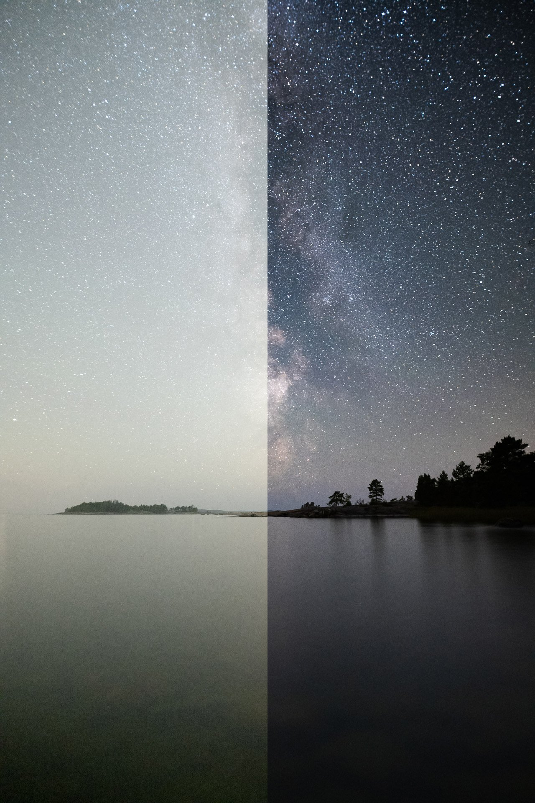

In the last week's tutorial, we went through [**Four Easy Steps to Capture Beautiful Astrophotography Landscapes**](https://www.mikkolagerstedt.com/blog/4-steps-to-capture-beautiful-astrophotography-landscapes). This week we follow through with how to edit your astrophotographs. Next week I'll write how to edit dual exposure astrophotography, so stay tuned and subscribe to my email list if you haven't already!

The photograph we are editing here was shot with the [Nikon Z 7](https://amzn.to/3mnzYbm) and [Sigma 20 mm f/1.4 lens](https://amzn.to/31cFZzD). With ISO 8000, f/1.6, and 25 seconds exposure.

Like I wrote last week, if you expose the picture more, it gives you more room for editing in Lightroom. Pulling the shadows is much more challenging when you use high ISO settings. So, don't underexpose your images.

These settings were made with my [**EPIC Preset Collection**](/epic-presets), but you can follow along and make those changes by yourself. The EPIC Presets makes your workflow faster with an entire section dedicated to night photography.

Before & After astrophotography editing Lightroom CC

## **1. Basic Settings**

Let’s emphasize the Milky Way and darken the image to look more like a night photo with the basic settings.

Temp 4200  
Tint + 28

Exposure – 1,06  
Contrast + 12  
Highlights + 7  
Whites + 40

Texture + 14  
Clarity + 6  
Dehaze + 24

## 2. Tone Curve

Darken the image more with the tone curves. Two points, top and bottom middle in the curves.

Input 188 – Output 180  
Input 93 – Output 75

## **3. Graduated Filters**

With the graduated filters, let’s apply light to the foreground and add contrast and detail to the sky. Because it's a simple photograph, we can use two graduated filters. The shortcut for the graduated filter is M.

If you feel fancy, you can also use the Select Sky feature, which works quite well for night photographs most of the time.

**Foreground graduated filter**

Place this filter in the bottom part of the frame. Using Temp and Tint, we try to match the overall colors in the image.

Temp – 14  
Tint 4

The following basic settings boost the foreground brightness.

Exposure 0,67  
Contrast 8  
Highlights 5  
Shadows 5  
Whites 20  
Blacks 4

For this particular image, we don't need more detail in the foreground. To apply a smoother look, use the following settings.

Texture – 4  
Clarity – 14  
Dehaze – 14

Lastly, let's make the saturation lower and apply a noise reduction.

Saturation – 11  
Noise 25

**Milky Way graduated filter**

Emphasizing the Milky Way is easy. Use the following settings if you don't have to boost it a lot.

Exposure – 0,67  
Highlights 24  
Whites 15

Clarity 9  
Dehaze 10

Noise 16

## 4. Final adjustments

Apply a lens correction if you have a lot of distortion in your astrophotograph. When working with high ISO photographs noise reduction is essential. I don’t usually add much sharpening for astrophotography because it can create more noise.

**Sharpening**

Amount 50  
Radius 1,2  
Masking 10

**Noise reduction**

Luminance 15  
Detail 45  
Contrast 15

**Post-Crop Vignetting**

Vignetting is something I tend to add in the final stages of my editing workflow.

Highlight Priority  
Amount – 9  
Feather 100  
Highlights 100

**Grain**

By removing a lot of noise, it’s good to add some grain so you don’t end up with a photograph that looks overly smooth.

Amount 9  
Size 10  
Roughness 9

Here is the final edit.

Below are two different versions made with the [**EPIC Preset Collection**](/epic-presets).

View fullsize

[**EPIC**](/epic-presets) - Overall Color: Fantasy

View fullsize

[**EPIC**](/epic-presets) - Color Grading: Teal and Orange

### Tools & tutorials used in this tutorial

Lightroom CC Classic  
[EPIC Preset Collection](/epic-presets)  
[Star Photography Masterclass](/star-photography-tutorial)

**Did you find the tutorial helpful? I would love to hear from you; what would you like to see more here on my blog!**

Until next time my fellow photographers, take care and keep on creating!

## Subscribe

If you enjoy this post. **Subscribe** to be the first to receive   
**fresh new tutorials** straight to your inbox!

First Name

Last Name

Email Address

Subscribe

We respect your privacy.

Thank you!