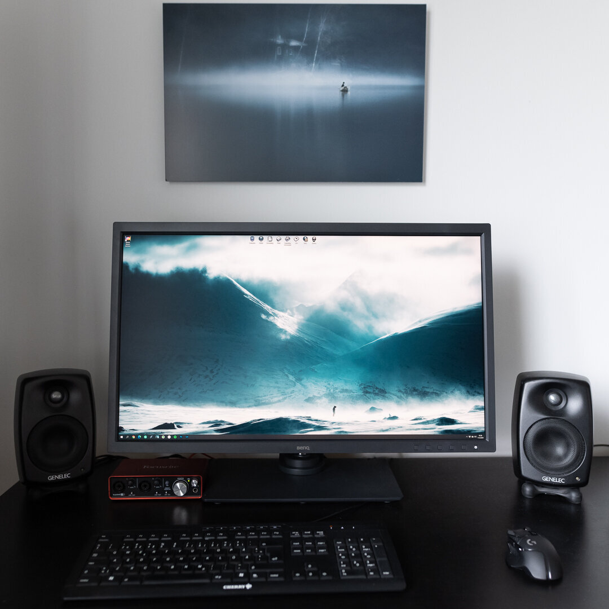

For the past month, I have been using the [BenQ SW321C](https://www.benq.eu/en-eu/monitor/photographer/sw321c.html) -monitor. And I have to say that I have been pleased with the display so far.

So far, I have been impressed by how good the display is. When you get the box, you can sense that it is a top-quality product. The box is enormous; no wonder it's a 32-inch 4K monitor.

The BenQ has a LED backlight IPS-panel with a high gamut covering 100% sRGB, 99% AdobeRGB, and 95% DCI P3 color space. The panel has a special coating that makes it lightly matt, reflections are minimal, making it perfect for even brighter rooms. The screen comes with shading hood parts; you can easily install to make the reflections disappear. There is a roller for cleaning the screen, which allows you to keep the screen's surface perfectly clean.

The monitor is heavy, well designed, and the movements are fluid despite this very large monitor's size and weight.

BenQ SW 321C without the shading hood

You can quickly select between Adobe RGB, sRGB, and B&W with the included Hotkey Puck G2. With a button press, you can set your monitor to the sRGB colorspace or Adobe RGB, which is an extremely useful function when you publish a lot on the internet.

BenQ Hotkey Puck G2

### **The box includes**

What you get in the box: Everything. No, but really, there is everything you would expect and more.

* Instruction manual
* Shading hood parts
* Power cable
* HDMI, DisplayPort, and USB -cables
* Hotkey Puck G2
* Screen cleaning roller
* Software (CD)

### **Connections**

The connections are fantastic, including USB type-c. With the new 2020 13 inch Macbook Pro, I can easily use the USB type-c to keep the laptop charged. So easy and convenient. I use the display with the desktop computer with the DisplayPort connection.

* 2 x HDMI 2.0
* DisplayPort 1.4
* USB Type-C
* 2 x USB 3.1
* SD Memory Card Slot
* 3.5 mm Audio Out

BenQ SW 321C with the shading hood

### **Colors & Sharpness**

Even out of the box, the colors look accurate. Covering 100% sRGB, 99% AdobeRGB, the panel is fantastic for photo editing. Of course, I recommend you calibrate the monitor before starting to work with it. The display includes hardware calibrating, which means it won't affect the graphic card while adjusting the colors. I use X-Rite i1 Display to calibrate my monitors, and after the calibration, I can say that the display looks even better. The contrast and sharpness are both perfect for photo editing.

BenQ SW321C includes hardware calibration. I use the X-Rite i1 Display calibrator.

### **Paper Color Sync**

If you print your photographs, you can take advantage of the Paper Color Sync technology. Download and install the free BenQ Paper Color Sync software on your computer and select your printer and the paper you want to use from the drop-down menus. This little tech makes it easy to match the photograph on-screen to your desired printing paper.

### **Conclusion**

The [BenQ SW321C](https://amzn.to/2ZxbkcE) is unquestionably a monitor that many photographers have been waiting for a long time. You can count me in that group as well. A 32″ 4K quality panel with great features at this price is difficult to find. Luckily the BenQ delivers. The anti-glare coating, panel uniformity, and ergonomics are all superb. With excellent color coverage, I can easily give it a 5/5 rating. Highly recommended for a professional photographer or advanced hobbyist. For me, it's a perfect display. Either if you share my work on the internet, or if you print your work, the monitor performs well for both tasks.

**Pros**

* Excellent image quality
* BenQ Puck G2 is perfect for switching between color profiles
* The anti-glare technology
* Fantastic ergonomics
* Shading hood
* Hardware calibration

**Cons**

* Big and bulky (good and bad)
* Big bezels
* Hard to reach cable connections