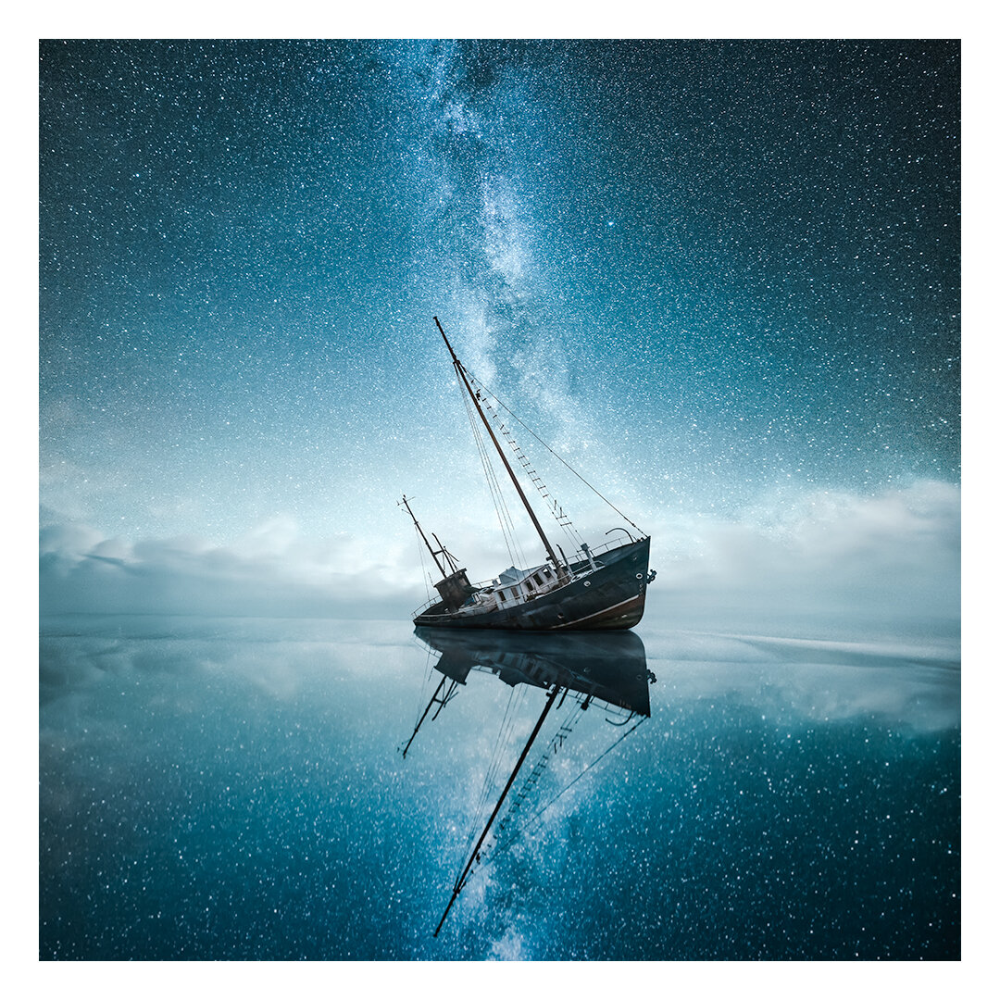

I’m very excited to share that a selection of my work is now available through [Aspen Gallery](https://www.aspen-gallery.com/artists/mikko-lagerstedt), New England, US.

Aspen Gallery was founded by Johnny Patience, one of my fellow fine art photographers I have known since the days of Flickr when I first started photography. When Johnny introduced me to the Aspen Gallery, I knew it was something I wanted to take part.

The gallery also awards an annual $5,000 Artist Fellowship to honor artistic excellence and advance the careers of emerging artists. Fellowships are merit-based awards that are informed by an applicant’s work (details about the grant and how to apply will be announced shortly).

[View my collection](https://www.mikkolagerstedt.com/buy-art)

