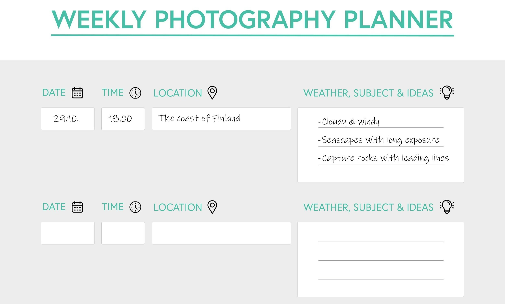

Sometimes we feel overwhelmed while taking landscape photographs. And it’s natural, but with a few steps, you can improve your results immensely. Of course, there are many ways to improve your photography, but behaviors that make the most difference are frankly quite simple. In this article, I have collected some of my favorite ideas on how to improve your landscape photography instantly.

## 1. Create a plan

Suppose you struggle to produce enough landscape photographs. Using a planner makes things more manageable, and you will go out on shoots more often, and when you go, you probably get more out of your trips. The more you go out, the better chances you have to improve your landscape photography. A daily or weekly planner gives you a framework for your photography.

Listing location, timing, and weather forecast give you ideas for your photography. For example, if it's windy and cloudy, you might want to go to a place where you can capture the sea or urban views. You can start the planning with timing as well. If you're going to take photos of the sunrise, you need to figure out where the sun rises in a location and plan the shoot. Use websites and applications such as [Google Maps](https://www.google.com/maps), weather forecast, [TPE](https://photoephemeris.com/), and [PhotoPills](https://www.photopills.com/) to plan your trips.

Here is a five-day photography planner you can [**DOWNLOAD**](/s/Photography-Planner-2021.pdf) for free.

Having a plan is an important step in capturing beautiful landscape photographs.

## 2. Take it Slow

When you are finally at a location, take your time and explore the area without your camera. Take a moment and appreciate the surrounding nature, and then focus on capturing the view. Be patient with the light. It can change in an instance. If you rush through a location, it's pretty common to miss the shot you wanted to capture. Also, keep your smartphone away and try to focus on the photographing.

If you genuinely want to capture a place at a specific time, be there beforehand so you have time to find a subject that interests you. Remember that you can't take photos of everything, so take it slow and keep yourself focused on the image you are trying to capture.

## 3. Use a tripod

After a shoot, while going through your images, you find out that they are blurry and unsharp is the worst. Getting sharp photographs is essential; that's why I always take my tripod with me, even if I take pictures in the middle of the day. On location, I recommend that you experiment without the tripod. As you find a subject you are interested in capturing, take out your tripod and capture the scenery. To make sure you capture everything sharp, use a timer or a remote controller.

Focus stacking is sometimes necessary to get enough depth of field, and it is much easier when you have a tripod. And when using a tripod, you often don't need to focus stack because you can use longer shutter speed and more depth of field with a smaller aperture. Fewer steps are better than more.

Tripod also makes you slow down and see the landscape as you might not otherwise see.

## 4. Use The Best settings

Always shoot in RAW file format. The more information you can capture, the better. Don't let over– or underexposed images ruin your landscape photography. If you expose your photos correctly, you have far more chances to adjust the RAW images. Remember to check the histogram when you are out photographing. View the sharpness and focus point by zooming in on the picture on your camera; it only takes a few seconds but saves you from the headache of an unsharp image.

**For most landscape photography, use the following settings**

* RAW file format
* The native ISO of your camera (64 – 200)
* Sharpest aperture on your lens (f/8.0 – f/12)

View fullsize

## 5. Learn Composition Guides

Suppose you don't want your images to look flat. Create more dynamic and eye-pleasing landscape photographs by using composition rules. For example, use the rule of thirds and leading lines to give your images more depth.

Before you go out to photograph, study other people's landscape photography and their composition rules to create it. Please don't copy their work; instead, use it as a framework.

**Composition rules to study**

* Rule of thirds
* Leading lines
* Golden ratio
* Framing a subject
* Symmetry
* Break the rules and experiment

Leading lines can give your image a sense of depth.

## 6. Get better at Editing

Don't underestimate the importance of editing in landscape photography. If you spend hours capturing the photographs, you should also dedicate time to edit your images. It's helpful to have a vision of how you want your pictures to turn out. Lightroom, Capture One, and Photoshop are all great for editing photographs. At the moment, I use mostly Lightroom.

If you want to improve your landscape photography editing immediately, check out my [**EPIC Preset Collection**](https://www.mikkolagerstedt.com/epic-presets). I made it for different kinds of landscape photography situations. For example, if you have a forest photograph, you can easily follow through with the steps and create a stunning result with a few clicks.

**Things to consider while editing your photographs**

* What is the subject, and how can you make it more clear?
* Can you improve the composition by cropping the image?
* Use radial and graduated filters to balance your shot.

**Also, check out my editing tutorials**

* [EPIC color edit in Lightroom](https://www.mikkolagerstedt.com/blog/how-to-create-epic-colors-in-lightroom)
* [How to add glow to a photograph in Photoshop](https://www.mikkolagerstedt.com/blog/2018/5/18/how-to-add-glow-to-photographs-in-photoshop)
* [How to create atmospheric photography](https://www.mikkolagerstedt.com/blog/2018/5/13/how-to-create-atmospheric-photographs-ii)
* [Matching colors in Lightroom](https://www.mikkolagerstedt.com/blog/2017/4/18/match-colors-in-lightroom)
* [Five steps to boost Milky Way in Lightroom](https://www.mikkolagerstedt.com/blog/2015/10/26/5-steps-how-to-boost-milky-way-in-lightroom)
* [How to edit Fog photographs in Lightroom](https://www.mikkolagerstedt.com/blog/2014/1/3/basic-lightroom-adjustments-fog-mist)
* [How to edit night photography in Lightroom & Photoshop](https://www.mikkolagerstedt.com/blog/2013/11/8/night-photography-tutorial-lightroom-5-photoshop)

More to come, so be sure to subscribe to my email list!

View fullsize

Use editing to balance the photograph. Above, I used the graduated filter both in the foreground and on the top part of the picture to make your eye focus on the mountains.

I hope you enjoy the tutorial and find something useful for your landscape photography! **Let me know in the comments below if you have any questions and what you would like to see me cover next.**

Until next time my fellow photographers, take care and keep on creating!

## SUBSCRIBE

If you enjoy this post. Subscribe to be the first to receive fresh new tutorials straight to your inbox!

First Name

Last Name

Email Address

SUBSCRIBE

We respect your privacy.

Thank you!