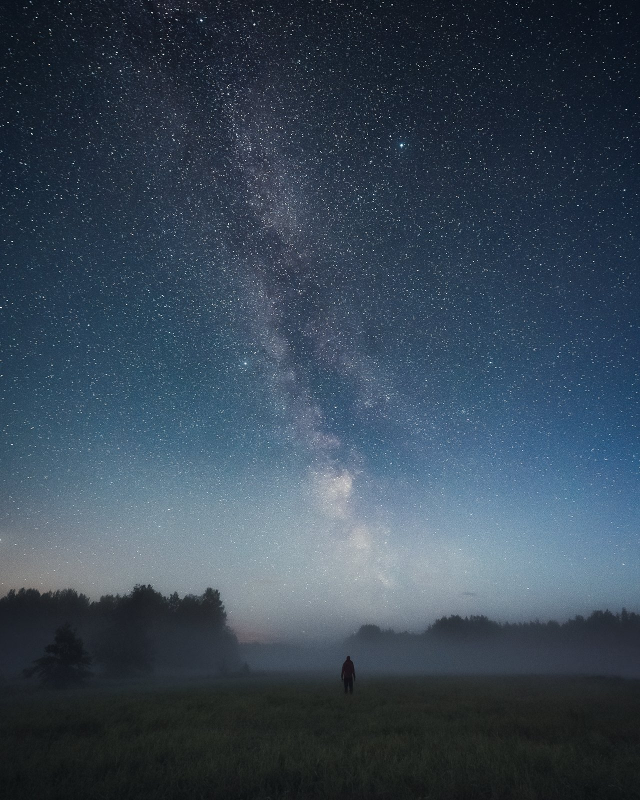
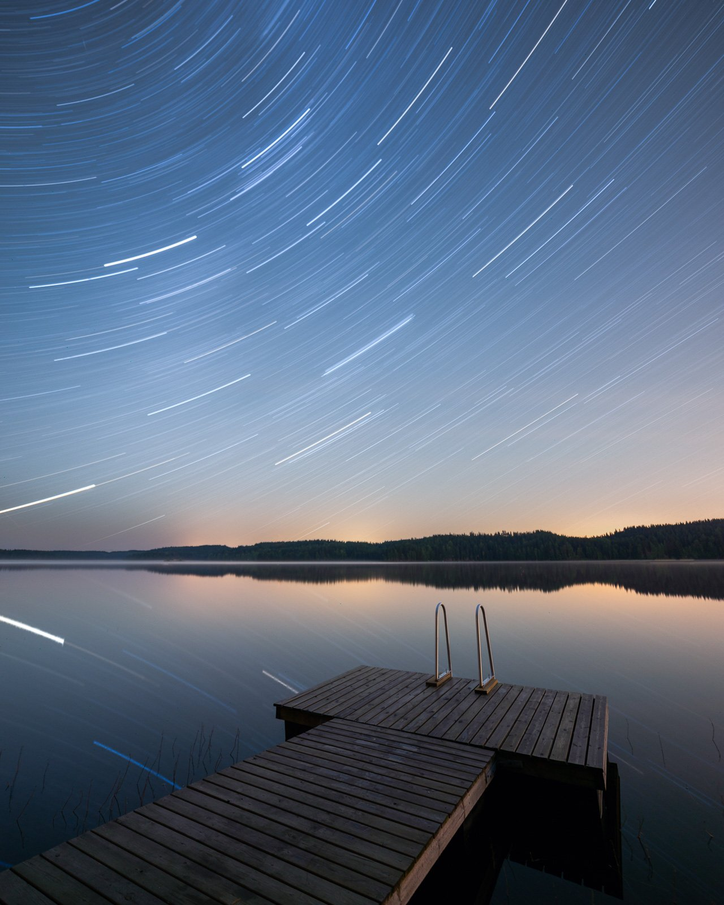
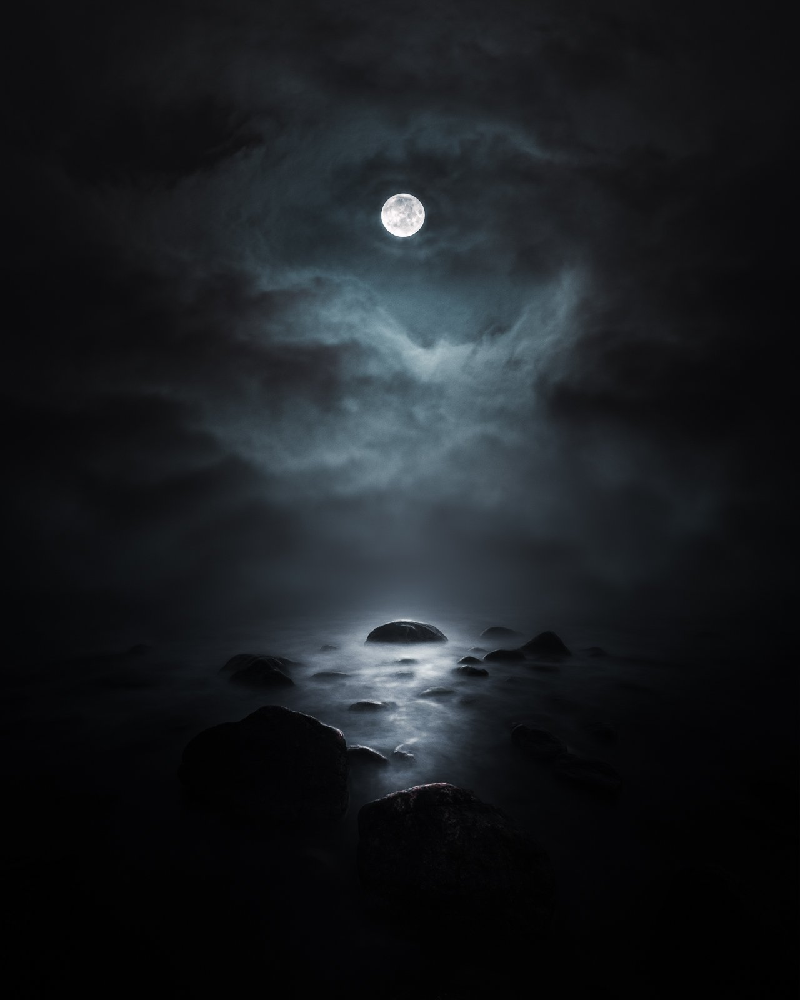
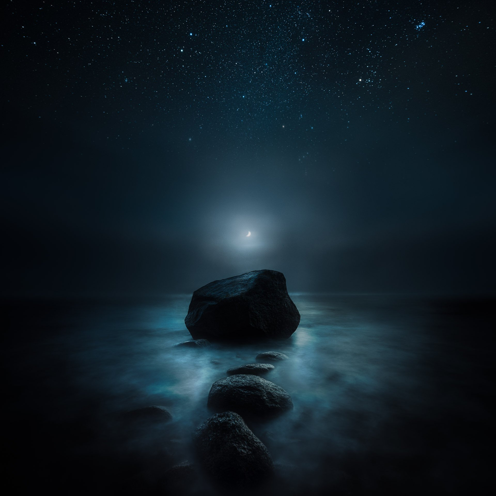
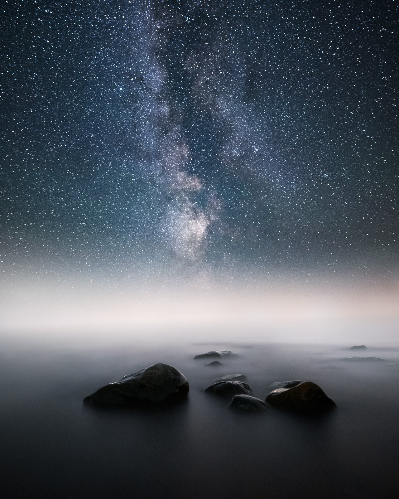
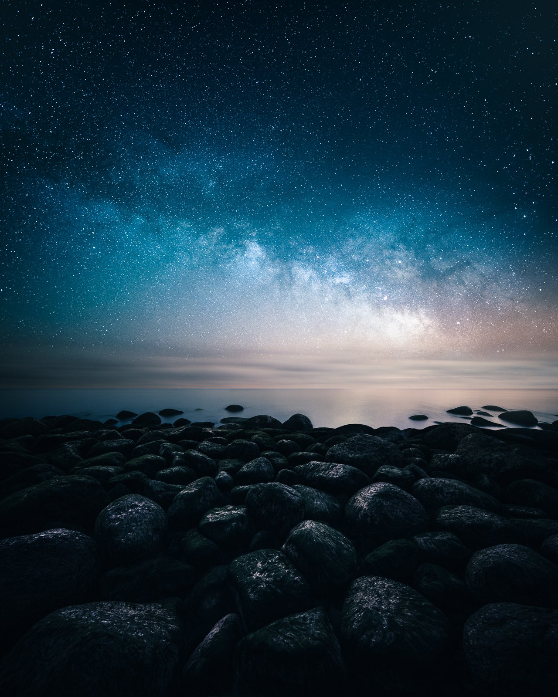
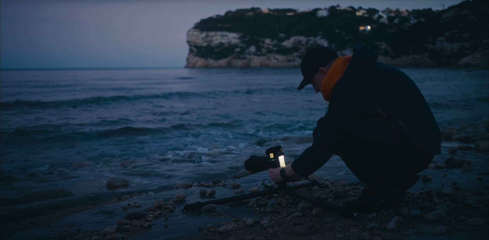
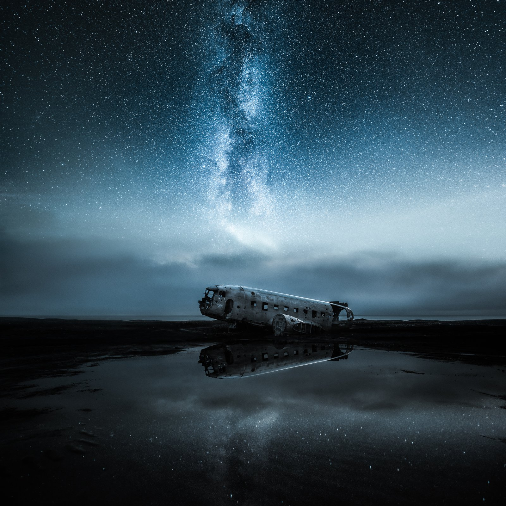

Support Mikko's blog posts!

I hope you are having a wonderful Summer. Even though I love summer, I find it challenging for photography. I have never been a big fan of the midnight sun or bright nights. The mist is something I find inspiring to photograph, yet there are only a handful of mornings when there is some mist in the summer. And as soon as the nights get darker and colder, I find myself inspired to go out and photograph. So for the upcoming dark season, I started writing a comprehensive and inspiration-filled tutorial about night photography. I hope you enjoy it.

As someone who has spent quite a few nights photographing different views, I find night photography fascinating and inspiring. As I was writing this post with the amount of knowledge I’ve gathered, I felt I needed to put this into an eBook, but then I thought to share it on my blog. If you enjoy my posts, you can support me by sharing this article or even buying me a coffee to keep me recharged and continue writing!

At night, our surroundings transform into a different kind of beauty. The sky becomes a vast canvas of stars, the moon casts a gentle glow, and the aurora comes alive in a luminous dance of lights and shadows. These mesmerizing views can be captured, making night photography a captivating genre full of creative opportunities and unique challenges.

The journey to night photography is planning, patience, and learning. It’s also understanding the nuances of light and darkness and mastering the technical aspects of long-exposure photography. The night presents a different kind of quiet and solitude, allowing introspection and creativity.

This tutorial explores my journey in night photography and guides those who wish to venture into this fascinating genre. Check out my [Star Photography Masterclass eBook](/star-photography-tutorial) if you want to dive deeper into night photography and editing.

In this tutorial, we go into various parts of night photography, from capturing Milky Way and moon to vertoramas night. I'll share the techniques, equipment, and settings I've found most effective for capturing stunning nighttime images.

Throughout this post, I challenge you to remember that photography is not just about capturing a scene; it's about conveying a feeling and telling a story through your lens. The night reveals mystery, tranquility, and natural beauty, and I hope my experiences and insights inspire and guide you in creating unique stories under the stars.

Here are a few other night tutorials I’ve written before:

* [5 Steps to Create Dreamy Astrophotography Using A Dual Exposure Technique](https://www.mikkolagerstedt.com/blog/5-steps-to-create-dreamy-astrophotography-using-a-dual-exposure-technique)
* [4 Easy Steps to Edit Astrophotography in Lightroom](https://mikkolagerstedt.com/blog/how-to-edit-astrophotography-in-lightroom)
* [4 Easy Steps to Capture Beautiful Astrophotography Landscapes](https://mikkolagerstedt.com/blog/4-steps-to-capture-beautiful-astrophotography-landscapes)
* [How to Photograph the Northern Lights](https://mikkolagerstedt.com/blog//how-to-photograph-the-northern-lights-aurora-borealis)
* [How to Capture Sharp Star Photographs](https://mikkolagerstedt.com/blog/2015/11/10/how-to-capture-sharp-star-photographs)

Additionally, I have written the [Star Photography Masterclass eBook](/star-photography-tutorial), which includes more details about my process.

## **1. The Magic of the Night Sky**

It is truly unique how the sky presents remarkable spectacles every night. There is always something captivating to observe, from stars and planets to the moon. Of course, those bloody clouds can block the views, but it’s part of the game.

Sometimes, we are blessed enough to witness extraordinary events like the Northern Lights or meteor showers. Although capturing these breathtaking sights through photography can be rewarding, it takes expertise and a lot of patience.

#### Planning

Photographing the night sky starts with planning. Unlike other genres of photography, where spontaneity can lead to the best shots, night sky photography demands careful thought and preparation. The key factors to consider include the weather, moon phase, light pollution, and the position of celestial bodies. Clear skies are ideal for capturing stars, while the moon's phase can significantly affect your scene's lighting. Light pollution can hinder your ability to capture the fainter stars, so venturing away from city lights is often necessary. Finally, knowing the position of celestial bodies can help you plan your composition. There are various apps available that can help you with these aspects of planning. PhotoPills, TPE and Stellarium, are great tools to use.

#### Camera Settings

The next step is understanding the crucial camera settings for night sky photography. Night photography is a game of light – or, more accurately, the lack of light. Because of this, you'll need to adjust your camera settings to capture as much light as possible. This means shooting in Manual mode and understanding the "Exposure Triangle" – the relationship between aperture, shutter speed, and ISO.

Shutter speed is critical in night sky photography. Your aperture should be as comprehensive as possible to allow maximum light into the lens. For most lenses, this will be between f/2.8 and f/4. A common rule for shooting stars without creating star trails is the '500 Rule': Divide 500 by your lens' focal length to determine the longest exposure time before stars begin to blur due to the Earth's rotation. However, this rule isn't infallible and may require some adjustments based on your specific camera and lens combination.

ISO settings can be tricky. A high ISO increases the sensor's sensitivity to light, which is beneficial in low-light conditions. However, pushing the ISO too high can result in a noisy image. Start with an ISO setting around 1600 – 6400 and adjust based on the results you're getting. I might go as high as 8000 ISO in complete darkness.

#### Focus

Focusing at night can be challenging, as autofocus systems often struggle in low light. A common technique is manually focusing on a bright star or distant light. Some photographers use the infinity (∞) symbol on their lens as a starting point, fine-tuning from there.

Try different compositions, play with settings, and, most importantly, take the time to enjoy the process. The night sky is a fascinating subject that rewards patience and curiosity. So, step out into the night, and gaze upwards.

## **2. Star Trails**

Star trails are one of the most fascinating aspects of night photography. These celestial brushstrokes, arcing gracefully across the night sky, depict the movement of stars relative to our Earth's rotation. Creating these light-painted masterpieces requires a blend of patience, technical know-how, and a little bit of star-guided luck.

Star trails are long-exposure photographs that capture the motion of stars as Earth spins on its axis. A clear, cloudless night is crucial for capturing uninterrupted star movement. To achieve this, you'll need to consider a location with minimal light pollution, as city lights can overpower the delicate glow of distant stars. Also, remember to find an interesting foreground to add depth and context to your sky-filled image.

Now, let's talk about the technical aspects. Star trail photography demands a careful balance of camera settings, including a wide aperture, long shutter speed, and an appropriate ISO. Set your camera to Manual mode and open your aperture as wide as possible (usually f/2.8 or f/3.5) to allow maximum light into your camera.

The shutter speed is where things get more complex. To capture star trails, you'll need a long exposure time - anywhere from a few minutes to several hours, depending on how pronounced you want the trails to be. However, digital sensors can generate noise during long exposures, and battery life can become an issue for extremely long shots. To navigate these challenges, you can use the "stacking" technique, where multiple short-exposure photos are taken over a period and combined in post-processing to create the final star trail image.

Set your ISO to a value that balances light sensitivity and noise. An ISO between 400 and 1600 is usually a good starting point, but you may need to adjust based on your specific conditions and camera capabilities. If you are stacking, use higher ISO settings to get more detail in the stars.

Focusing on star trails follows the same approach as general night sky photography. Manually focus on a bright star, using the infinity (∞) symbol on your lens as a guide, and then fine-tune to achieve sharp focus.

Lastly, turn off any image stabilization on your lens or camera body, as this can interfere with your long exposure shots when the camera is on a tripod. Speaking of tripods, a sturdy one is crucial to prevent camera shake during the long exposure.

Shooting star trails can test patience as you wait for the stars to etch their paths across the sky. However, the resulting image - a unique depiction of time and space - is worth the effort.

Single exposure: ISO 100, 3600 sec., f/3.2 @ 14 mm.

## **3. Moon Photography**

The moon, our closest celestial neighbor, is a captivating subject in night photography. Moon photography allows for capturing stunning details of the moon and its interaction with the surrounding landscape. However, it also presents unique challenges due to the stark contrast between the moon's brightness and the surrounding darkness. Let's explore how to overcome these challenges and capture the moon in all its glory.

The first step in moon photography is understanding its phases and planning your shoot accordingly. Each phase offers unique photographic opportunities - the full moon provides the most light. It can illuminate landscapes beautifully, while a crescent moon or half-moon can add a unique element to your compositions. A 'moonrise' or 'moonset' can also be a magical moment to capture as the moon interacts with the elements on the horizon. And this time gives you more opportunity to capture less contrast between the landscape and the moon, making it one of my favorite times to capture the moon.

Next, let's talk about gear. A DSLR or mirrorless camera with manual settings is essential. A telephoto lens can be incredibly useful for moon photography. The moon is much smaller than it appears to our eyes, and a long lens (200mm or more) will allow you to fill the frame with the moon for detailed shots. A sturdy tripod will help you capture sharp images and avoid camera shake from pressing the shutter button.

Now, onto the settings. Unlike most night photography, where you deal with low light, the moon is a bright object against a dark sky. This contrast can trick your camera's metering system, causing the scenery to underexpose. To overcome this, you can use the 'Looney 11' rule as a starting point. This rule suggests setting your aperture to f/11 and shutter speed to 1/ISO. For example, if your ISO is 100, your shutter speed would be 1/100th of a second. These settings should provide a well-exposed moon, but you'll need to adjust based on your specific conditions and camera.

Focusing on the moon can be done manually or with autofocus. Using autofocus to place a single focus point directly on the moon can be helpful.

Finally, consider your composition. While a detailed shot of the moon is impressive, including landscape elements can create a more engaging image. Trees, buildings, or mountains can provide scale and context for the moon in your shot.

The following images were captured using a dual exposure technique to get more detail in the seascape while keeping the moon perfectly exposed.

View fullsize

View fullsize

## 4. Vertoramas at Night

Vertorama, a name that comes from "vertical" and "panorama," is a technique where multiple horizontal images are stitched together vertically to create a wide-angle view of a scene. This technique is particularly effective in night photography, as it allows you to capture the night sky's grandeur and the detail of the landscape below in a single image. This chapter explores how to create stunning vertoramas at night.

#### Preparation

Before you start shooting, scout your location during the day to identify potential compositions. Look for locations that offer a clear view of the sky and an interesting foreground. Also, check the weather and moon phases to plan for the best conditions.

#### Shooting

Start by setting your camera on a tripod and switching to manual mode. Use the widest focal length of your lens to capture as much of the scene as possible. Set your focus manually to ensure sharpness throughout your series of shots.

Begin shooting from the bottom and work your way up, ensuring that each shot overlaps the previous one by about 30-50% to make stitching easier later. Try to keep your camera level as you pan upward to avoid distortion.

#### Post-Processing

Once you've captured your series of images, the next step is to stitch them together using software like Adobe Photoshop or Lightroom. Import your images and use the 'Photomerge' or 'Stitch Panorama' function to combine them into a single vertorama. You may need to crop the final image slightly to ensure all edges are even.

#### Advanced Techniques

For more complex scenes or to create ultra-wide vertoramas, you can shoot multiple rows of images, moving both horizontally and vertically. This requires careful alignment and more complex stitching but can produce stunning results.

Remember, vertoramas can be a powerful tool in your night photography arsenal, allowing you to capture spectacular views of the night sky and the landscape below. It's a technique that requires practice, patience, and a bit of post-processing prowess, but the results can be truly rewarding.

## **5. Essential Equipment for Night Photography**

Night photography, with its unique challenges, calls for specific equipment to help you capture the best images. The right gear can significantly enhance your ability to work with low light and long exposure times, two vital elements of night photography. This chapter will provide you with an in-depth guide to selecting and using the right equipment for your nocturnal photo shoots.

#### Camera

The heart of your night photography gear is, of course, the camera. While almost any camera can capture images at night, certain features can significantly improve your night photography experience and results. A full-frame DSLR or mirrorless camera is ideal for night photography due to its large sensors' ability to capture more light. Look for a camera with excellent low-light performance, a high dynamic range, and the ability to handle noise effectively at high ISO settings. Soon there will be time that even the smart phones will capture the night sky full of detail and with help of AI noise reduction it will be interesting to see how this technology advances.

#### Lenses

When it comes to lenses, a fast, wide-angle lens is a favorite for night photographers. The wide field of view lets you capture expansive night skies or sprawling cityscapes, while a large maximum aperture (low f-number) lets in more light, helping to keep your ISO down and reduce noise. Prime lenses, which have a fixed focal length, often offer wider apertures and sharper images than zoom lenses.

#### Tripod

Long exposures are a cornerstone of night photography; you'll need a sturdy tripod to achieve them. A good tripod ensures that your camera stays still throughout the exposure, preventing blurred images. Look for a sturdy tripod to withstand wind and any potential disturbances yet light enough to carry comfortably.

#### Remote Shutter Release

A remote shutter release is another invaluable tool for night photography. This device allows you to trigger your camera's shutter without physically touching the camera, reducing the risk of the camera shaking during long exposures.

#### Extra Batteries

Night photography often involves long exposures and high ISOs, which can drain your camera battery faster than usual. A battery grip and extra batteries ensure you won't miss the perfect shot because of a dead battery. Remember to keep your batteries warm in cold weather, as low temperatures can reduce lifespan.

#### Headlamp or Torch

A headlamp or torch is necessary for safety and convenience when shooting at night. A headlamp with a red-light setting can be particularly useful, as red light is less likely to interfere with your night vision or the nighttime ambiance if you're shooting in a natural environment.

#### Lens Heater Band

For those shooting in cold conditions or aiming for long star trail exposures, a lens heater band can prevent condensation or frost from forming on your lens and potentially ruining your shots.

## **6. Composing the Night: Framing, Balance, and Storytelling**

Composition is the soul of a photograph. It's how you tell your story, draw the viewer's eye, and express your creative vision. Night photography offers a unique composition canvas, from the Milky Way's grandeur stretching across the sky to the intimate interplay of shadows and light in a moonlit landscape or a vibrant cityscape. In this chapter, we'll explore the principles of composition and how to apply them to create compelling night images.

#### Rule of Thirds

One of the most fundamental principles of composition is the Rule of Thirds. Imagine your frame divided into a 3x3 grid. The idea is to place the vital elements of your scene along these lines or at the points where they intersect. In night photography, you might place the horizon along the lower third line, allowing the sky to fill the upper two-thirds of the frame. Or you could align a prominent landmark or the moon at one of the intersection points.

#### Balance

Balance is crucial in creating a harmonious composition. This doesn't necessarily mean symmetry (although symmetrical compositions can be striking) but rather a sense of equilibrium between the elements in your frame. For instance, if you have a bright moon on one side of your image, you might balance it with a lit building or a cluster of stars on the other side.

#### Leading Lines

Leading lines are a powerful compositional tool that can guide the viewer's eye through the image. These could be natural, like a river leading towards a mountain under the stars, or man-made, like a road or city lights leading towards a skyscraper. Leading lines can add depth to your image and create a sense of movement.

#### Framing

Framing involves using elements within the scene to frame your main subject, drawing attention to it. Night photography could involve framing a castle with trees silhouetted against the starry sky or framing a cityscape through a bridge.

#### Storytelling

Every photograph tells a story, and your composition plays a significant role in that story. Think about what you want to convey with your image. The vastness of the universe? The tranquility of a quiet night? The energy of a city after dark? Compose your image in a way that supports this story.

I hope you enjoyed this tutorial! If you do, feel free to share it and subscribe to my newsletter to receive new tutorials straight to your inbox.

What is your favorite night photography?

## Subscribe

Sign up with your email address to receive new tutorials and updates!

First Name

Last Name

Email Address

Sign Up

Thank you!

Until next time my fellow photographers, keep on creating!