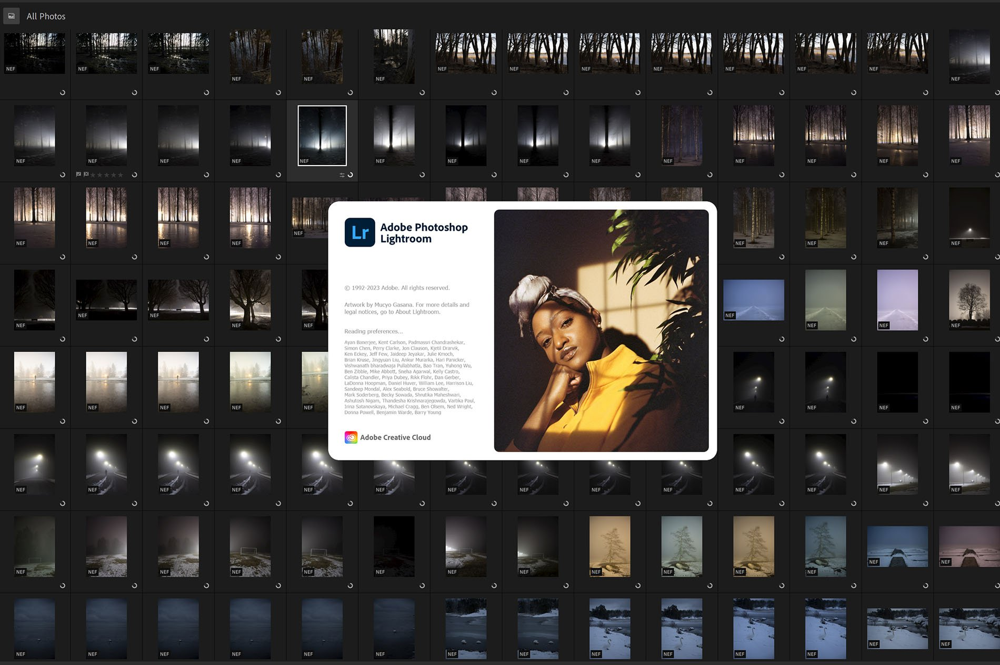
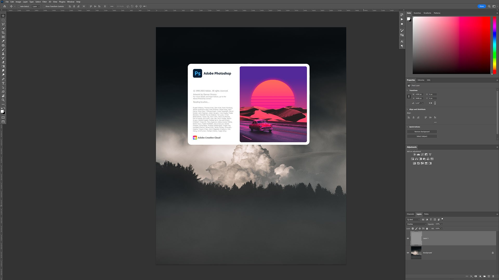
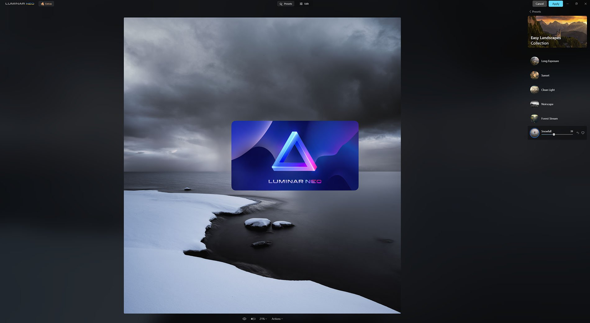
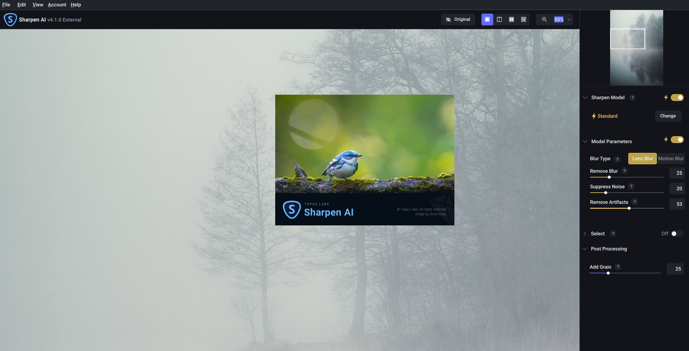
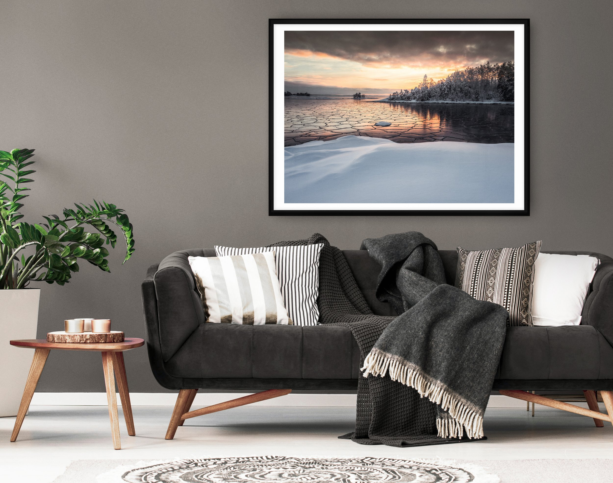

Today, I'm excited to share my favorite AI-powered image editing tools. While Midjourney has taken the spotlight for the tool to create "AI art," I personally don't use it because my heart belongs to the captivating world of photography. There's an indescribable feeling of awe when standing before an inspiring landscape or view. For me, it's all about the journey – immersing myself in the outdoors and capturing the breathtaking beauty of nature.

So, in this article, I'll be shedding light on the incredibly powerful AI image editors. With the help of AI tools, I can make easier selections and enhance my photography adjustments and editing to bring my vision to life easier than before.

Be careful not to let the AI decide what you want to do with your photography. It can be a great starting point for editing, but for full creative control and inspiration, use something like [**EPIC Presets**](/epic-presets) and get breathtaking results. A new update to the [**EPIC Presets**](/epic-presets)is coming soon with new AI adjustments for skies to use in various different sceneries, such as night sky, sunsets, etc. If you already have EPIC Presets, once the upgrade is done, you’ll receive an update in your email! **The EPIC Presets are now -30% for a limited time!**

### AI Image Editing: How It Works - Benefits & Limitations

Before diving into the specific AI tools, let's take a moment to explore how AI works in image editing and the benefits it brings to landscape photographers.

Artificial intelligence, or AI, has made a significant leap in recent years, particularly in the field of image editing. Machine learning algorithms can now analyze and process complex visual data, allowing them to recognize patterns and make intelligent decisions based on their input. In the context of image editing, AI algorithms are trained on vast datasets of images, learning from the various adjustments and enhancements made by photographers.

#### Benefits of AI

* **Time-saving.** AI-powered tools can quickly analyze and make adjustments to your images, significantly reducing the time spent on manual editing. This allows you to focus more on capturing stunning landscapes and less on post-processing.
* **Improved efficiency.** AI tools provide intelligent and precise selections, allowing you to make targeted adjustments easily. This can streamline your editing process and help you achieve your desired results faster.
* **Creativity.** With AI tools at your disposal, you can experiment with different looks and styles, pushing the boundaries of your creativity. The intelligent algorithms can suggest new possibilities for your images, inspiring you to explore fresh perspectives.
* **Image quality improvement.** AI algorithms can analyze and enhance specific aspects of your images, such as sharpness, noise reduction, and exposure adjustments. This can help you achieve professional-quality results, even if you're not an expert in image editing.
* **Adaptive learning.** One of the most impressive aspects of AI is its ability to learn and adapt over time. As AI tools continue to evolve, they'll become more accurate and efficient, further refining your editing process and ensuring your images stand out.

#### Limitations of AI

* **Overreliance on AI**. One of the primary concerns with AI-driven tools is the potential for overreliance on the technology, leading to a loss of personal touch in your photography. Remember that AI tools should be used to support your creative vision, not replace it. Ensure that your artistic voice remains at the forefront of your work.
* **Inaccurate results**. While AI algorithms are becoming increasingly sophisticated, they can still occasionally produce inaccurate or undesirable results. Be prepared to step in and make manual adjustments when necessary to achieve your desired outcome.
* **Loss of creative control**. Some AI tools may make decisions and adjustments you may disagree with on your behalf. Maintaining creative control over your images is crucial, and not allowing AI algorithms to dictate your artistic choices is crucial.

## 1. Adobe Lightroom CC

Lightroom is my go-to tool for organizing, managing, and editing my photography. I often find myself only using Lightroom because it’s what I’m used to and its capabilities suited for me. Lightroom's AI-powered features, such as Auto Tone and Range Mask tools, make it easy to adjust my images quickly and efficiently.

### Lightroom CC AI Features for Landscape Photographers

* **Auto Tone** - Balances exposure, contrast, and color for a well-balanced start to your edit.
* **Subject and Sky Masking** - AI makes targeted adjustments without affecting the rest of the image.
* **Content-Aware Healing Brush** - Remove blemishes, imperfections, or unwanted elements easily.
* **AI-Powered Enhance Details** - Improve the quality of your RAW images by enhancing details and reducing artifacts.

[Visit Adobe for more information](https://www.adobe.com/creativecloud/photography.html).

*Adobe Lightroom CC*

## 2. Adobe Photoshop CC

Photoshop is my companion when I need to perform complex edits like blending multiple exposures and manipulations. With advanced layering and masking, Photoshop offers seamless editing and creative possibilities. I have used Photoshop for a long time and am very comfortable working with it because of my experience. However, it can be a bit overwhelming if you haven't used it.

### Photoshop CC AI Features for Landscape Photographers

* **Content-Aware Fill and Scale** - Remove unwanted elements or resize images while maintaining important details.
* **Sky Replacement and Object Selection Tool** - Replace skies and easily make precise selections.
* **Smart Object Selection** - Automatically detect and select complex objects for targeted adjustments or effects.

[Visit Adobe for more information](https://www.adobe.com/creativecloud/photography.html).

*Adobe Photoshop CC*

## 3. [Luminar Neo](https://skylum.evyy.net/xkk355)

Luminar Neo is an innovative AI-powered photo editing software, much like Lightroom. It offers a variety of AI-driven features that can help you enhance your images in unique ways. I have used Luminar Neo for a few months and am getting more comfortable using it. What I enjoy about the program is the simple layout and how you can easily apply different AI adjustments.

### Luminar AI Features for Landscape Photographers

* **AI Structure** - Enhance details and textures in landscapes without affecting other image parts.
* **AI-powered Accent** - Apply smart contrast, saturation, and exposure adjustments without manual input.
* **AI-powered Atmospheric Haze** - Add depth and atmosphere to your landscape photos with realistic haze and fog.
* **AI Sky Replacement** - Swap out dull skies with more dramatic ones effortlessly.
* **AI Color Harmony** - Optimize your images' color balance, contrast, and vibrancy for a harmonious result.

[Visit Luminar Neo](https://skylum.evyy.net/xkk355)

[*Luminar Neo*](https://skylum.evyy.net/xkk355)

## 4. [Topaz Labs](https://www.topazlabs.com/shop/ref/2009/?campaign=AiImageEditingBlogPost)

Topaz Labs offers AI-driven tools for various landscape photography editing aspects. These powerful tools can significantly enhance the quality of your images. For prints, I use Gigapixel AI to ensure that the print size is good for printing large. For sharpening the Sharpen AI seems to be very good for most of my photography.

### Topaz Labs AI Tools for Landscape Photographers

* **Gigapixel AI** - Upscale your images without losing quality or introducing artifacts.
* **DeNoise AI** - Effectively reduces noise in low-light and high-ISO shots.
* **Sharpen AI** - Recover lost detail and sharpness in your images.

[Visit Topaz Labs](https://www.topazlabs.com/shop/ref/2009/?campaign=AiImageEditingBlogPost)

[*Topaz Labs Ai Tools*](https://www.topazlabs.com/shop/ref/2009/?campaign=AiImageEditingBlogPost)

## My Workflow & AI

I mostly use Lightroom CC Classic as my daily choice. The AI tools inside Lightroom are powerful, and I often use the masking panel to create selections and fine adjustments. Occasionally, when I need to do some heavy editing, such as removing a difficult part from an image, I turn to Photoshop. The Content-Aware Crop is brilliant for adding more sky to a picture if cropped too tightly. Or, if I need to have more flexibility with layers, Photoshop is an excellent choice.

For experimenting with a photograph or when I feel too comfortable with editing, I use [Luminar Neo](https://skylum.evyy.net/xkk355). I can easily step into a beginner's mindset while working with it. And finally, my go-to sharpener at the moment is [Topaz Labs Sharpen AI](https://www.topazlabs.com/shop/ref/2009/?campaign=AiImageEditingBlogPost), which does an excellent job when I need to add sharpness to my images. Also, [GigaPixel AI](https://www.topazlabs.com/shop/ref/2009/?campaign=AiImageEditingBlogPost) is fantastic for ensuring my photographs look brilliant when printed.

AI image editing tools can significantly improve your landscape photography editing process. By using Lightroom, Photoshop, Luminar Neo, and Topaz Labs, you can achieve beautiful results and bring your creative vision to life. While these tools are powerful, they may have some flaws, so finding the right balance and workflow that suits your needs is essential. I recommend exploring and incorporating these tools into your workflow to enhance landscape photography.

## Unlock Your Creative Potential

As you delve deeper into the world of AI-powered photo editing tools and unleash their potential, consider exploring some of the resources I've created to help photographers at all levels improve their skills and find inspiration.

* [**The Complete Photography Collection**](/complete-bundle)**.** This all-inclusive package features all of my tutorials, presets, and eBooks, offering a comprehensive guide to enhancing your landscape photography and achieving the recognition your photos deserve.
* [**Epic Preset Collection**](/epic-presets)**.** Transform your editing process in Lightroom with my presets to help you unlock your creative potential and bring your images to life.
* [**1-on-1 Photography Coaching**](/coaching)**.** Whether you're a beginner or an experienced photographer, my new online 1-on-1 coaching service is designed to provide personalized guidance and support to your needs and goals.
* [**Free Tutorials**](/tutorials)**.** For those just starting or looking to expand their skills without breaking the bank, check out my collection of free tutorials covering various aspects of photography and editing.

**Remember that AI is a tool; like any tool, it can't replace the human element in the creative process.** Embrace your intuition, emotions, and experiences as a photographer, and let them guide your editing choices. This will help you create images that not only look interesting but also resonate on an emotional level.

Your personal style and artistic voice are what makes your photography unique. While AI tools can help you achieve technical perfection, preserving your creative identity and ensuring that your images reflect your personal touch is essential.

Let me know if you use any of these tools or want to try them out. Thanks for reading!

*Disclaimer: I'm an affiliate of some of these programs. Remember that using the affiliate links in this article helps support my work and enables me to continue sharing my experiences and insights with you.*

## Subscribe

If you enjoy this post, SUBSCRIBE to be the first to receive **fresh new tutorials** straight to your inbox!

First Name

Last Name

Email Address

Subscribe

Thank you!

# Print Collection

Surround yourself with inspiration by adding one of my [fine art landscape photography prints](/print-collection) to your home or workspace. These prints constantly remind you of the beauty of the World and inspire you to seek out your hidden gems.

 