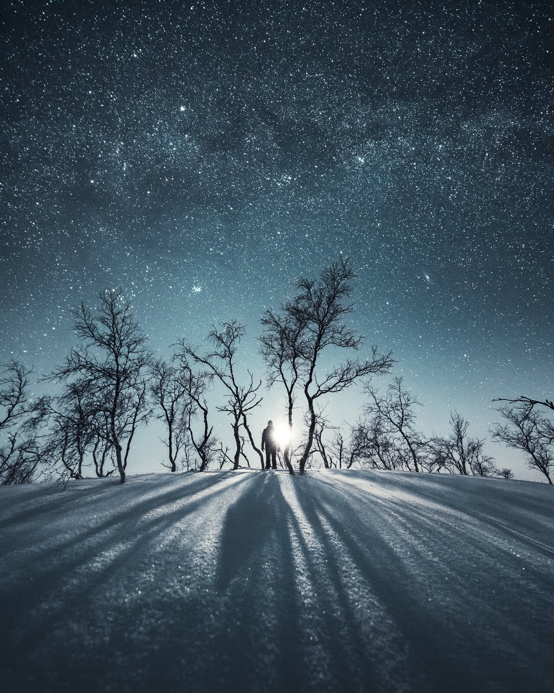

As the new year approaches, I can't help but get excited about all the potential it holds for my photography and creativity. The winter season is my favorite time to take photographs. The possibilities seem endless. I'm also looking forward to learning new techniques, visiting new locations, and creating meaningful images. I think you'll enjoy this post if you feel the same way.

Setting goals for your photography to continue growing and improving as a photographer is essential. Whether you are doing it as a hobby or a profession, learning and improving is the key to enjoying photography. Inspiration is all around us. One way to be inspired is by setting inspiring goals.

## 1. Reflect on your past to improve your future

How to improve and learn new? I believe the saying: *“The past is a valuable resource, not a burden.”* I encourage you to use your past experiences as a source of knowledge and wisdom rather than dwelling on mistakes or regrets. Start by reflecting on what you did the past year. Using what you've learned over the past year can help you set meaningful and achievable goals. Start by answering the following questions.

* What did you accomplish?
* What were your successes and challenges?
* What did you enjoy, and what was frustrating?

  + Reflect on any challenges or frustrations you experienced in your photography over the past year.
  + What could you have done differently to overcome those challenges?
* What areas do you want to focus on improving in the new year?

Use the insights you gained from reflecting on the past year to set clear and attainable goals for the new year. For example, suppose you identified a specific technique or approach that was particularly challenging for you. In that case, you might set a goal to master that technique.

By reflecting on the past year, you are one step closer to moving your craft to the next level.

Cold Night – Mikko Lagerstedt – Kilpisjärvi Finland, 2018

## 2. Set goals

* It's essential to be clear and realistic when setting your goals. For example, instead of making a goal to "become a better photographer," set a more specific goal such as "learn how to shoot long exposures" or "shoot in a new location once a month." This will help you focus on specific areas for improvement and make it easier to track your progress.
* Once you've set your goals, creating a plan for achieving them is essential. Break your goals into smaller, achievable steps, and schedule a time to work on them each week. This will help you stay motivated and on track.
* Be bold, try new things, and push your boundaries. Experiment with different techniques and styles; be brave and make mistakes. This will help you grow as a photographer and find your unique voice.
* Seek feedback: It's essential to get feedback on your work to improve. Share your photos with friends, family, and fellow photographers, and ask for honest feedback. This will help you see your work through the eyes of others and identify areas for improvement.

## 3. Track your Progress

* Keeping a planner or journal can be a helpful way to track your progress and goals. Write down your goals and any action steps you need to take to achieve them, and schedule time each week to work on them. You can also use your planner or journal to document your progress, noting any milestones or accomplishments along the way.
* Use your phone or computer to set up reminders or alarms to help you stay on track with your goals. For example, set a reminder to practice a specific technique each day or to spend a certain amount of time editing photos each week.
* Many apps can help you track your progress and goals. Consider using an app to help you stay organized and motivated. I use TickTick for simple tasks and for focusing.
* Sharing your progress with others can be a great way to stay motivated and accountable. Share your goals and progress with friends, family, or mentors, or join a community of like-minded photographers to share your journey. Would this be something you are interested in?

Approaching Storm – Mikko Lagerstedt – Porvoo Finland, 2020

## 4. Breaking down goals

This is how you can achieve goals and track them in your journal. Write down each of these and be as thorough as you can.

**Specific Goal**What do you want to improve? *“I want to improve my Lightroom Color editing.”*

**Specific Action**What are your action steps? *“Use the HSL panel in Lightroom and watch tutorials on how to use it.”*

**Timeframe**  
How many hours does it take? *“I will spend 1 hour per day editing in the HSL panel to improve my color editing.”*

**Track your Actions**  
How many hours have you spent this week? *“I have spent learning 2 hours this week using the HSL Panel?”*

**Results**Write down what you learned. Be specific and acknowledge your improvement. *“I understand the HSL panel easily and can identify how to improve the colors in my photography.”*

I believe these steps will help you improve your photography and make you continue to enjoy taking photographs.

## 5. Goal ideas for Your Photography

When you set inspiring goals, it’s easy to feel inspired to start creating and have fun in the process. Let your creativity flow and create what you desire!

* Practice shooting in different lighting conditions, such as sunrise or sunset, to improve your skills in capturing the golden hour
* Experiment with using filters, such as polarizers or neutral density filters, to enhance the colors and contrast in your photos
* Work on composing your shots more effectively by learning about the rule of thirds or practicing leading lines
* Practice shooting in different weather conditions, such as fog or rain, to capture unique and atmospheric images
* Learn how to use a tripod effectively to capture sharp, blur-free photos, especially in low light
* Experiment with different focal lengths and perspectives to create different effects in your photos
* Practice shooting in manual mode to have more control over your camera settings and to create the desired exposure and depth of field in your photos
* Experiment with different types of lenses or camera settings to create other effects in your photos
* Shoot in a new location or visit a new destination specifically to photograph landscapes
* Work on improving your post-processing skills, such as using software to enhance colors and composition
* Collaborate with other photographers or participate in a photography workshop or retreat
* Work on developing a personal style or theme in your landscape photography
* Explore new local locations. Many beautiful locations are likely near your home, even if you cannot travel far. Aim to explore these new locations and try out different compositions, lighting conditions, and subject matter.

If you want, you can do daily tasks, such as the one below. You can [**Download Your Free Photography Planner**](https://static1.squarespace.com/static/515aaa6be4b063d29d1c71ea/t/61714172feb494526f21dbf8/1634812274427/Photography-Planner-2021.pdf) I made last year.

The important thing is to set specific, possible goals to help you grow and improve as a photographer.

Two – Mikko Lagerstedt – Kilpisjärvi Finland, 2019

**Thank you for reading this post. Do you have any plans or goals for the upcoming year? I would love to read them.**

Thank you for the year, and I hope to see you again next year! Keep on creating, and finally, **Happy New Year!**

**If you want to stay connected with me and my photography, you can follow me on** [**Twitter**](https://twitter.com/MikkoLagerstedt)**, where I’m most active.**

## Subscribe

Sign up with your email address to receive posts like this straight to your email.

First Name

Last Name

Email Address

Subscribe

We respect your privacy.

Thank you!