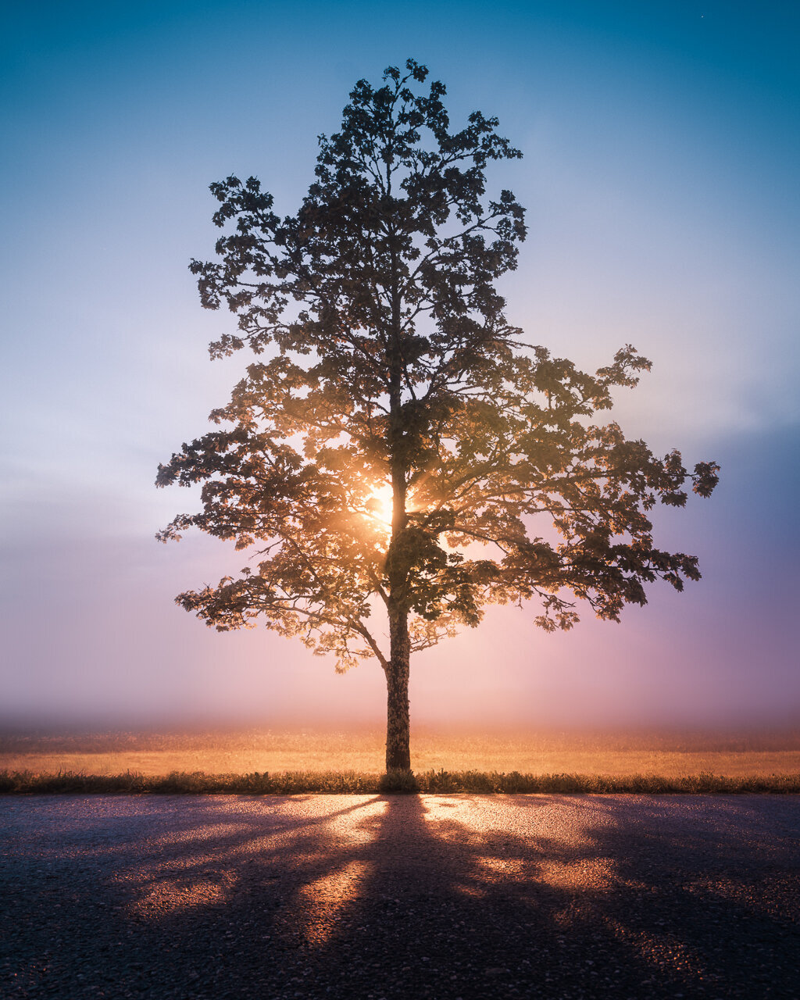

Hey everyone. I hope you had a wonderful summer. I wanted to write this post for a long time, and finally, I have some energy to do it. It’s been a long summer and quite difficult for me. In May, I felt that I needed to take a break from photography, as the Spring season is not really inspiring to me. I went out to photograph, but the weather was just blah, so I called it and took a couple of weeks off.

As I started to photograph again in mid-June, I started getting strange pain in my left leg. It was really mild at first, and I just thought I needed to rest. As time went on, it got worse, and in late June, I went to see an osteopath three times, but it didn’t work, so in August, I went to see a doctor. The doctor diagnosed a nerve problem in my back with a possibility that I have a bulging disc. She sent me to physiotherapy.

After my first physiotherapy session, things seemed to get better, and I got some pain relief. The next week the pain went back and forth. One day it would be mild, and the other was really bad. I couldn’t stand for more than 10 minutes before I got pain going from the lower back to the left side of my feet. There was no consistency in what I had done the previous day to make it better. It just was random.

Two weeks ago, my lower back was really stiff on Sunday, and I thought it would be fine the next morning. But I couldn’t have been more wrong. The next night I woke up in the middle of the night with severe pain in the left leg and lower back. I tried sleeping, but I couldn’t find a way to put my body to get any relief in pain. It was something else. I took some painkillers and hoped for the best. I finally fell asleep after four hours in bed. In the morning, I woke up and tried to get up, but I couldn’t. The pain was so bad that I couldn't do it even when I tried to crawl.

I called the doctor, and she told me to get stronger painkillers. My wife was kind enough to deliver them to me. Later that day, I barely got out of bed to walk. I couldn’t walk straight. My body was fully twisted to the left. Finally, the meds helped me get some sleep. It was a struggle the whole day and night, but since I had no problem peeing or no muscle weakness, the doctor told me to stay home and try to move and walk. I did what she told me, but on Tuesday, I could barely get out of my bed, and then I realized that my left calf muscle was not responding, and I couldn't walk normally.

I called the doctor, and she told me to go to the emergency. As my wife was driving me to the hospital, my left leg started to get numb. I couldn’t feel my butt. The pain was excruciating. I got straight into the surgery ward. The next day I got a CT-scan, and they confirmed the bulging disc on my lower back. After a long couple of days, on Friday, I had a successful surgery. Immediately after the surgery, the leg pain was gone.

It has now been a week after the surgery. I write this from my bed. My left leg still has some problems; the calf muscle is partially numb, and so is my pinky toe and heel. I can walk, but it’s not easy. I try to walk as often as possible to keep getting better. I still have 7-9 weeks of recovery to get fully back on photography. Since I can’t lift anything heavy or do any necessary movements, landscape photography is not an option. I hope to get back on my feet and start doing what I love to do.

I’m forever grateful to the hospital staff in HUS and my lovely wife for the support, caring, and helping me along the way.

I also want to thank everyone who has supported me by buying my prints and tutorials. Thank you!

While you are waiting for new content, you can find my tutorials, eBooks, and more from the [Learn-page](https://www.mikkolagerstedt.com/learn), and my prints are available through the [Printshop](https://www.mikkolagerstedt.com/buy-art).

Here is a photograph I took in August, one foggy night. It wasn’t easy to capture it with the problems I had, but I’m glad I went out that night.

Midnight Light - 2020