I don’t often write about gear, but it’s the most common question I get, so today, let’s talk about gear and what I currently use in landscape photography. Throughout my journey, I've experimented with various Nikon cameras, from D90 to Z7 II and now to the new Z8. I have used lenses from Nikon, Sigma, Tokina, Tamron, and Laowa, ultimately finding the current setup that allows me to express my creative vision.

I used the new Nikon Z 8 for a week in March, and it was fantastic. From a quick overview, I think it delivers an excellent upgrade for the autofocus and video options compared to the Nikon Z 7II. I’ll receive my copy of the Nikon Z8 later, so I can give you more thoughts about the camera. These are my honest opinions about the gear I use. Even though I'm a Nikon Creator, this post is not sponsored by Nikon.

## **Nikon Z7 II**

I have used the Nikon Z7 II as my primary camera for the past year. Before that, I used [Nikon Z7](https://amzn.to/3IodXUm) and D810. You can [**view my review of the Nikon Z7**](https://mikkolagerstedt.com/blog/nikon-z7-mirrorless-camera-for-landscape-photography). Now with the [Nikon Z7 II](https://amzn.to/3pm3ims), I barely use anything else. The SD card slot is a great addition to the previous version. I’m not currently shooting video much, but that part has also been upgraded from Z7. The battery life is slightly better than in the Z7. When I want to capture time-lapse as well as stills I bring with me the Z7 to have the option to shoot two different perspectives at the same time.

**Sensor**

Although not the highest-megapixel sensor in the market, the [Nikon Z7 II](https://amzn.to/3pm3ims)'s 45.7-megapixel sensor produces high-quality images with incredible detail. It is essential in landscape photography, where every nuance, from the texture of rocks to intricate patterns, adds depth and richness to the final image.

**Dynamic Range**

The dynamic range of a camera refers to its ability to capture detail in both the brightest and darkest parts of a scene. It is essential when photographing landscapes with high contrast between bright skies and shadowy foregrounds. The [Nikon Z7 II](https://amzn.to/3pm3ims) excels, allowing me to capture images that retain detail even in challenging lighting conditions.

**Low-Light Performance**

One of my favorite aspects of landscape photography is capturing the beauty of the night sky. The [Nikon Z7 II](https://amzn.to/3pm3ims)'s excellent low-light performance allows me to photograph the stars and the Milky Way with minimal noise and incredible detail. The camera's high ISO capabilities and noise reduction ensure that my astrophotography images are clean and sharp.

#### Nikon Z7 II pros and cons

**+** Exceptional image quality  
**+** Low-light capability  
**+** Dynamic Range  
**+** Low weight, only 705 g   
**+** Dual card slot  
**-** No in-camera RAW video capabilities  
**-** Relatively slow autofocus  
**-** Could have a better battery life

[**Nikon Z7 II**](https://amzn.to/3pm3ims)

[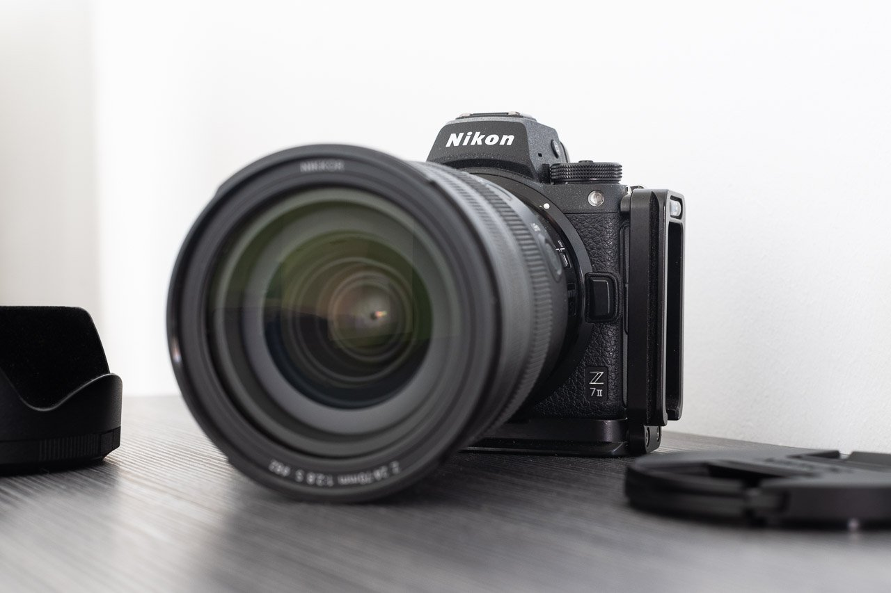](https://amzn.to/3MCDhbH)

[Nikon Z 7 II](https://amzn.to/3MCDhbH) and [Nikkor Z 24-70 mm f2.8 S](https://amzn.to/3MdYbwt) and [L-Bracket](https://amzn.to/3MfqqLs)

### Captured with the Nikon Z 7 II & Nikkor Z 14-24 mm f2.8 S

[View fullsize
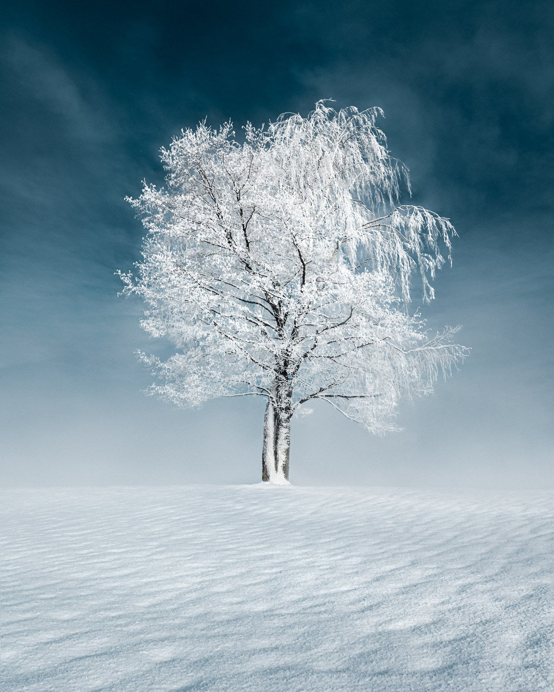](https://images.squarespace-cdn.com/content/v1/63ceaffd33529a45e572bf90/1684421089447-AG50B51GGIX2RC2TB9CY/Mikko-Lagerstedt--23.jpg)

[View fullsize
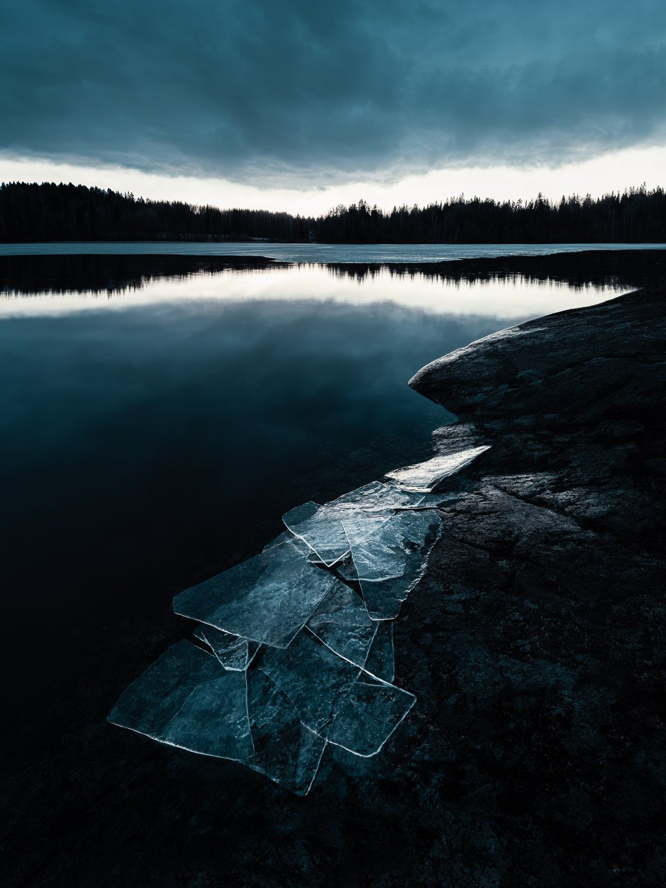](https://images.squarespace-cdn.com/content/v1/63ceaffd33529a45e572bf90/1684421089148-LRK03XNCPPSME02CM8WY/Mikko-Lagerstedt--25.jpg)

[View fullsize
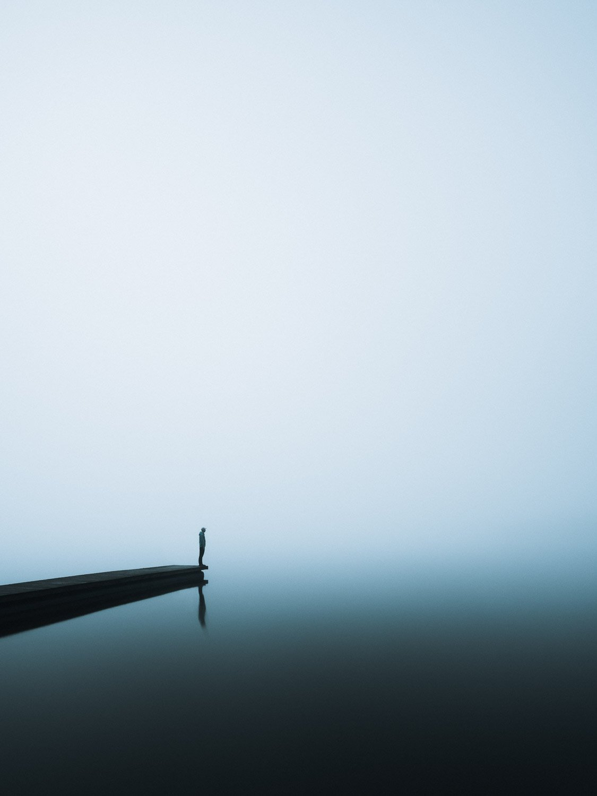](https://images.squarespace-cdn.com/content/v1/63ceaffd33529a45e572bf90/1684421090065-HRWGQOS7IR90Y792B2V9/Mikko-Lagerstedt--26.jpg)

[View fullsize
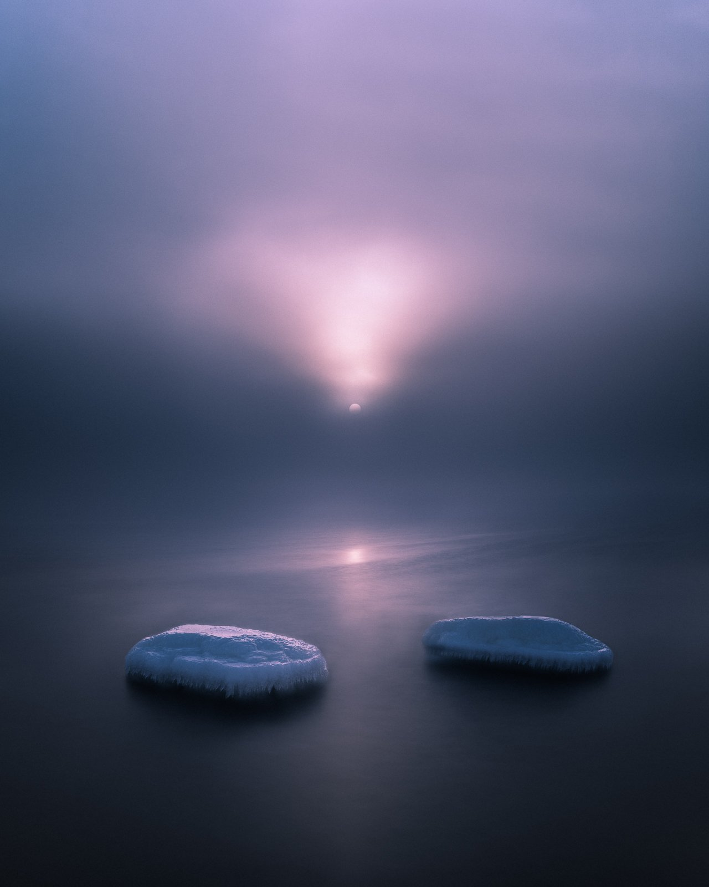](https://images.squarespace-cdn.com/content/v1/63ceaffd33529a45e572bf90/1684421350664-8TIUPBC1ZHBGSINX6YTF/Mikko-Lagerstedt-Morning-Echo+%282%29.jpg)

[View fullsize
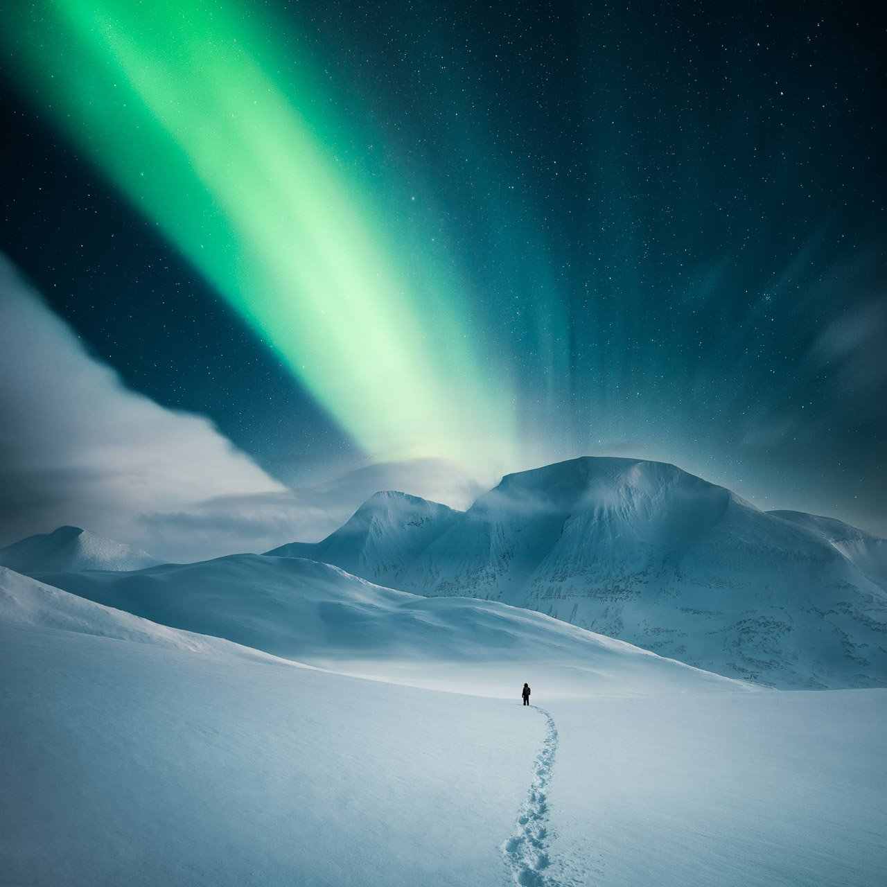](https://images.squarespace-cdn.com/content/v1/63ceaffd33529a45e572bf90/1684421090707-Z28YGW9NQ6BX7ZLT3UYM/Mikko-Lagerstedt-Infinite.jpg)

[View fullsize
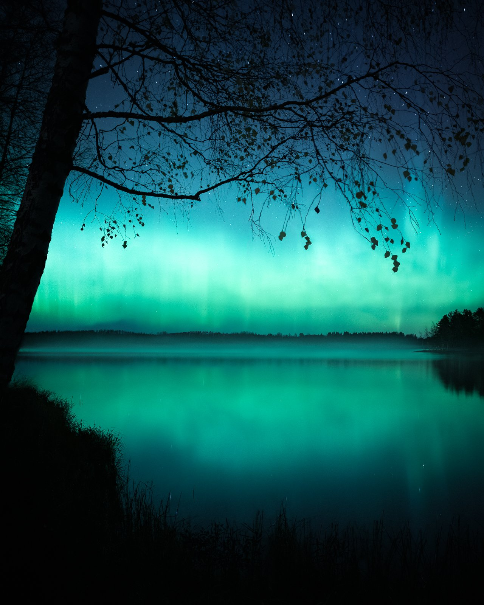](https://images.squarespace-cdn.com/content/v1/63ceaffd33529a45e572bf90/1684421354552-LBQ7PPFT6UAEE6TCHEB4/Mikko-Lagerstedt-Stillness-2.jpg)

[View fullsize
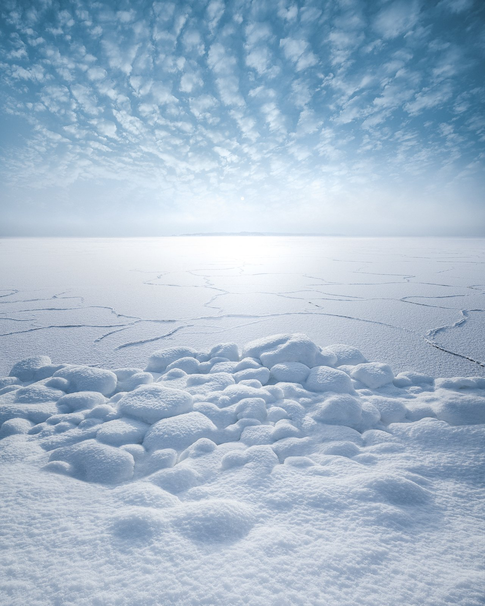](https://images.squarespace-cdn.com/content/v1/63ceaffd33529a45e572bf90/1684421356982-7KQRBY2SXQFGFULBPIVU/Mikko-Lagerstedt-Peacefull.jpg)

[View fullsize
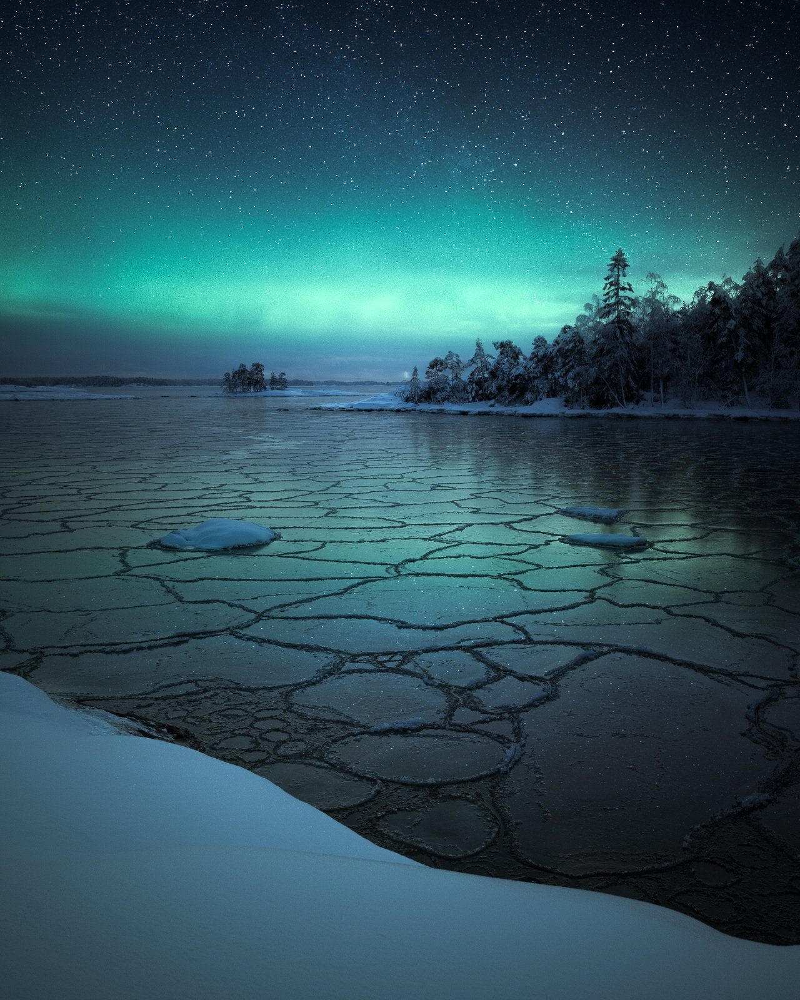](https://images.squarespace-cdn.com/content/v1/63ceaffd33529a45e572bf90/1684421367075-WHX9R22AZ8IL92KP10K0/Mikko-Lagerstedt-Glow-5.jpg)

## Nikon Z8

As I said earlier, I have to spend more time with the camera to give you more insight, but here are quick pros and cons from my brief exposure to the camera. I would have enjoyed more megapixels for landscape photography, but it’s not the most important thing. The dynamic range is more important, which seems to be great. The tilting screen was great for horizontal shots.

Some specs: 45.7 megapixels, ISO 64-25600, EXPEED 7, Real-Live Viewfinder, Subject detection for nine subject types, 3D-tracking, Up to 120 fps and Pre-Release Capture, RAW video up to 8.3K/60p, 4K UHD/120p, and 4-axis tilting monitor. When I got the camera back in March, I had no chance to edit it in Lightroom because it was new. Now the RAW files have been added to Lightroom, so I will have to go through them again to see if there is a difference to the Z 7 II files.

#### Nikon Z8 pros and cons

**+** Great image quality  
**+** Dual card slot  
**+** In-camera 8K RAW video  
**+** Fast autofocus, same or even better than the Z9  
**+** Starlight feature is exceptional for low-light composing  
**+** Backlit buttons  
**-** Low battery life when shooting video  
**-** Low-light with high ISO settings might be worse than Z7 II

**You can view my video from the trip in Spain below. I hope you enjoy it as much as I enjoyed being there with the Nikon family!**

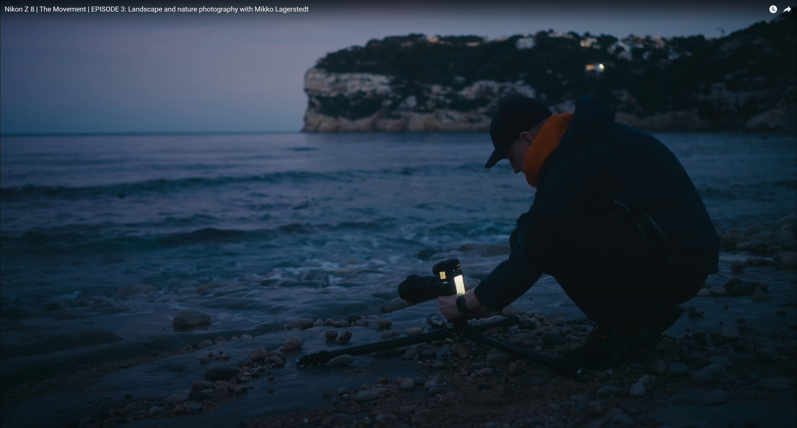

### Captured with the new Nikon Z 8

[View fullsize
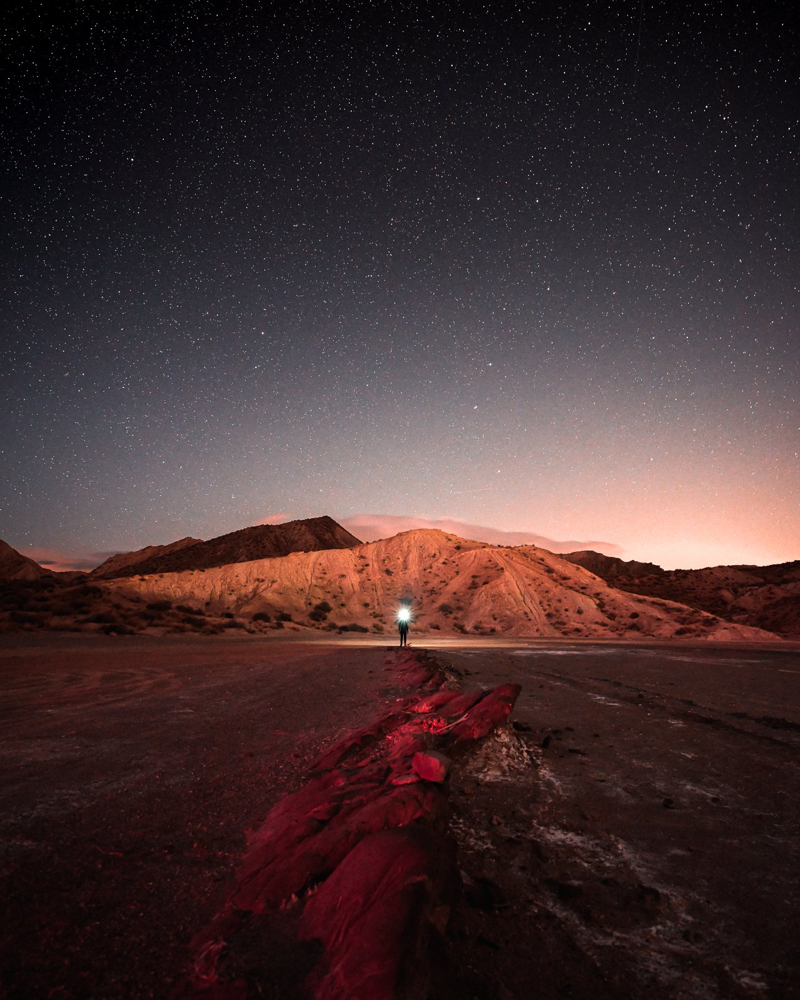](https://images.squarespace-cdn.com/content/v1/63ceaffd33529a45e572bf90/1684335150231-KOI38OR3OC67CND3OTKR/Mikko-Lagerstedt-Nikon-Z8-8.jpg)

[View fullsize
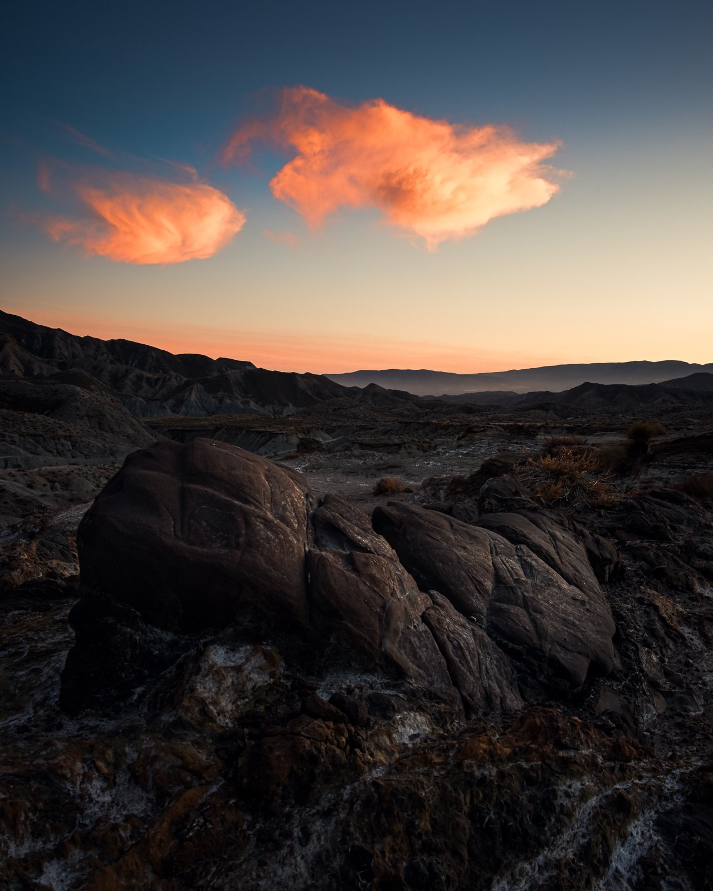](https://images.squarespace-cdn.com/content/v1/63ceaffd33529a45e572bf90/1684335155140-8QBX05QQRKZT4XZH16D2/Mikko-Lagerstedt-Nikon-Z8-7.jpg)

[View fullsize
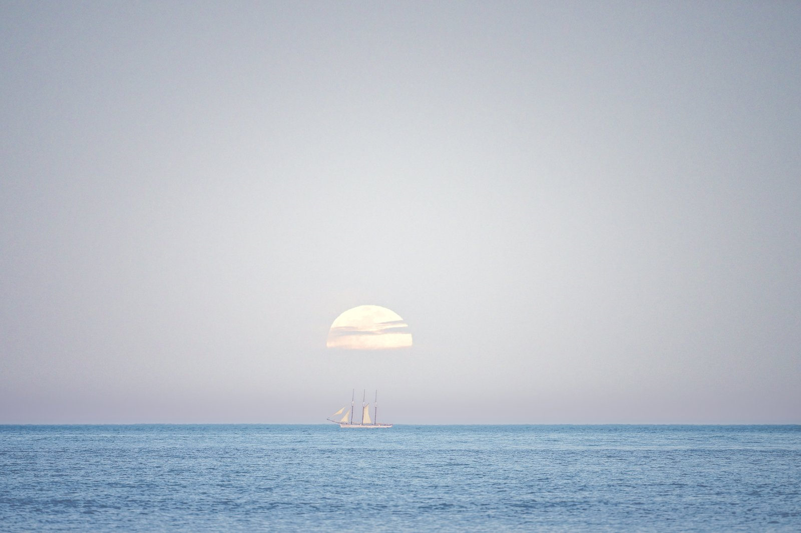](https://images.squarespace-cdn.com/content/v1/63ceaffd33529a45e572bf90/1684335160675-4BMIP9J7CARQMPGREWRV/Mikko-Lagerstedt-Nikon-Z8.jpg)

[View fullsize
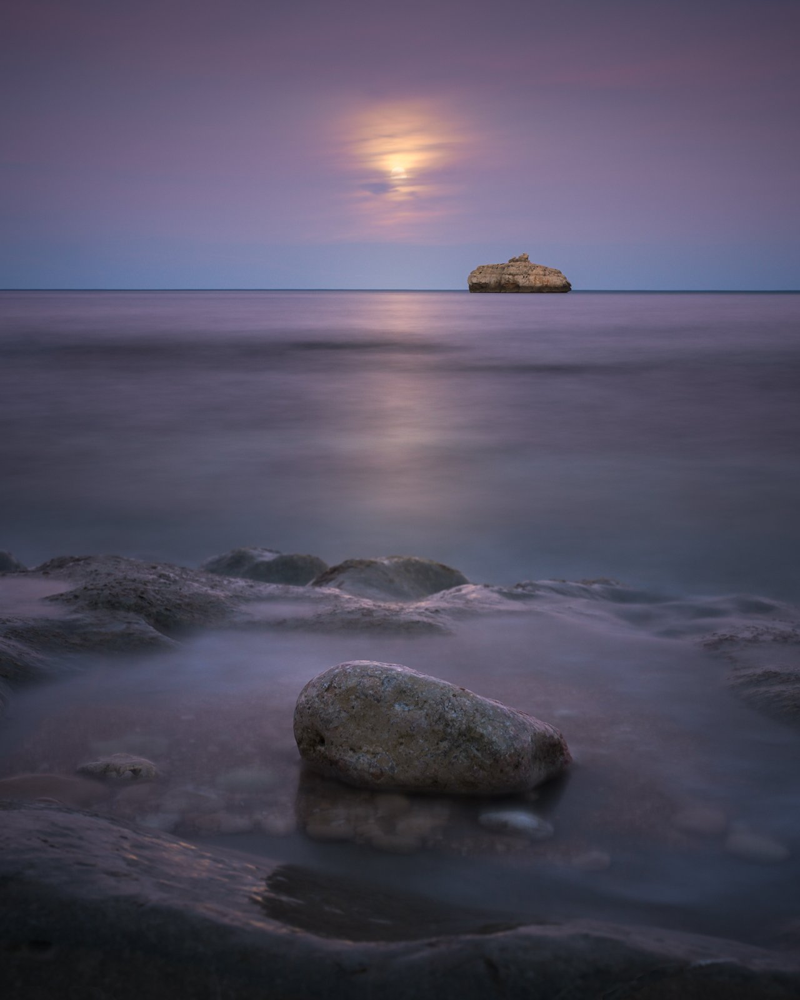](https://images.squarespace-cdn.com/content/v1/63ceaffd33529a45e572bf90/1684335157719-V2HSYZTI7Z2BKVFSI662/Mikko-Lagerstedt-Nikon-Z8-4.jpg)

[View fullsize
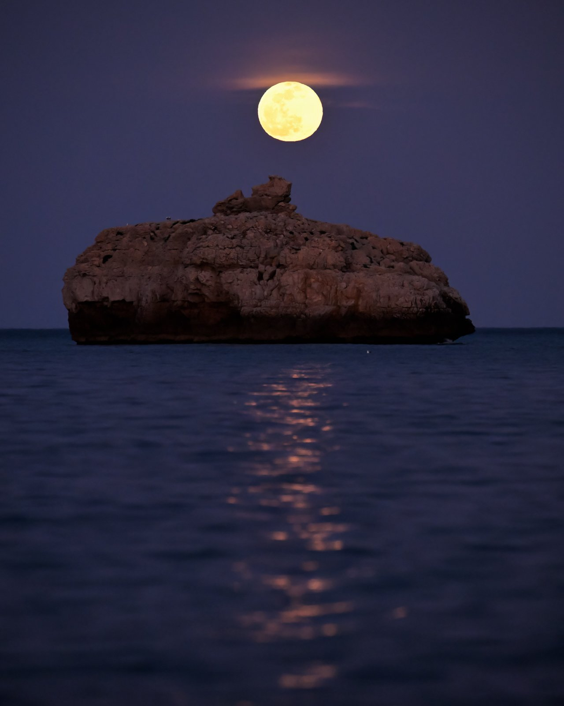](https://images.squarespace-cdn.com/content/v1/63ceaffd33529a45e572bf90/1684335146127-9UPCRGAPI2Q65TEM2IFB/Mikko-Lagerstedt-Nikon-Z8-3.jpg)

[View fullsize
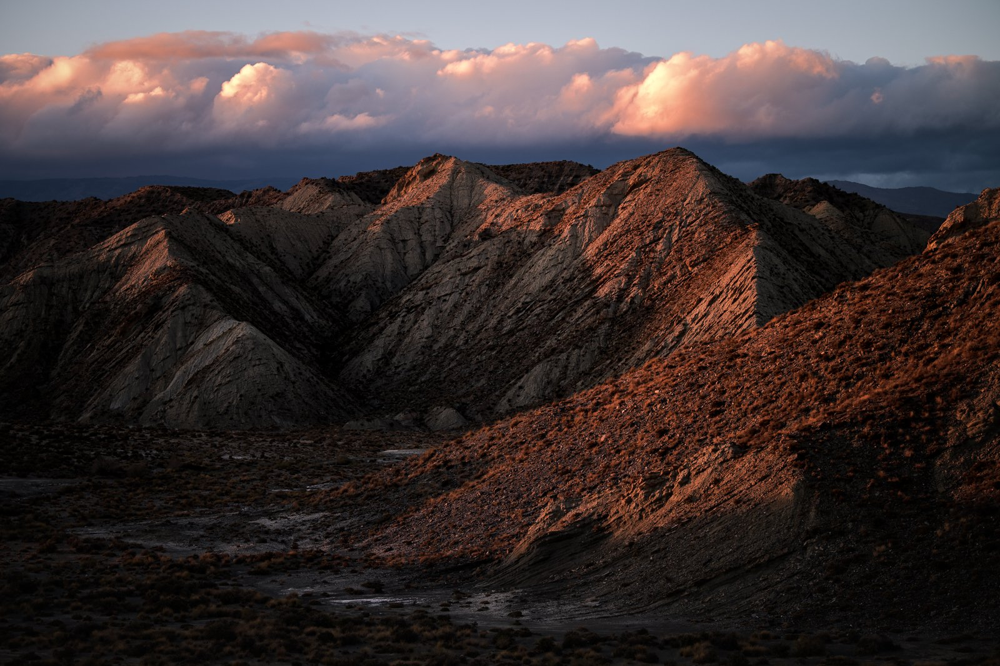](https://images.squarespace-cdn.com/content/v1/63ceaffd33529a45e572bf90/1684335153427-DU1T6YEMPFIPYNPX203X/Mikko-Lagerstedt-Nikon-Z8-6.jpg)

[View fullsize
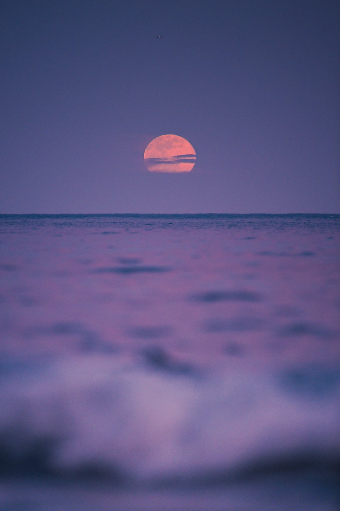](https://images.squarespace-cdn.com/content/v1/63ceaffd33529a45e572bf90/1684335165632-OMK7870O1EBP5DG7UY77/Mikko-Lagerstedt-Nikon-Z8-2.jpg)

[View fullsize
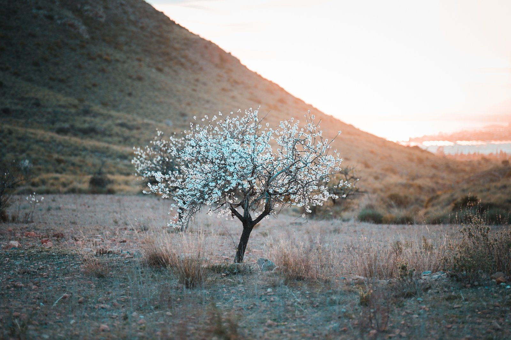](https://images.squarespace-cdn.com/content/v1/63ceaffd33529a45e572bf90/1684335164132-GVGSACXZXJSJKKNB9X1K/Mikko-Lagerstedt-Nikon-Z8-5.jpg)

## Lenses for Landscape photography & Night photography

If I only bring two lenses, my choice is easy. The Nikkor Z 14-24 mm f2.8 S and Nikkor Z 24-70 mm f2.8 S. These lenses cover most of my landscape photography focal range. I will receive the Nikon Z 70-200 f/2.8 S soon to upgrade my old trusted 70-200 f/4.0 VR, which I usually bring in the camera bag. If I brought just one lens, I would take the Nikkor Z 24-70 mm f2.8 S because it’s so versatile.

#### Nikkor Z 14-24 mm f2.8 S

This ultra-wide-angle zoom lens is my top choice for capturing landscapes and star-filled night skies. Its razor-sharp image quality, minimal distortion, and fast f2.8 aperture allow me to create awe-inspiring images that genuinely resonate with my vision. The upgrade from the old 14-24 mm is fantastic. The sharpness of the Z7 II and [Nikkor Z 14-24 mm f2.8 S](https://amzn.to/3NJazXO) combination is remarkable.

**+** Great for night photography  
**+** Excellent image quality and sharpness from edge to edge  
**+** Low weight: 650 g *(compared to the old 14-24: 1000 g)*  
**+** Low distortion

[**Nikkor Z 14-24 mm f2.8 S**](https://amzn.to/3NJazXO)

#### Nikkor Z 24-70 mm f2.8 S

As a versatile standard zoom lens, the [Nikkor Z 24-70 mm f2.8 S](https://amzn.to/3NMNF1C) has proven invaluable for various photography situations. And I can say I have it on my camera 70% of the time. This lens consistently delivers outstanding image quality, from intimate landscapes to environmental portraits. It has become a constant companion in my camera bag.

**+** Exceptional sharpness and image quality  
 **+** Relatively low weight: 805 g *(compared to the older 24-70 VR: 1070 g)*  
 **+** f2.8 useful in low light  
 **+** Versatile focal range

[**Nikkor Z 24-70 mm f2.8 S**](https://amzn.to/3NMNF1C)

[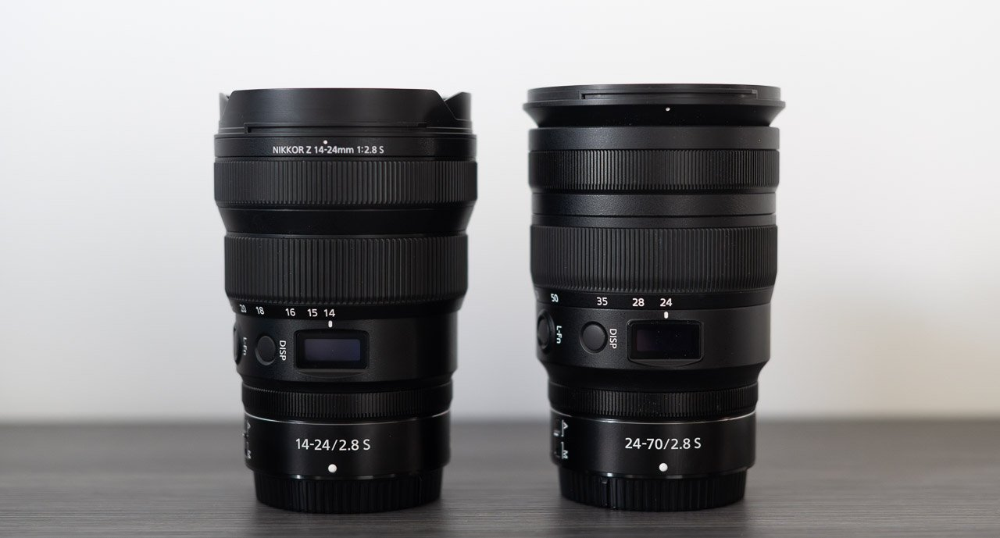](https://amzn.to/3BD6xsM)

#### Other Lenses

As mentioned above, I also carry the [Nikkor AF-S 70-200 f4.0 VR](https://amzn.to/42O1fGD) lens, a low-weight option to capture those intimate landscape photographs. I have the Nikon converter to use F-lenses on my Z7 II. When I know I want to have the option to shoot in really low light, I use the [Sigma ART 20 mm f1.4](https://amzn.to/3IJQwW3) lens. It’s not as sharp as the Z 14-24, but it certainly beats it with the big aperture, which helps capture the night sky.

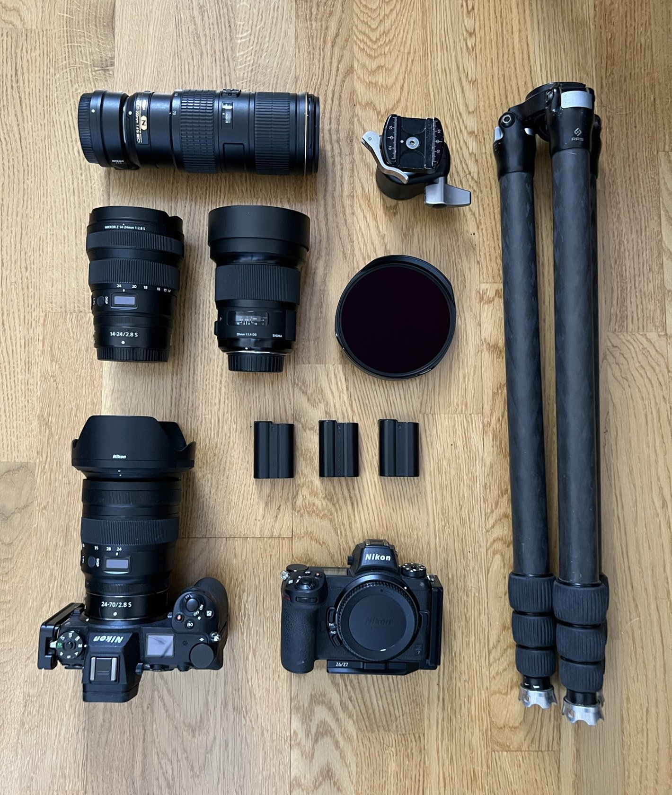

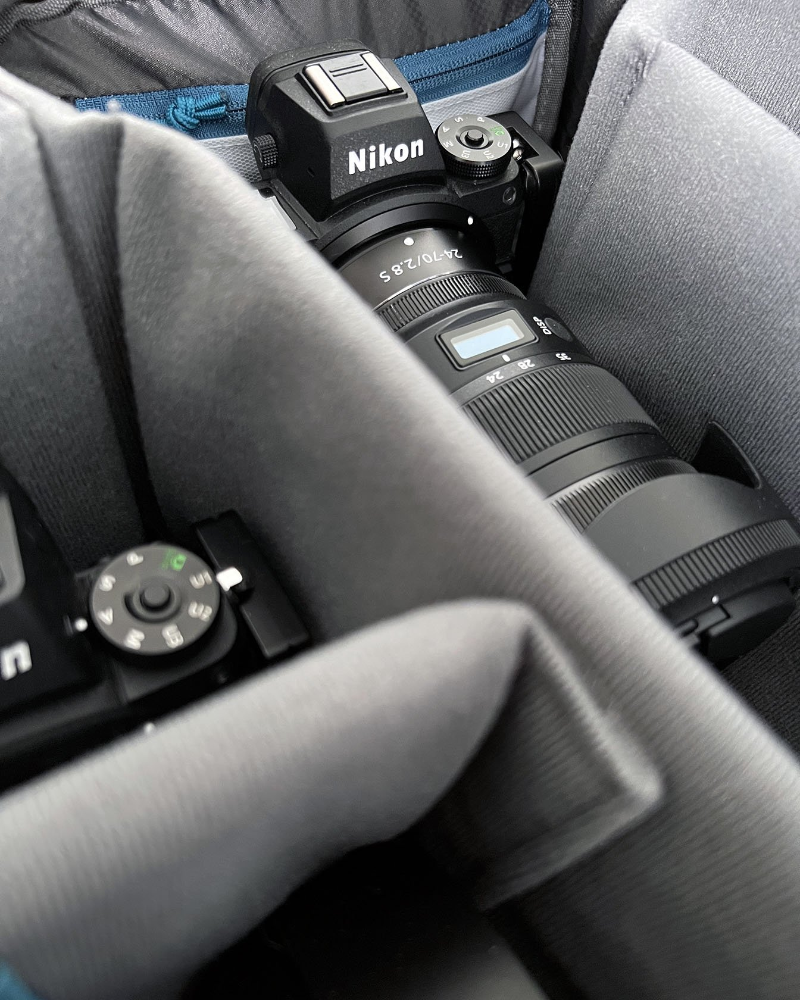

## Camera Bag

[Tenba Axis v2 24 L](https://amzn.to/3ph87gY) camera backpack is my current choice for carrying my gear. Its robust construction, customizable interior, and ergonomic design make it the bag for my gear, whether venturing to a remote location or just taking my camera to the nearby fields I carry this backpack. The only thing I don’t like about this backpack is that it has few pockets, less than in my old [Lowepro Protactic](https://amzn.to/436baXV) bag. Overall, I’m satisfied with the design.

#### Tenba Axis v2 24L

**+** Durable materials and construction   
**+** Comfortable to carry  
**+** Customizable interior   
**+** Using straps, you can add your tripod easily  
**+** Side access to the camera  
**-** Could have more pockets on the sides

[**Tenba Axis v2 24 L**](https://amzn.to/3ph87gY)

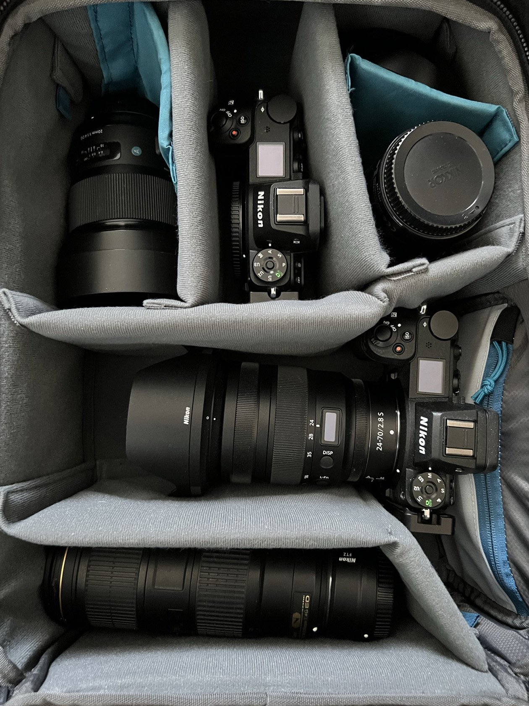

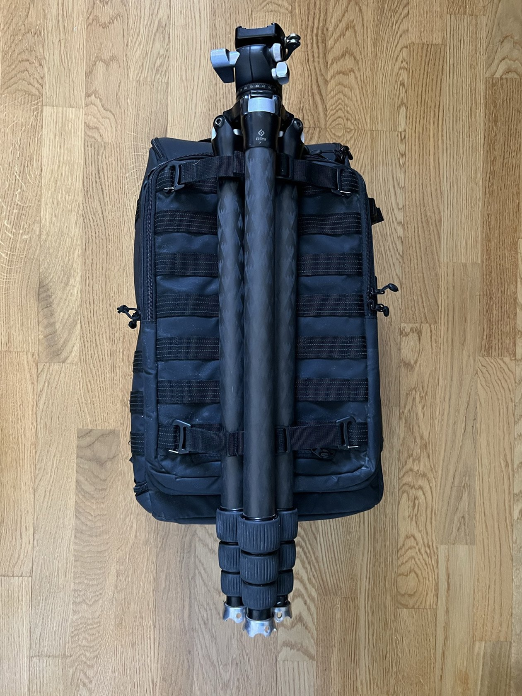

## **Tripod, ball head, and L-plate**

My go-to tripod for many years has been the [Really Right Stuff Versa MK2](https://amzn.to/41MX5O0) with the [RRS BH-40](https://amzn.to/3nCv2CT) ball head. I highly recommend one if you don’t own an [L-Bracket](https://amzn.to/3MfqqLs) for your camera. With a quick-release system, you can easily change the orientation of your camera. The RRS ball head allows smooth and precise adjustments, enabling me to fine-tune my compositions easily. I love that it’s a lever and not a screw adjustment, which makes it easier to use with gloves one. I use a [Sirui Travel 7c](https://amzn.to/3MfMci6) carbon fiber tripod when I have only the bare minimum gear with me or when I know it’s not windy. I use the [RRS BH-40](https://amzn.to/3nCv2CT) in every tripod I own; it’s that good.

#### **RRS Versa MK2 with the BH-40 ball head**

**+** Made to last  
**+** Adjustment lever is exceptional  
**+** Excellent ball head for precise adjustments  
**+** Superb quick-release lever

[**Really Right Stuff Versa MK2**](https://amzn.to/41MX5O0) & [**RRS BH-40**](https://amzn.to/3nCv2CT)&[**L-Bracket**](https://amzn.to/3MfqqLs)

## **Accessories**

What I usually want to have with my camera is an ND filter for long-exposure photography. Currently, I use [NiSi Filter Lens Hood](https://amzn.to/3oayYLp) for the Nikkor Z 14-24 f2.8 with [Nisi 112mm ND1000](https://amzn.to/3Mi3dIi). I have the older version of the [F to Z mount adapter](https://amzn.to/4323K82). I have three extra batteries for the Nikon Z 7 II, but I usually only need one or two, even if I shoot for a long time. I also have a couple of microfiber clothes in the camera bag.

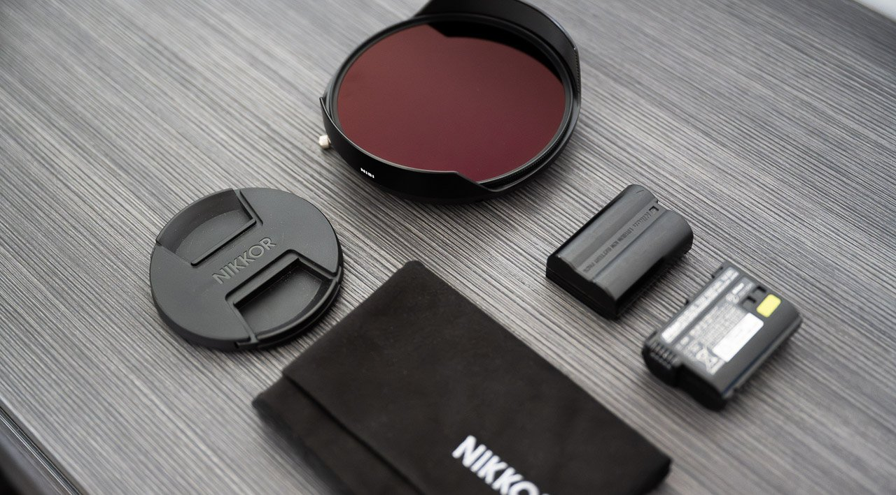

#### What I’m currently looking to upgrade?

At the moment, I’m enjoying using the above gear. However, there are a few upgrades I’m looking to get in the upcoming months. First is the Nikon Z8, because I’m going to start doing more videos. As I mentioned earlier, the second is the [Nikkor Z 70-200 f2.8 S](https://amzn.to/3NNYMY9) lens. I’m curious to see its quality difference compared to the older AF-S 70-200 mm f4 VR. The third upgrade will be the [Nikkor Z 20 mm f1.8](https://amzn.to/3M2BpI7) lens for astrophotography. I have tested it a couple of times, and the quality and weight are impressive. It will undoubtedly replace the 20 mm Sigma ART lens.

## Final words

If you currently use the Nikon Z7 II and don’t need fancy autofocus improvements or video features, I would keep the Z7 II as it’s lighter, has a great sensor, and has the same amount of megapixels as the Z8. But if you want to move towards video and also shoot other than landscapes, the features of the Z8 compared to the Z7 II cannot be overlooked. I don’t often shoot videos, but that’s something I’m looking to do more, and I also want to have the option to shoot RAW on camera.

Until next time my friends, keep on creating!

**Please let me know if you have any questions about the gear I use or anything else.**

*I’m an Amazon affiliate, and the links provided in the article can help me continue sharing my passion with you.*