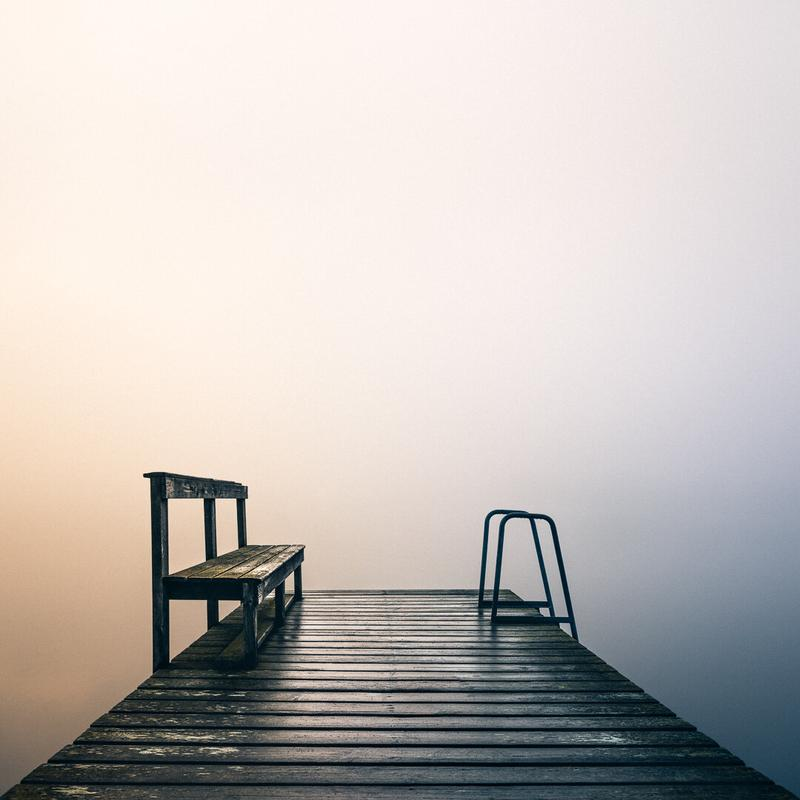

One of my favorite mornings in 2018 has to be this one. I shared last week a view captured on the same morning. [Old Ghost](https://www.mikkolagerstedt.com/blog/2018/6/12/old-ghost) was taken just a few hours before the picture in this post. I was pleasantly surprised when I saw this old pier floating in the mist. You can never be sure what you will find or capture when you grab your gear and head out.

For me, finding inspiring views like these is the beauty of photography. The unpredictable faces of nature and places, in which weather plays a huge role. This view was particularly compelling to me at the time I captured it. The moment made me appreciate my time in nature and ground my thoughts to the base of life. Before I went out to photograph, I seemed to be lost in feelings of worry and anxiety. I believe that taking action in something you love to do will free your thoughts and make you appreciate what you have.

Take a slow breath and focus on the things that make you happy.

### Equipment & Exif

Nikon D810, Nikon 24-120 mm f/4.0 VR  
ISO 100, 24 mm, f/8.0 & 1/200 sec.

### Post-Processing

I used Lightroom to edit this photo. I went through basic settings, lens corrections and finally, I used the transform panel to straighten the perspective. Colors were modified with a preset Blue & Yellow from my [Phase Preset Collection](/phase-presets).

Mikko Lagerstedt - Breathe - Finland - 2018

In other news. I've just created a new page, where you can quickly scroll through my favorite photographs with stories, equipment, and other information. See [Behind The Photography.](/behind-the-photography)

I will be posting more of these stories here on my blog as well. The idea behind the page is to give you easier access to the stories behind my favorite photographs. Is there something specific you would like to see in the behind the photography posts? Let me know.