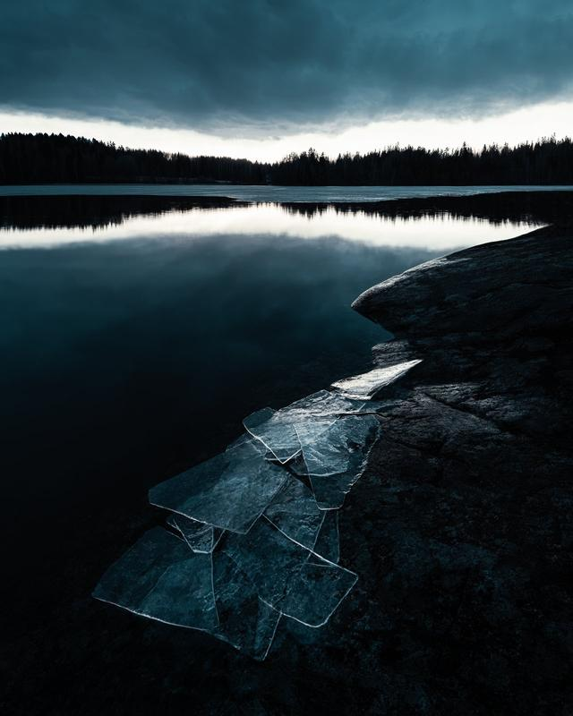
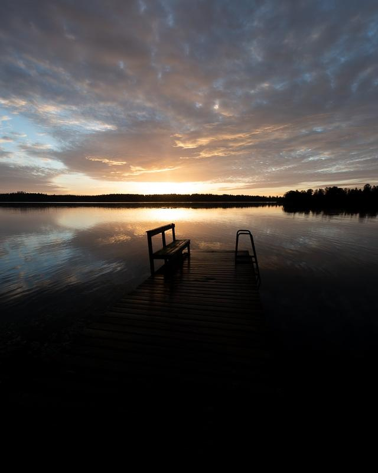
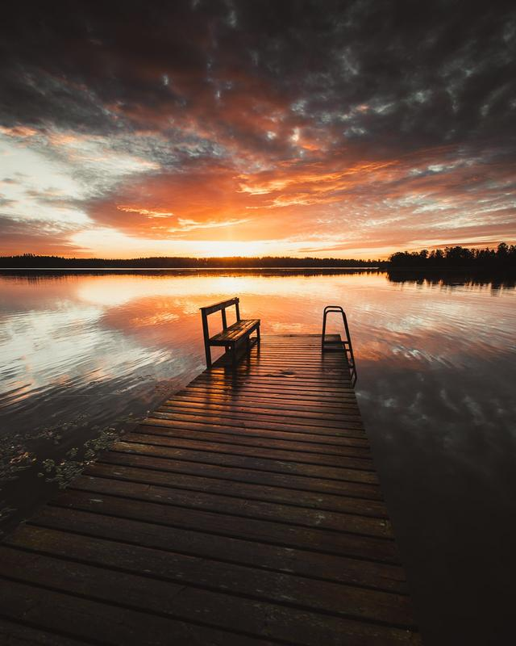
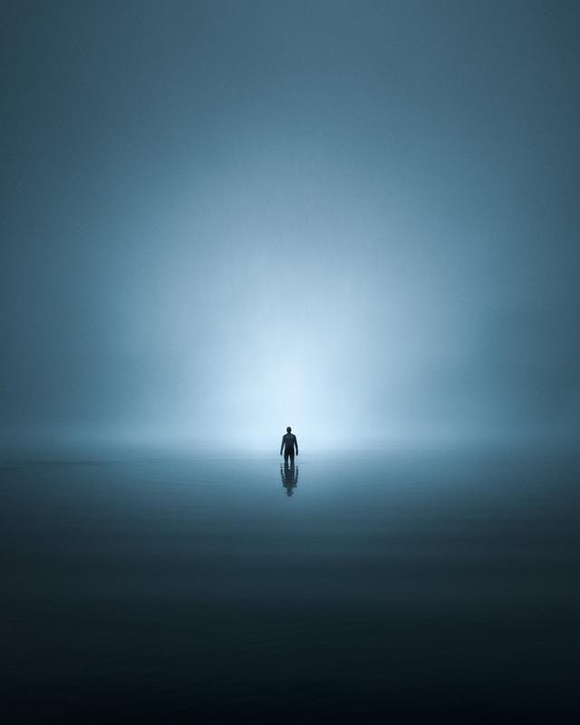
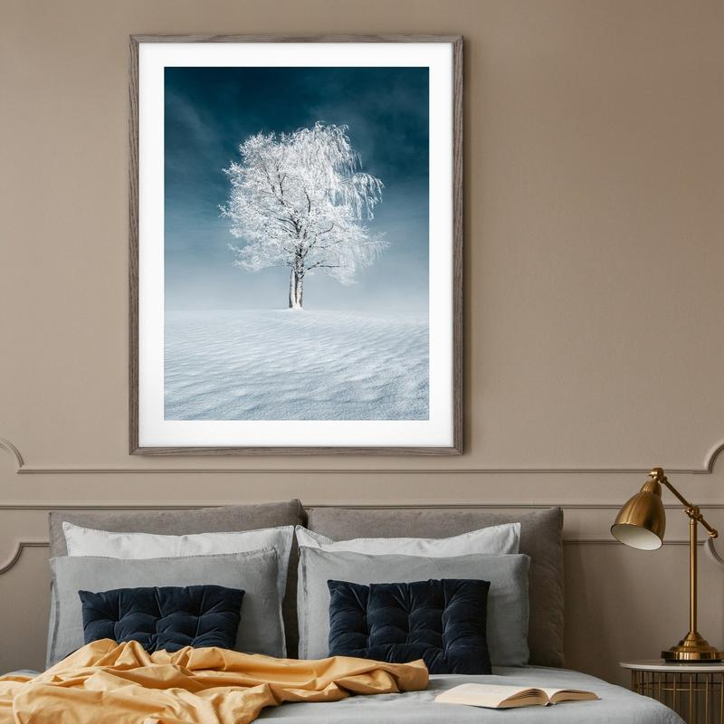

Today, I want to share some insights on finding and capturing the hidden beauty in everyday landscapes. In recent years, there has been a trend to seek out and photograph the most spectacular views, often replicating the same composition down to every detail. While these images may be visually stunning, they only sometimes showcase true creativity or originality. I've personally done the same, but it's good to practice finding beauty near where we live. Traveling is always inspiring, but I firmly believe you can see beauty almost everywhere – even in the most mundane places by thinking creatively.

As a landscape photographer, I've learned that even the most ordinary places can become breathtaking works of art with the right conditions, approach, and perspective. So, let's challenge ourselves to break free from the popular trend and explore some tips on capturing the magic in the ordinary!

## the Art of Observation

To discover the beauty in overlooked places, you must train yourself to observe your surroundings more intently. Make a conscious effort to notice the details, textures, and colors that make up the world around you. Look for patterns, lines, and shapes you might not have seen before. Developing a keen sense of observation will help you identify the hidden gems in ordinary landscapes.

Become more open and attentive to your environment. Observe how light changes throughout the day and how weather and atmospheric conditions can alter the landscape. By being mindful of these changes, you can uncover unique compositions and captivating scenes in the most unexpected places.

Don't be afraid to return to the same spot multiple times to capture it under different conditions. Experiment with various lighting, weather, and angles to reveal new aspects of the scene that might have gone unnoticed during your first visit. This approach challenges your creativity and helps you develop a deeper connection with the location.

**The story about the photograph Edge**.

A place I have visited more than a hundred times. A place where I thought I would never find a new perspective to photograph. However, on this day, I kept my mind open and tried to see if I could capture something unique. As the sun set, I looked for anything that caught my eye. I saw how the thin ice had come to the lake shore, making this beautiful foreground, reminding me of the long winter. While composing the shot, I saw how the treeline created a line between the frame, with the clouds almost perfectly replicating it. I took the photograph and was pleased with how it turned out. It was already quite dark, yet, the horizon was bright. I wanted to emphasize the mood in post-processing and used the EPIC Preset collection to add more contrast and darken the sky with the built-in masks.

**Equipment & Camera Settings**

Nikon Z7 II, Nikkor Z 14-24 mm f/2.8 S & RRS Tripod and Ballhead  
1/6 sec, f/9.0, ISO 64 @ 15.5mm

[Mikko Lagerstedt – Edge](https://mikkolagerstedt.com/print-collection/p/the-edge) – Tuusula Finland, 2022

## Find Different Perspectives

Sometimes, all it takes to uncover the beauty in an ordinary landscape is to change your perspective. Don't be afraid to explore different angles. Shoot from a low or high vantage point, or even lie on the ground to get a unique shot. Experimenting with perspectives can completely transform a seemingly ordinary scene into something extraordinary.

## Play with Light and Shadows

Lighting plays a crucial role in photography, dramatically changing a scene's mood and atmosphere. Pay attention to how light and shadows interact with your surroundings, and use them to your advantage. Experiment with shooting during different times of the day or in various weather conditions. You might be surprised how a familiar landscape can take on a new life under other lighting conditions. Don’t be afraid to use artificial light to your advantage. I sometimes use flashlights, car headlights, and other artificial lights to capture an everyday place beautifully.

## Experiment with Different Tools and Techniques

Using a variety of tools and techniques can significantly impact the way you capture a landscape. Try experimenting with different lenses, filters, or shooting techniques to create unique images. For instance, a wide-angle lens can give a more dramatic perspective, while a telephoto lens can help capture intimate details. Experimenting with long exposure, focus stacking, or multiple exposures can create a more captivating image.

While capturing the grandeur of a landscape is essential, sometimes the most captivating shots are found in the more minor details. Try focusing on close-ups of textures, patterns, or natural elements in your environment. This can create a striking image and showcase the often-overlooked beauty in everyday landscapes.

[Mikko Lagerstedt – Yin Yang](https://mikkolagerstedt.com/limited-edition-prints/p/yin-yang) – Järvenpää Finland, 2018

## Use Post-Processing Techniques

Post-processing is a powerful tool that can help you bring out the hidden beauty in your photos. Experiment with color adjustments, contrast, and exposure to enhance the mood and atmosphere of your images. Be bold and play with different editing techniques. Sometimes, a subtle change can make a difference in the final result.

Post-processing is an essential step in creating captivating landscape photographs. Masking in Adobe Lightroom has made it even easier to achieve stunning results. Let's walk through aN example to help you understand how to use these masking tools.

Suppose you've captured a beautiful landscape photograph with a dramatic sky and a foreground filled with interesting textures or subjects. However, the sky needs more contrast and color, while the foreground requires more detail and sharpness.

**Create a Sky Mask**

To enhance the sky, first, create a mask that isolates this area of the image. Click on the Mask icon (the circle with a dotted outline) above the Basic panel. In the new Mask panel that appears, select "Select Sky" from the drop-down menu. Lightroom will automatically detect and mask the sky in your image. If necessary, you can adjust the mask further by using the Add and Subtract tools.

**Adjust the Sky**

Increase the contrast, saturation, or clarity to make the sky more dramatic and visually appealing. With the sky mask selected, you can now make targeted adjustments to this area of your image. Feel free to experiment with different settings until you achieve the desired effect.

**Create a Foreground Mask**

Next, we'll create a mask for the foreground to bring out more detail and sharpness. Click the "Create New Mask" button in the Mask panel and choose "Brush" from the drop-down menu. You can adjust the brush size, feather, and flow for more precise control. Carefully paint over the foreground area to create a new mask.

**Adjust the Foreground**

With the foreground mask selected, increase the texture, clarity, and sharpness to bring out more detail. You can also adjust the exposure, shadows, and highlights to optimize the tonal range in the foreground.

**Fine-tune Your Image**

Once you've adjusted the sky and foreground, you can further fine-tune your image using global adjustments in the Basic panel or by applying one of my Lightroom presets specifically designed for landscape photography.

**I created** [**The EPIC Preset Collection**](/epic-presets) **for these types of situations. And I use it daily because of its power. I believe it can change the way you edit your work. It has the ideal adjustments fitted for your landscape photography.**

Before Adjustments

After Adjustments

## Tell a Story with Your Images

One of the most powerful ways to capture the beauty in the ordinary is by telling a story with your photographs. Use your images to convey emotions, evoke feelings, or share a moment in time. You can transform an ordinary landscape into something special by giving your viewers a reason to connect with your pictures. I do this sometimes by adding a person (usually myself) to the scenery. I set up my camera on a tripod, use the self-timer, and run into the picture.

## Be Patient and Persistent

Lastly, remember that finding beauty in the mundane takes time and patience. You may need to revisit a location several times or wait for the perfect moment to capture the magic you see. Be persistent and keep experimenting – the more you practice, the better you'll uncover the hidden beauty in your surroundings.

I hope these tips inspire you to seek out the magic in everyday landscapes and capture the breathtaking beauty waiting to be discovered.

Thank you for joining me on this journey, and happy shooting!

**Next week I’ll write more about approaching photography with a beginner’s mind, which is also very important in having a creative mindset and staying out of a creative rut.**

Mikko Lagerstedt – Morning Echo – Asikkala Finland, 2018

## Subscribe

If you enjoy this post, SUBSCRIBE to be the first to receive **fresh new tutorials** straight to your inbox!

First Name

Last Name

Email Address

Subscribe

Thank you!

# Print Collection

Surround yourself with inspiration by adding one of my [fine art landscape photography prints](/print-collection) to your home or workspace. These prints constantly remind you of the beauty of the World and inspire you to seek out your hidden gems.

 