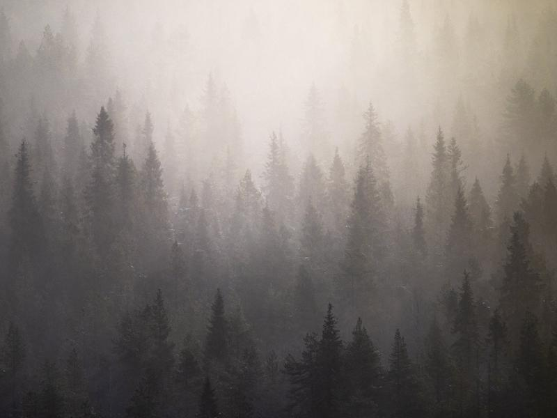
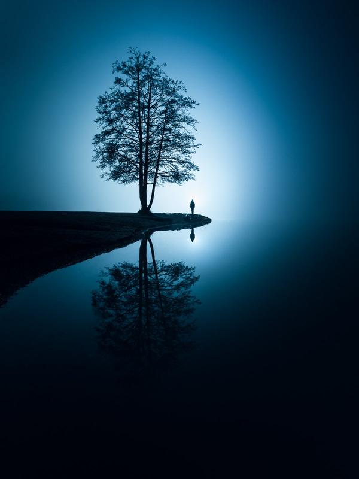
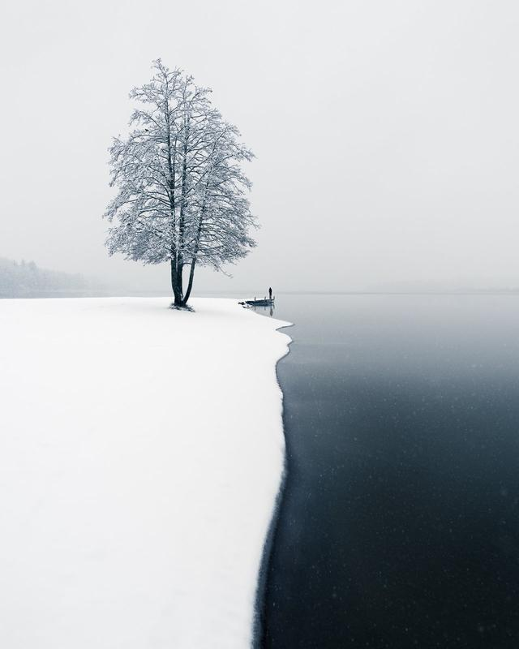
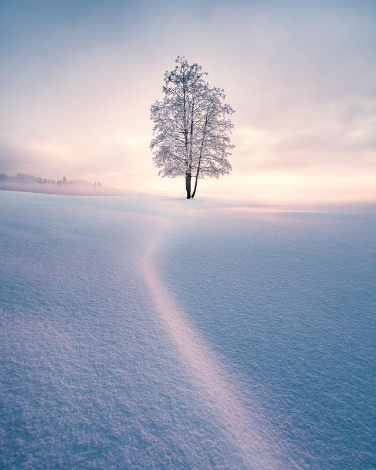

### Introduction

Ever looked at a landscape photo and felt like it could be straight out of a movie? Cinematic landscapes aren’t just about snapping a pretty place. They pull you in, tell a story, and make you feel something. In this guide, we’ll dive into how you can add that cinematic magic to your shots by thinking like a filmmaker.

### 1. Set the Mood with Light

Light plays a huge role in creating cinematic landscapes. Golden hour and blue hour give a soft, atmospheric glow, while backlighting and silhouettes add mystery. Shadows and low light crank up the drama. Artificial lights like streetlights, car headlights, or even a flashlight can add a unique cinematic feel. What gives a photo that cinematic feel? It’s all about composition, lighting, color, and depth. A great cinematic shot doesn’t just show a place, it makes you wonder what’s happening there. Is it peaceful? Mysterious? A little eerie? That’s where storytelling comes in.

Think about the mood you want to create. Light plays a huge role. So do colors. A cooler palette feels moody and calm, while warm tones bring energy. Keep these things in mind when you’re shooting and editing.

Silence – Mikko Lagerstedt

### 2. Use Framing to Tell a Story

Directors don’t just point the camera at a scene, they compose it. Leading lines guide the viewer’s eye, negative space creates solitude, and wide shots feel epic while tighter compositions bring intimacy. A strong foreground element adds depth and makes a scene feel immersive. In movies, framing is everything. Directors don’t just point the camera at a scene, they compose it. The same goes for photography.

Try leading lines to guide the viewer’s eye. Use negative space for a feeling of solitude. Wide shots feel epic, while closer frames bring intimacy. A strong foreground element can make a scene feel deep and immersive.

### 3. Lighting Like a Director

Lighting sets the mood more than anything else. You can use natural light just like a cinematographer would. Golden hour and blue hour are perfect for that soft, atmospheric glow. Backlighting and silhouettes add mystery. Shadows and low light crank up the drama. And don’t be afraid to use artificial light. Headlights, streetlights, or even a flashlight can add that extra cinematic touch. Lighting sets the mood more than anything else. You can use natural light just like a cinematographer would.

Golden hour and blue hour are perfect for that soft, atmospheric glow. Backlighting and silhouettes add mystery. Shadows and low light crank up the drama. And don’t be afraid to use artificial light. Headlights, streetlights, or even a flashlight can add that extra cinematic touch.

### 4. Master the Power of Color

Filmmakers obsess over color, and you should too. Cool blues and greens feel calm, distant, or mysterious. Warm oranges and reds bring emotion, nostalgia, or excitement. High contrast adds drama, while soft pastels create a dreamy effect. Split toning, where warm highlights contrast with cool shadows, enhances depth and atmosphere. Filmmakers obsess over color, and you should too. It’s a subtle but powerful way to shape the mood of your image.

Cool blues and greens feel calm, distant, or even a bit mysterious. Warm oranges and reds bring out emotion, nostalgia, or excitement. High contrast makes things dramatic. Soft pastels give a dreamy feel. You can also play with split toning, warming up the highlights while keeping shadows cool for added depth.

### 5. Create Depth for a Three-Dimensional Look

A cinematic image should feel like you could step right into it. Layering foreground, midground, and background elements adds depth. Distant objects should fade slightly for realism. Framing with trees, cliffs, or windows enhances the sense of place. A bit of motion blur in clouds, water, or fog adds a dynamic touch. A cinematic image should feel like you could step right into it. That’s where depth and scale come in.

Layering is key, foreground, midground, and background all working together. Distant elements should fade a bit for realism. Framing your subject with trees, cliffs, or windows creates a stronger sense of place. A little motion blur in clouds, water, or fog adds a subtle, dynamic touch.

### 6. Focus on Emotion Over Perfection

Cinematic photography isn’t about getting every setting perfect, it’s about making people feel something when they look at your image. Think about the story your photo is telling. Is it peaceful, mysterious, dramatic? Next time you’re shooting, focus on capturing emotion over technical perfection, and your landscapes will feel more cinematic. Cinematic photography isn’t about getting every setting perfect, it’s about creating a mood, telling a story, and making people feel something when they look at your image. Think like a filmmaker next time you’re out shooting, and you’ll see your landscapes in a whole new way.

What story will your next photo tell?

[View fullsize
](https://images.squarespace-cdn.com/content/v1/63ceaffd33529a45e572bf90/1702892856712-HMYCDWNRI858X82805AN/Mikko-Lagerstedt-Balance.jpg)

Balance (Copy)

[View fullsize
](https://images.squarespace-cdn.com/content/v1/63ceaffd33529a45e572bf90/1702892856402-XQ6T97Y17F4LCNUDHO8M/Mikko-Lagerstedt-First-Snow.jpg)

First Snow (Copy)

[View fullsize
](https://images.squarespace-cdn.com/content/v1/63ceaffd33529a45e572bf90/1702892859648-5KO7VXF0EKFN2LQXG9K6/Mikko-Lagerstedt-Winter-Solitude.jpg)

Winter Solitude (Copy)