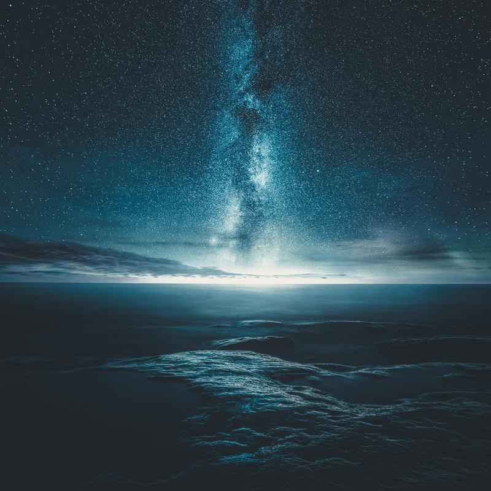

We have had a several beautiful clear nights over the past couple of months here in Finland. I captured this photograph in Meri-Pori, Finland. The photograph is a combination of two pictures. The first taken after sunset and the second one a couple of hours later from the same point of view. This technique is called Vision of Depth, and you can learn more about it in my [Star Photography Masterclass](/star-photography-tutorial).

### Exif

Nikon D810, Nikkor 14–24 mm f/2.8 G ED, Sirui R-4203L Tripod & K-40X  
1st: ISO 100, 30 sec. f/8.0  
2nd: ISO 8000, 30 sec. f/2.8

### Post-Processing

I used one of my [Phase Presets](/presets) to edit the photographs. First I used an overall look (Balanced) to fit my vision and then after combining the pictures I used another to create the atmospheric look to the image (Hazy - Morning Road).

View fullsize

Dimension of Night - Mikko Lagerstedt - 2015, Meri-Pori, Finland