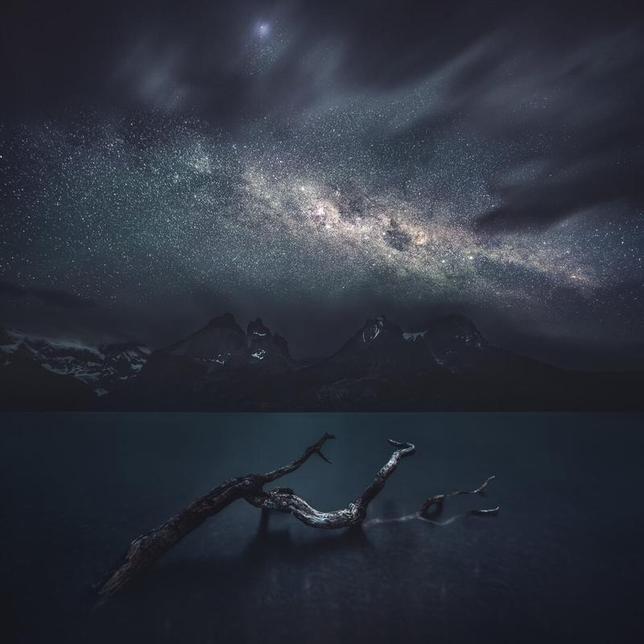

Last year I had the pleasure to visit Chile and the Torres Del Paine national park with Konsta Punkka and the crew. We stayed there for eight days and shot a mini-doc series Exploring Earth's first episodes. If you haven't seen the series, check it out here: [Exploring Earth – Patagonia](http://areena.yle.fi/1-3763924).

I captured this view from a different perspective than the usual views of this mountain line. I used two exposures to capture the scenery and then blended them together in Photoshop.

### Equipment & Exif

Nikon D810, Nikkor 14-24 mm f/2.8 - Tripod RRS TVC-34, BH-40 Ballhead.   
Sky ISO 6400, 30 sec, f/2.8 @ 14 mm  
Water & Mountains ISO 800, 215 sec, f/4.0 @ 20 mm

### Post-processing

I blended the two vertical images manually in Photoshop CC. Learn this blending technique from my eBook [Star Photography Masterclass](http://www.mikkolagerstedt.com/star-photography-tutorial). After combining the images, I opened the final work in Lightroom and edited it with [Phase Presets](/phase-presets): Hazy Night.

View fullsize

If you wish to see my and Konsta's photos in prints, visit the [Photo & Camera Expo](http://goexpo.messukeskus.com/whats-on/photo-camera/?lang=en) in Messukeskus, Helsinki on the 17-19th March.