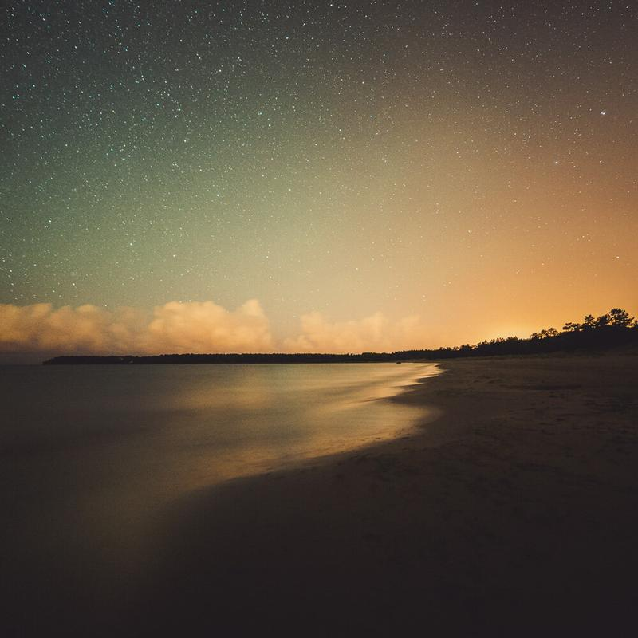

Here is another shot taken at Yyteri beach, Finland. It was a beautiful night to walk around the beach alone. I think the light pollution gives this photograph dreamy atmosphere. I hope you like it!

### Equipment & Exif

Nikon D800, Samyang 14 mm f/2.8, Sirui R-4203L tripod with K-40X ball head  
ISO 6400, 14 mm, f/2.8, 30 sec.

### Post-processing

For base edit I used my [Fine Art Lightroom Preset](/presets): Landscape - Stars II. I also used one of my upcoming Lightroom presets to edit the colors here. No Photoshop was used to edit this one.

View fullsize

Dreamy Night - Mikko Lagerstedt 2014

I just released a new project on Behance: [Night II](https://www.behance.net/gallery/19804029/n-i-g-h-t-II) I'm really happy that it got featured on the front page of the site among many blogs.

If you are interested, I was interviewed for two websites check those out:  
<http://www.idesigni.co.uk/blog/interview-top-finnish-landscape-photographer-mikko-lagerstedt/>  
&  
<http://www.photographyoffice.com/blog/2014/9/the-most-beautiful-night-sky-photography-by-mikko-lagerstedt>