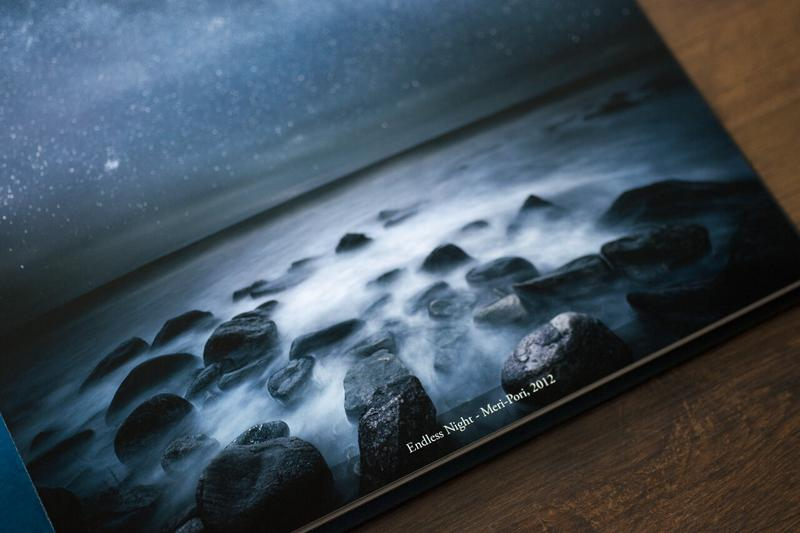

For galleries I want to send examples of my images and the best way to do this is with a solid portfolio book. As my old books were not suitable for this due to the heavy use, I decided couple of days ago to order a new portfolio book "Edge" from a Finnish camera store [Rajala Pro Shop](http://www.rajalacamera.fi/) and their new [photo book](http://www.rajalacamera.fi/rajala-valokuvakirja-30x30cm-uutuus.html). I just received it today safely wrapped inside a big envelope. I took some photographs of it and I must admit: it looks fantastic!

The first thing that struck me was the size and the thickness of the pages. It sure gives you a professional feeling, when the pages don't bend while going through the book. You can order it with 20 pages and the size is 30 cm x 30 cm, which is fantastic for showing quality pictures in decent size. I used square photos for my book so that I could fit more in the book. The overall quality of the book is superb! Colors, sharpness and detail are all well balanced.

View fullsize

I used matte finish on the cover. There is also a glossy finish available

If you want to prevent it for scratching over time I would recommend to go with a glossy finish

View fullsize

Here you can see how thick the pages are

View fullsize

The spreads look fantastic and the overall quality of the prints is excellent

View fullsize

Great sharpness and detail in the photographs

If you are located in Finland and you are searching for a book to show your work, or want to create a book for yourself  I highly recommend Rajala Pro Shop photo book: [Rajala Kuvakirja](http://www.rajalacamera.fi/rajala-valokuvakirja-30x30cm-uutuus.html). 

For those of you who would like to see a book with my pictures, I will be working on it in the future!