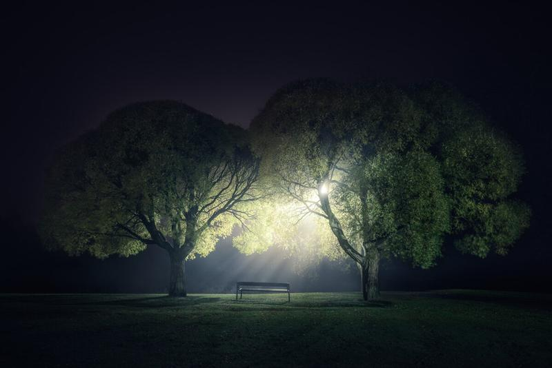

I was driving through some places few nights ago and stopped on this park to see if there was something to shoot. This bench was nicely in the middle of these two trees. Some fog and light to make it interesting. Waiting for more nights like these.

Equipment:  
Nikon D800  
Nikon 16 - 35 mm f/4.0  
Sirui Tripod R-4203L + Sirui Ball Head K-40X

35 mm, f/4.0, 30 sec, ISO 100

View fullsize

