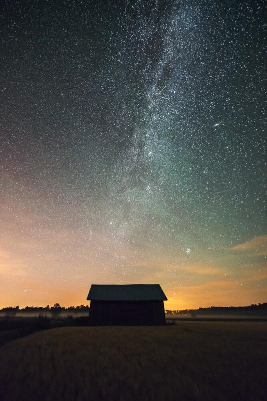

Finally after many hours of testing and working on my Action Collection, I'm happy to announce my new and shiny Fine Art Action Collection is ready! You can purchase yours through the Action page or [click here](/actions).

There are four types of different actions in the Fine Art Action Collection. Styling actions are meant for editing the colors, contrast and atmosphere of the photograph. Graduated actions are for balancing the image and adding drama to the sky. Adjustment actions are for getting the fine detail of stars and milky way in your photographs and also to sharpen images.

Here are couple of my favorite photographs edited with the Actions. For more info check out the [Actions page](/actions). **[The Action Collection](/actions) & [Fine Art Presets](/presets) are on sale for limited time!**

Mikko Lagerstedt - One Step Closer 2014

Mikko Lagerstedt - Night at the Countryside in Finland 2014