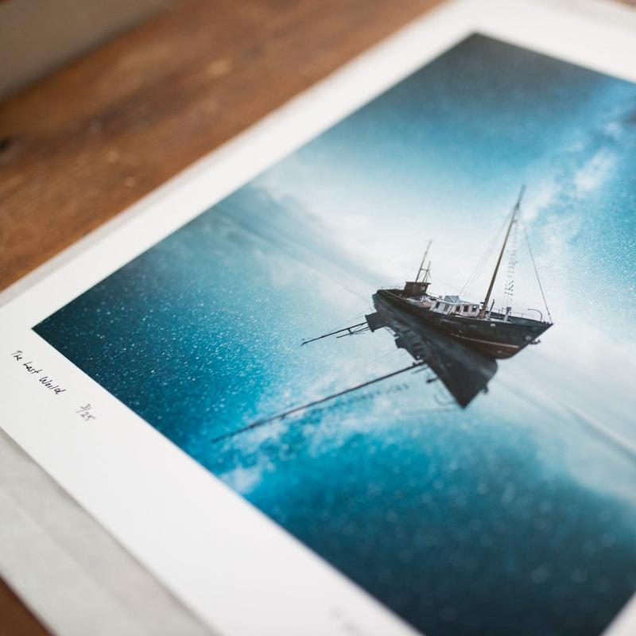
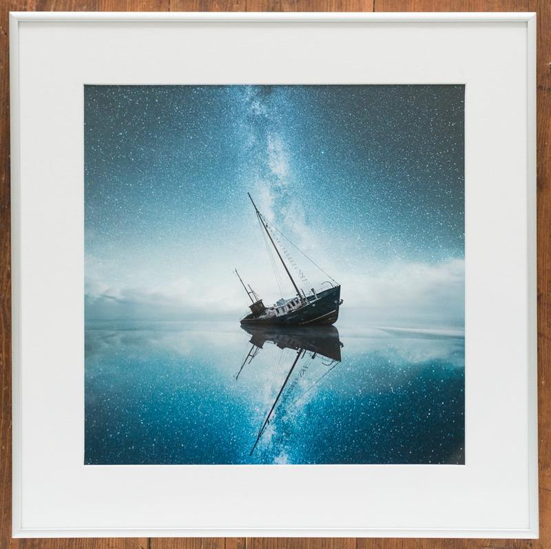
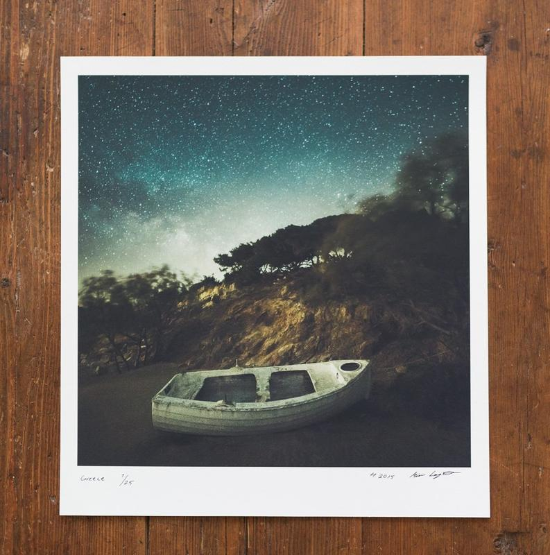

We have received numerous print inquiries, so we have worked long for an option to purchase my work directly from this website. The shop is now live! You can choose three different Hahnemühle fine art papers and various sizes for your preferred artwork. You can learn more about the printing materials here: [Print Information](/print-info).

If you didn't find a photograph, you would love to have a fine art print. You can contact us by emailing: [mikko.lagerstedt@gmail.com](mailto:mikko.lagerstedt@gmail.com) and we will add it to the shop.

*So what happens when you order a print? Here are the steps we make to provide our quality products:*

1. We receive the order information and review the picture, size, and paper choice
2. Image sent to Dialab a Finnish fine art printing lab
3. The print is delivered to be reviewed and signed by Mikko Lagerstedt
4. Artwork packed
5. Buyer receives delivery notification with a tracking code

And this all happens in a couple of days. The art buyer will receive the print within ten business days after the delivery notification.

[Fine Art Print Shop](/prints)

Print Signed

Framed Print Example

Print Signed