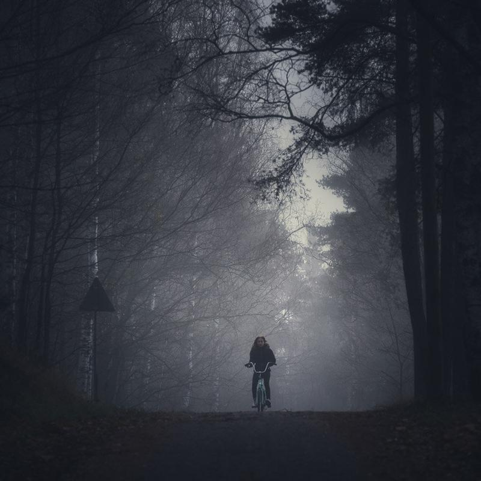

I have been photographing now every day for the past week and a half - it feels great. I have always thought, that my photography inspiration comes only time to time, but creating an old habit is far more inspiring to me. I have always loved to take long walks and enjoy fresh air and by taking my camera with me every day, it gives me inspiration to continue to do that. What are your old habits that you would want to start again?

A couple of days ago we had some beautiful morning fog. This was photographed just couple of kilometers from where I live. Hope you like it! The dark mood was created using one of my upcoming Lightroom presets.

### Equipment & Exif

Nikon D800, Nikkor 70-300 mm f/4.5 - 5.6 VR  
140 mm, f/5.0, ISO 100 & 1/200 sec.

View fullsize

From the Darkness - Mikko Lagerstedt, 2014

Remember the Preset & Action Sale!  
[Fine Art Lightroom & Camera Raw Presets](/presets)  
[Fine Art Photoshop Actions](/actions)